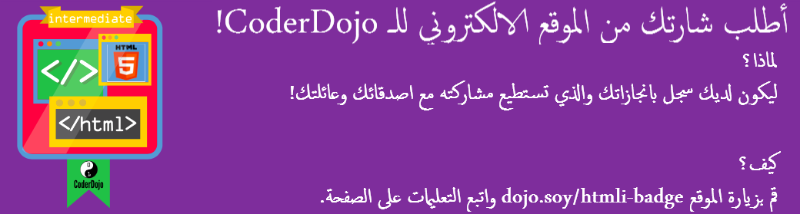

## علّم تيتو ليتدحرج!

يمكنك جعل موقع الويب الخاص بك أكثر **تفاعلية** وذلك عن طريق جعل اشياء رائعة تحدث عندما يحوم مؤشر الماوس فوق الأشياء!

+ ابحث عن قواعد CSS الخاصة بك لعناصر` img `، أو إنشاء البعض منها إذا لم يكن لديك واحدة. أضف حدودًا، ثم قم بإضافة مجموعة جديدة من القواعد الموجودة بالاسفل:

```css
  img {
    border: 2px solid White;
  }
  img:hover {
    border: 2px dashed Navy;
  }
```

لقد استخدمت للتو نوعًا خاصًا من كتل CSS تسمى **seudo-class**.

## \--- collapse \---

## title: كيف يعمل؟

**pseudo-class** يختلف قليلاً عن الصنف ** class** الذي تقوم بانشائه بنفسك. يمكنك التعرف عليه من خلال `:`.

Pseudo-classes تكون مدمجة مع عناصر HTML: بامكانك إضافة قاعدة نمط التحويم ` hover` لأي عنصر، صنف، أو معرف ` id` في ورقة الانماط الخاصة بك دون الحاجة الى اضافة اي شيء اضافي في برمجة HTML الخاصة بك.

\--- /collapse \---

+ ما الذي تظن أنه سيحدث؟ تحقق من الصفحات الموجودة على موقع الويب الخاص بك والتي تحتوي على صور (أضف صورة إذا لم يكن هناك!) ، ثم حرك مؤشر الماوس فوق الصورة لمعرفة ما سيحدث!

+ لنستخدم خاصية ` hover` الجديدة مع صنف CSS لجعل الروابط تتوهج عندما تحوم فوقها! أضف رابطًا إلى صفحة الويب الخاصة بك وقم بتضمين خاصية لتحديد اسم الصنف. تذكر، يتم تعريف الروابط باستخدام العلامة `<a>`، مثل:

```html
    <p>
      Visit the <a class="niceLinks" href="https://en.wikipedia.org/wiki/Ireland">Wikipedia page</a> to learn even more about Ireland!
    </p>
```

+ أضف الكود التالي إلى ورقة الأنماط الخاصة بك، ثم قم بتشغيل الكود الخاص بك لرؤية روابطك الجميلة في العمل.

```css
  .niceLinks {
    text-decoration: none;
    color: #FFFAF0;
  }
  .niceLinks:hover {
    color: #00FF7F;
  }
```

+ لما لا تضيف ايضاً الخاصية `class="niceLinks"` لكل الروابط في شريط القوائم الخاص بك؟

يمكنك الجمع بين كل هذه الحيل مع الرسوم المتحركة أيضا!

+ ابحث عن كتلة CSS لصورة تيتو مرة أخرى (أو أي صورة كنت تعمل عليها سابقًا). أضف الكود التالي الى ملف ورقة الأنماط الخاص بك:

```css
  #titoPicture {
    border-radius: 100%;
    width: 100px;
  }
  #titoPicture:hover {
    animation-name: rollOver;
    animation-duration: 1s;
    animation-iteration-count: 1;
  }
  @keyframes rollOver {
    0% {
      transform: rotate(0deg);
    }
    100% {
      transform: rotate(-360deg);
    }
  }
```

+ هل يمكنك تخمين ما سيحدث؟

+ الآن أصرخ "تدحرج!" بينما تمرر المؤشر فوق الصورة!

\--- challenge \---

## التحدي: اجعل روابط قوس قزح متوهجة

+ هل بامكانك استخدام مؤثر `rainbowGlow` من البطاقة السابقة لجعل الروابط في القائمة تستمر بتغيير الالوان عندما يحوم مؤشر الماوس فوقها؟

\--- hints \---

\--- hint \---

في أدناه الكود الخاص بمؤثر ` rainbowGlow `. له خمس مراحل محددة، ويقوم بتعيين لون نص مختلف في كل مرحلة. يمكنك إضافة المزيد أو تغييرها كما تريد!

```css
    @keyframes rainbowGlow {
        0% {
            color: #00BFFF;
        }
        25% {
            color: #00FF7F;
        }
        50% {
            color: #eeeeaf;
        }
        75% {
            color: #eeafee;
        }
        100% {
            color: #00BFFF;
        }
    }
```

\--- hint/ \---

\--- hint \---

لتحريك شيء ما، يمكنك إضافة ثلاث خصائص متحركة ` animation` لقواعد الانماط كما فعلت أعلاه. تأكد دائمًا من اسم الخاصية المتحركة ` animation-name ` يطابق اسم الحركة التي ترغب في استخدامها.

\--- hint/ \---

\--- hint \---

يمكنك إضافة تأثيرات الحوم ` hover` مباشرة على قائمة التنقل ` nav` مثل هذا:

```css
  nav ul li a:hover {
    animation-name: rainbowGlow;
    animation-duration: 1.5s;
    animation-iteration-count: infinite;
  }
```

أو ، إذا كنت تريد إنشاء روابط أخرى على موقع الويب الخاص بك، يمكنك إضافة ألوان قوس قزح أيضًا، يمكنك إضافة الحركات إلى طبقة `.niceLinks ` بدلا من ذلك ، مثل هذا:

```css
  .niceLinks:hover {
    color: #00BFFF;
    animation-name: rainbowGlow;
    animation-duration: 1.5s;
    animation-iteration-count: infinite;
  }
```

\--- hint/ \---

\--- hints/ \---

\--- /challenge \---

