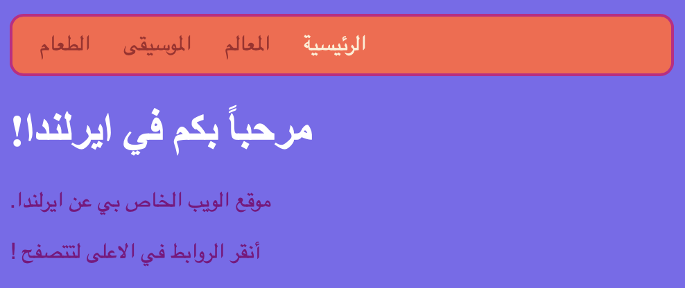

## كل الألوان!

كما رأيت من قبل، يمكنك كتابة العديد من أسماء الألوان المختلفة ككلمات، وسوف يتعرف عليها متصفح الانترنت. ولكن هناك طريقة أكثر شيوعًا لضبط الألوان وهي استخدام شيء يسمى رموز ست عشري ** ** ("ست عشري" اختصار لـ ** النظام الرقمي المعروف بالسادس عشري ** ، وهي طريقة خاصة للحساب).

+ ألق نظرة على ورقة أنماطك ** **. وهو الملف الذي يحتوي على `.css ` في الاسم.

+ داخل قواعد CSS body ` ` ، اضبط لون الخلفية على رمز سداسي عشرية ` # 7B68EE `:

```html
  background-color: #7D68CC;
```

ملاحظة: إذا كنت تستخدم جهاز حاسوب من نوع Mac، فيمكنك كتابة ` # ` عن طريق الضغط على مفاتيح <kbd>alt</kbd> و <kbd>3</kbd> في نفس الوقت.

يجب أن يكون لموقعك الآن خلفية بنفسجية.

 

+ لست من محبي اللون البنفسجي؟ اذهب الى [صفحة الويب هذه](http://dojo.soy/html2-colors){:target="_blank"} واختر لون جديد لورقة الانماط الخاصة بك - بدلا منكتابة اسم اللون، اكتب الرمز السداسي. 


تسمح لك رموز الالوان بإنشاء أي لون، حتى لو لم يكن موجود في أي قائمة من أسماء الألوان.

+ حاول صنع رمز لون خاص بك. يجب أن يبدأ بالرمز `#`. هذا يخبر المتصفح أنه رمز ست عشري بدلاً من اسم اللون. وباقي الرمز يتكون من ستة أحرف. يمكن أن تكون أي رقم من **صفر الى ٩** واي حرف من **A الى F**.

## \--- collapse \---

## title: كيف يعمل؟

يتكون كل لون عن طريق مزج كميات مختلفة من **الاحمر**، **الاخضر**، و **الازرق**. سترى هذا احياناً مكتوبا بصيغة **RGB**. يتم تمثيل كل من هذه الألوان برقمين من ستة أرقام في كود HEX (ست عشري). `00` هو الحد الادنى، و`FF` هو الحد الاعلى.

**النظام السادس عشري** هو طريقة حساب تجعل الارقام أقصر في الكتابة باستخدام الحروف A-F كأرقام إضافية. الرقم `٢٥٥` يكتب بالشكل `FF` في النظام السادس عشري. لا داعي للقلق بشأن تعلم عد الارقام في النظام السادي عشري. بدلاً من ذلك، قم بتجربة رموز hex (ساسدس عشري) مختلفة للتعود على استخدامها.

+ إليك بعض الألوان الأساسية التي يمكنك تجربتها على موقع الويب الخاص بك. حاول وضع أرقام أصغر بدلاً من ` FF ` لنرى كيف تتغير تدرجات الالوان.

|      | R  | G  | B  |   النتيجة    |
| ---- | -- | -- | -- |:------------:|
| \# | FF | 00 | 00 |     أحمر     |
| \# | 00 | FF | 00 |     أخضر     |
| \# | 00 | 00 | FF |     أزرق     |
| \# | FF | FF | 00 |    الأصفر    |
| \# | FF | 00 | FF |   أرجواني    |
| \# | 00 | FF | FF |  ازرق سماوي  |
| \# | FF | 8C | 00 | برتقالي غامق |

\--- /collapse \---

خلط اللون المثالي قد يحتاج لاجراء الكثير من التجارب. لحسن الحظ، هناك الكثير من ادوات اختيار الألوان عن طريق الإنترنت والتي تساعدك في الحصول على كود سداسي عشري لأي لون تريده.


+ جرّب [this colour picker](http://dojo.soy/html2-color-picker){:target="_blank"} لاختيار بعض من رموز الوان hex لاستخدامها في بقية الانماط على موقع الويب الخاص بك.