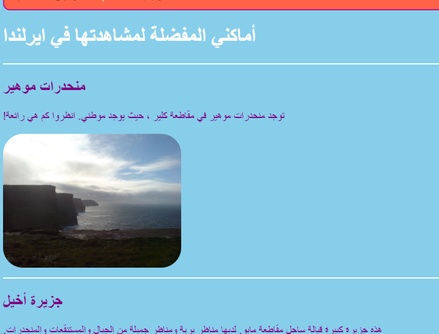
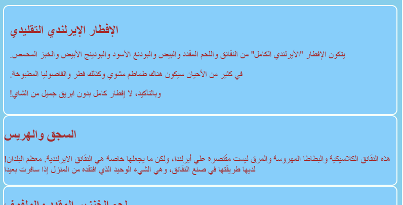
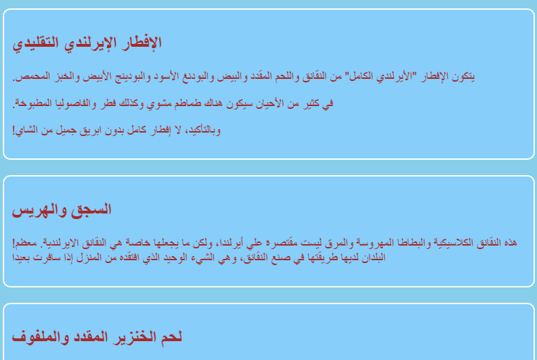

## صمم بعض المواضيع

من الرائع كتابة قواعد CSS لعناصر مثل `القسم` و `p`، ولكن ماذا لو كنت تريد أن تجعل بعضها يبدو مختلفًا عن الآخرين؟ في هذه البطاقة ستتعلم كيفية تطبيق مجموعات مختلفة من قواعد الانماط على عناصر من نفس النوع وإنشاء سمة مختلفة لكل صفحة على موقع الويب الخاص بك!

+ انتقل إلى ملف ورقة الأنماط الخاص بك وأضف ما يلي - تأكد من تضمين النقطة في المقدمة!

```css
  .topDivider {
    border-top-style: solid;
    border-top-width: 2px;
    border-top-color: #F5FFFA;
    padding-bottom: 10px;
  }
```

+ الآن انتقل الى `attractions.html` أو (اذا كنت تعمل على مشروع خاص بك فاذهب الى ملف HTML الخاص بك) ثم أضف ** الخاصية** التالية لكل ` section` (وسم القسم):

```html
  <section class="topDivider">
```

يجب أن ترى خطًا يظهر أعلى كل قسم في الصفحة. تهانينا - لقد استخدمت للتو مصنفك الاول لـ ** CSS **!



+ انظر كيف تبدو صفحة الويب الخاصة بك الآن وقارنها بالصفحات الأخرى التي تحتوي على عناصر `قسم`. سترى أنه فقط في الاجزاء التي أضفت لها الخاصية `class="topDivider"` سوف تحصل على خط في الاعلى.

## \--- collapse \---

## title: كيف يعمل؟

تذكر عندما تستخدم **محدد** CSS مثل القسم ` section` او `p` او `nav ul`، فان قواعد النمط تنطبق على **جميع** العناصر من ذاك النوع في موقع الويب الخاص بك.

مع أصناف **CSS**، فقط يمكنك تغيير نمط **بعض** من العناصر.

وضع نقطة أمام المحدد الخاص بك سيجعل منه **محدد صنف**. يمكن أن يكون للصنف أي اسم، لذلك من الممكن أن لا يكون نفس الاسم لعنصر HTML. مثال:

```css
  .myAwesomeClass {
    /*قواعد أنماطي الرائعة تأتي هنا */
  }
```

لاختيار أي من العناصر التي ستنطبق عليها قواعد النمط، يمكنك إضافة **خاصية** `صنف` لتلك العناصر في كود HTML: ضع اسم الصنف كقيمة للخاصية، ** بدون ** النقطة، مثل هذا:

```html
  class="myAwesomeClass"
```

\--- /collapse \---

+ هل أنت مستعد لتجربة مصنف آخر؟ أضف كود CSS التالي إلى الملف `styles.css`:

```css
  .stylishBox {
    background-color: #87CEFA;
    color: #A52A2A;
    border-style: solid;
    border-width: 2px;
    border-color: #F5FFFA;
    border-radius: 10px;
  }
```

+ ثم ، في صفحة مختلفة من موقع الويب الخاص بك ، أضف الصنف إلى بعض العناصر هناك. سأقوم بإضافته إلى عنصر `القسم` في صفحة الطعام على موقع الويب الخاص بي، مثل هذا: `<section class="stylishBox">`.

تبدو رائعة، ولكن الآن كل أقسامي ملتصقة معًا.



يمكنك تطبيق اي عدد من فئات CSS على العنصر كما تريد. اكتب فقط أسماء جميع الفئات التي تريد استخدامها داخل خاصية الصنف ` class` (وتذكر ، بدون النقطة!) ، وافصل بينها بمسافات.

+ دعونا نصنع صنف CSS آخر لإعطاء الأقسام بعض الهامش والحشو. في ملف `styles.cs `، قم بإنشاء صنف CSS التالي:

```css
  .someSpacing {
    padding: 10px;
    margin-top: 20px;
  }
```

+ في رمز `html` الخاصة بك، أضف الصنف الجديد إلى كل عنصر من العناصر التي كنت تعمل عليها، مثل هذا:

```html
  <section class="stylishBox someSpacing">
```



لذا تتيح لك اصناف CSS**الاختيار ** ما هي العناصر التي يتم إضفاء طابع جديد عليها، وهي تتيح لك ** إعادة استخدام** نفس مجموعة قواعد النمط على أي عناصر تريدها.

+ انتقل إلى ` index.html ` وأضف صنف` stylishBox ` إلى عنصر` main `، أو اي عنصر آخر على الصفحة. يمكنك إزالته مرة أخرى لاحقاً!

```html
    <main class="stylishBox">   
```

إليك ما تبدو عليه صفحتي الرئيسية مع مصنف CSS. لقد أضفت أيضًا مصنف`topDivider ` إلى صفحة ` img ` مع صورة تيتو.


\--- challenge \---

## تحدي: أصنع بعض الاصناف الجديدة

+ استخدم صنف CSS ** ** لتحديد بعض أحجام الصور المختلفة لموقع الويب الخاص بك، على سبيل المثال `.smallPictures` و `.mediumPictures`. ثم قم بإزالة خاصية العرض ` width ` من كل عناصر ` img ` وإضافة الصنف المناسب بدلا من ذلك.

\--- hints \---

\--- hint \---

يمكنك إنشاء صنف CSS الذي يحدد عرض عنصر فقط مثل هذا:

```css
  .smallPictures {
    width: 100px;
  }
```

\--- /hint \---

\--- hint \---

إليك وسم ` img ` بخاصية عرض `width `:

```html
         
```

عند إزالة خاصية العرض ` width` والتحكم في الحجم باستخدام صنف CSS بدلاً من ذلك، يبدو كما يلي:

```html
         
```

باستخدام صنف CSS، يمكنك بسهولة تغيير عرض جميع الصور في وقت واحد عن طريق تغيير سطر واحد فقط من التعليمات البرمجية في ورقة الأنماط الخاصة بك!

\--- /hint \---

\--- /hints \---

\--- /challenge \---