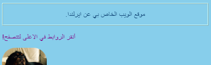
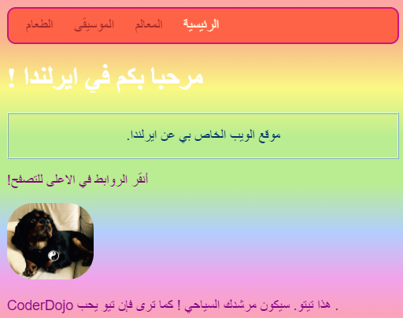
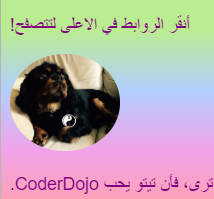

## أسلوب فردي

دعونا نقوم ببهرجة الصفحة الرئيسية قليلا! مع نوع آخر من محدد CSS ، يمكنك تطبيق مجموعة فريدة من قواعد CSS على ** عنصر محدد واحد فقط **.

+ انتقل إلى ` index.html ` وقم بايجاد الفقرة (`p`)، أو إضافة واحدة إذا لم يكن لديك واحدة. قم باضافة **الخاصية** التالية إلى العلامة:

```html
    <p id="myCoolText">
    موقع الويب الخاص بي عن أيرلندا.
    </p> 
```

المعرف `id ` هو الاسم الذي تحدده لعنصر معين **لتعرّفه**. لا يجب أن يكون لعنصران في الصفحة نفس المعرف `id `!

+ اذهب الآن إلى صفحة الأنماط وأضف الكود التالي:

```css
    #myCoolText {
        color: #003366;
        border: 2px ridge #ccffff;
        padding: 15px;
        text-align: center;
    }
```

يجب أن تبدو التعليمات البرمجية خاصتك بالشكل التالي:



يستخدم محدد مع العلامة ` # ` أمامه لتطبيق قواعد CSS على عنصر واحد محدد على موقع الويب الخاص بك. يمكنك تحديد العنصر بمساعدة الاسم الذي قمت بتعيينه `id` لخاصية العنصر.

+ دعونا نفعل واحدة `لمتن` الصفحة الرئيسية. انتقل إلى ` index.html ` وأضف معرف ` id` إلى ورقة ` المتن `.

```html
    <body id="frontPage">
```

+ في ورقة الأنماط، أضف قواعد CSS التالية:

```css
    #frontPage {
        background: #48D1CC;
        background: linear-gradient(#fea3aa, #f8b88b, #faf884, #baed91, #baed91, #b2cefe, #f2a2e8, #fea3aa);
    }
```

يجب أن نرى شيئا يشبه هذا:



لقد استخدمت للتو تدرج ** gradient) </0)>! هذا هو الاسم الذي يُعطى للتأثير حيث يتلاشى لون في الآخر. ملاحظة: إن خاصية أول ` خلفية ` فوق التدرج اللوني تحدد لونًا افتراضيًا للمتصفحات التي لا تدعم التدرجات اللونية.</p> 

إذا قمت بكتابة التعليمات البرمجية بشكل مثالي ولم تحصل على تأثير قوس قزح الرائع أعلاه ، فقد يكون متصفحك لا يدعم التدرجات اللونية.

يمكنك صنع الكثير من المؤثرات المختلفة ياستخدام التدرجات. إذا كنت تريد معرفة المزيد، قم بالنقر[ هنا ](http://dojo.soy/html2-css-gradients) {:target="_blank"}.

\--- challenge \---

## Challenge: قم بتغيير تصميم عناصر أكثر

+ حاول إعطاء عنصر آخر معرف `id ` وقم بتصميم هذا العنصر باستخدام محدد الهوية باستخدام ` # ` كما في أعلاه. ماذا عن صنع صورة واحدة لها `حدود قطرية` من ` 100٪ ` بحيث يتم تقريبه بالكامل؟ أي صور أخرى على الموقع ستبقى كما هي. 

\--- hints \---

\--- hint \---

يمكنك إعطاء العنصر معرف `id ` بإضافة خاصية المعرف `id ` إلى علامة HTML، مثل هذا:

```html
          
```

اختر اسم أي معرف ` id` تريده.

\--- /hint \---

\--- hint \---

لتحديد قواعد النمط لعنصر معين، يمكنك استخدام الرمز `#` والاسم الذي أعطيته للعنصر كمعرّف `id`.

```css
  #titoPicture {
    border-radius: 100%;
  }
```

ملاحظة: يجب أن يكون الاسم الذي تكتبه أمام قواعد CSS ** ** يطابق الاسم الذي وضعته لمعرف `id` خاصية العنصر.

\--- hint/ \---

\--- /hints \---



\--- /challenge \---