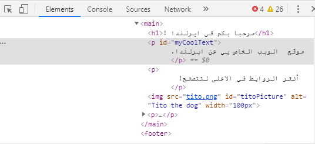
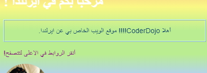
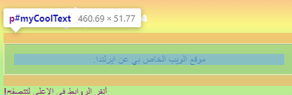
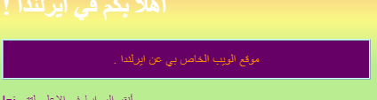

## انظر الكود على المواقع الأخرى!

** ملاحظة:** لإكمال هذه الخطوة ، تحتاج إلى استخدام أحد متصفحات الويب هذه: Chrome أو Firefox أو Internet Explorer / Edge. إذا لم يكن لديك واحد منهم، يمكنك المتابعة إلى البطاقة التالية.

في هذه البطاقة ستتعرف على كيفية إلقاء نظرة خاطفة على التعليمات البرمجية في أي موقع ويب باستخدام أداة الفحص **inspector tool**، وستكتشف أيضًا كيفية إجراء بعض التغييرات التي تراها أنت فقط!

+ قبل ان تبدأ، تأكد من حفظ مشروعك. ثم قم بتحديث موقع الويب الخاص بك عن طريق النقر على أيقونة التحديث في متصفحك.

+ في صفحة الويب الخاصة بك (الصفحة الفعلية، وليس صفحة التعليمات البرمجية) ، قم بتمييز النص بالحد الذي أضفته في البطاقة السابقة، ثم انقر بزر الماوس الأيمن فوقه وحدد الخيار فحص** Inspect** من القائمة التي تظهر. (قد يكون اسمه "Inspect Element" أو ما شابه، اعتمادًا على المتصفح الذي تستخدمه. إذا كنت تواجه مشكلة في العثور على خيار القائمة، فما عليك سوى طلب المساعدة من شخص ما في Dojo الذي تشترك فيه.)


سيظهر مربع جديد في متصفح الويب الخاص بك مع الكثير من علامات التبويب والرموز:** developer tools** أو للاختصار ** dev tools **. هنا يمكنك رؤية التعليمات البرمجية (الكود) للشيء الذي نقرت عليه، وكذلك كود الصفحة بأكملها!

### فحص كود HTML

+ ابحث عن علامة التبويب التي تعرض لك رمز HTML للصفحة (قد يطلق عليها "Elements" أو "Inspector"). يجب أن تبدو الكود مشابهة تمامًا لكيفية كتابتها في ملف HTML الخاص بك! يمكنك النقر فوق المثلثات الصغيرة على الجانب الأيمن لاظهار الكود المخفي.



+ انقر نقرًا مزدوجًا فوق النص الموجود بين العلامات. يجب أن تكون قادرًا على تعديله الآن! اكتب شيئًا ما واضغط على <kbd> Enter </kbd>.


+ هل ترى تحديث النص على موقع الويب الخاص بك؟ لاحظ: أنت فقط يمكنك رؤية هذه التغييرات.



+ الآن **أعد تحميل** الصفحة وشاهد ما يحدث. يجب أن تختفي التغييرات الخاصة بك!

+ في الزاوية العلوية اليمنى من مربع أدوات dev، انقر فوق الرمز الذي يبدو وكأنه مستطيل صغير به سهم. يمكنك الآن تحريك المؤشر فوق صفحة الويب، وسيعرض لك فاحص HTML الرمز الذي يصفه.

 

### فحص كود CSS

+ دعنا تالياً نلقي نظرة على كود CSS. ابحث عن علامة تبويب الأنماط ** Styles ** في أدوات المطور (developer tools) (قد يطلق عليها "Style Editor" أو ما شابه). سترى مجموعة من قواعد CSS، بما في ذلك القواعد التي أنشأتها لهذه الفقرة، ` #myCoolText `.


+ في قواعد ` #myCoolText `، انقر على القيمة بجانب خاصية اللون ` color `. حاول كتابة قيمة مختلفة. شاهد تغير لون النص مباشرة على صفحة الويب الخاصة بك! 


لاحظ: يمكنك أيضًا النقر فوق المربع الملون لتغيير اللون باستخدام أداة منتقي الألوان.

+ انقر في الفضاء بعد اللون. سيبدأ سطر جديد، حيث يمكنك كتابة المزيد من CSS. اكتب التالي واضغط على <kbd> Enter </kbd>:

```css
  background-color: #660066;
```

يجب أن تشاهد تغيير الخلفية على هذا النص.

 

## \--- collapse \---

## title: كيف يعمل؟

عندما تقوم بتغيير رمز موقع الويب باستخدام أدوات المطور، فأنت ** مؤقتًا ** تغير شكله ** في متصفحك **. أنت في الواقع لا تغير الملفات التي تشكل الموقع.

عندما تقوم بتحديث الصفحة، فأنت تقوم بتحميل موقع الويب مرة أخرى من ملفاته (على الإنترنت أو على جهاز الكمبيوتر الخاص بك). لهذا السبب تختفي التغييرات.

الآن بعد أن عرفت ذلك، يمكنك الاستمتاع ببعض اللعب مع الكود على مواقع الويب الأخرى!

\--- /collapse \---

+ حاول استخدام هذه الأدوات لإلقاء نظرة على الكود على موقع ويب آخر. يمكنك حتى إجراء تغييرات إذا أردت! تذكر أنه انت فقط يمكنك رؤية التغييرات التي تجريها، وسيتم إعادة ضبط كل شيء عند تحديث الصفحة.