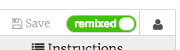

## Vorbereitungen

- Gehe zum Starter Trinket Projekt auf [trinket.io/html/0e694c9153](https://trinket.io/html/0e694c9153){:target="_blank"}. Die Beispiele in diesen Sushi-Karten basieren hauptsächlich auf diesem Projekt.

- Wenn Du möchtest, kannst Du auch mit einer Website arbeiten, die Du bereits erstellt hast.

--- collapse ---
---
title: Ich habe ein Trinket Konto
---

- Klicke auf **Remix** in der oberen rechten Ecke des Projekts (falls Du nicht angemeldet bist wirst Du dazu aufgefordert, das zu tun. Sobald du angemeldet bist, musst du erneut auf **Remix** klicken). Das erstellt eine Kopie des Projektes, mit dem Du arbeiten kannst. 

Dort sollte nun **remixed** stehen, nachdem du es angeklickt hast:

--- /collapse ---

--- collapse ---
---
title: Ich habe kein Trinket Konto
---

Auch wenn Du kein Konto hast, kannst Du trotzdem mit Trinket arbeiten.

### Speichere deine Arbeit

Du kannst deine Arbeit speichern, indem du auf eine der Optionen im **Share** Menü klickst. Du kannst das Projekt entweder herunterladen oder einen Link erhalten, den Du zum Beispiel in einem Dokument speichern oder per E-Mail verschicken kannst. **Hinweis:** Jedes Mal, wenn du eine Änderung vornimmst, erhältst du einen neuen Link.

### Wie Du dich für ein Konto anmeldet

Wenn Du ein Konto bei Trinket erstellen möchtest, folge den folgenden Schritten. So kannst du von einem beliebigen Computer aus einfach auf deine Arbeit zugreifen und auf Projekte **remixen**, die jemand mit dir geteilt hat (also eine Kopie anlegen, die Du verändern kannst).

- Im Browser-Tab mit dem Starter Trinket Projekt klicke auf **Sign Up**. Du wirst eine Email-Adresse brauchen um dich anzumelden.

- Gib deine E-Mail-Adresse ein und wähle ein Passwort oder bitte jemanden darum, das für dich zu machen.

- Du kannst nun auf alle Deine gespeicherten oder remixten Projekte zugreifen, indem Du auf Deinen Benutzernamen klickst und zu **My Trinkets** gehst. 

--- /collapse ---