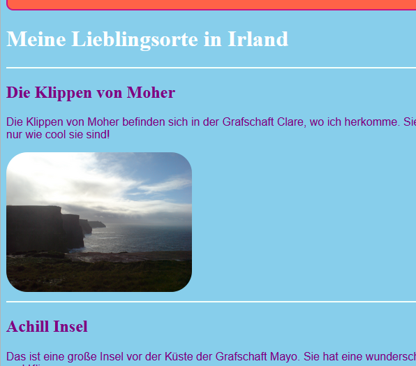
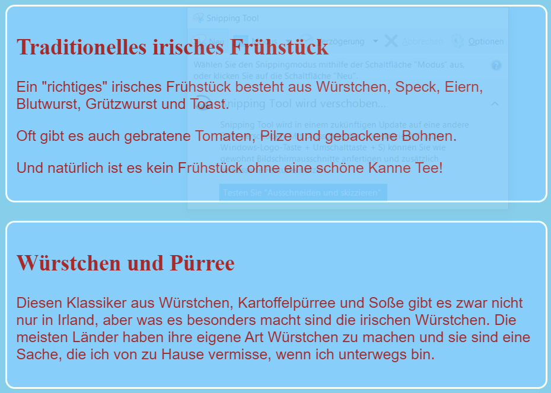
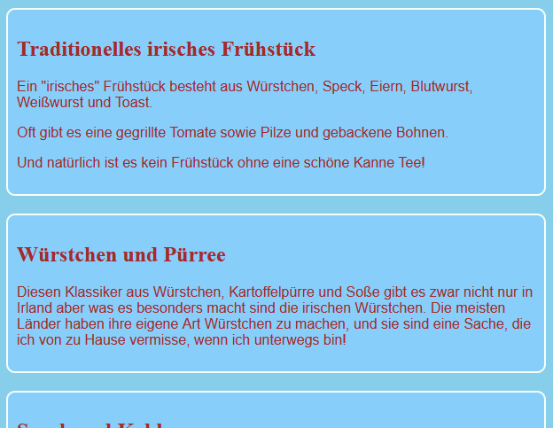
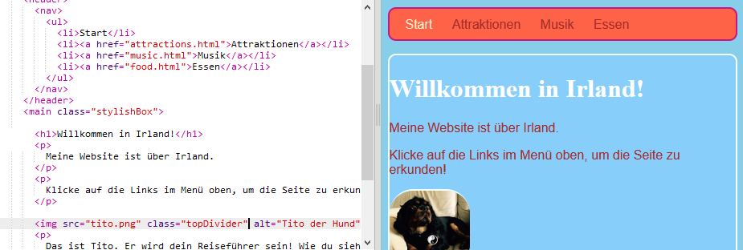

## Entwirf einige Themen

CSS-Regeln für Elemente wie `section` und `p` zu schreiben ist großartig, aber was, wenn Du willst, dass einige davon anders aussehen? Auf dieser Karte lernst Du, wie Du verschiedene Stilregeln auf Elemente desselben Typs anwendest und für jede Seite auf Deiner Website ein anderes Design-Thema erstellst!

+ Gehe zu Deiner Stylesheet-Datei und füge Folgendes hinzu - achte darauf, den Punkt voran zu stellen!

```css
  .topDivider {
    border-top-style: solid;
    border-top-width: 2px;
    border-top-color: #F5FFFA;
    padding-bottom: 10px;
  }
```

+ Gehe jetzt zu `attractions.html` (oder der HTML-Datei, an der Du arbeitest, falls Du dein eigenes Projekt verwendest) und füge das folgende **Attribut** (engl.: attribute) zu jedem `section` Tag hinzu:

```html
  <section class="topDivider">
```

Du solltest sehen, dass über jedem Abschnitt auf der Seite eine Zeile erscheint. Herzlichen Glückwunsch - Du hast gerade Deine erste **CSS Klasse** benutzt!



+ Schau Dir an, wie deine Website jetzt aussieht und vergleiche sie mit den anderen Seiten die `section` Elemente haben. Du wirst sehen, dass nur diejenigen, bei denen du das Attribut `class="topDivider"` hinzugefügt hast, die Zeile oben haben.

## \--- collapse \---

## title: Wie funktioniert das?

Denke daran, dass, wenn Du einen CSS-**Selektor** wie `section` oder `p` oder `nav ul` verwendest, die Stilregeln für **alle** Elemente dieses Typs auf Deiner Website gelten.

Mit CSS **Klassen** kannst Du den Stil von **einzelnen** Elementen ändern.

Wenn Du einen Punkt vor Deinen Selektor setzt, wird er zu einem **Klassen-Selektor**. Eine Klasse kann einen beliebigen Namen haben, es muss also nicht der Name eines HTML-Elements sein. Zum Beispiel:

```css
  .myAwesomeClass {
    /*hier kommt meine coole Stilregel */
  }
```

Um auszuwählen, für welche Elemente die Stilregeln gelten, fügst Du diesen Elementen im HTML-Code das `class` **Attribut** hinzu: Gib den Namen der Klasse als Wert für das Attribut ein, aber **ohne** den Punkt:

```html
  class="myAwesomeClass"
```

\--- /collapse \---

+ Bereit, eine andere Klasse auszuprobieren? Füge folgenden Code zur `styles.css` hinzu:

```css
  .stylishBox {
    background-color: #87CEFA;
    color: #A52A2A;
    border-style: solid;
    border-width: 2px;
    border-color: #F5FFFA;
    border-radius: 10px;
  }
```

+ Füge dann, auf einer anderen Seite Deiner Website, die Klasse zu einigen Elementen hinzu. Ich werde sie zu den `section` Elementen auf der "Essen"-Seite meiner Website hinzufügen, und zwar so: `<section class="stylishBox">`.

Es sieht toll aus, aber jetzt sind meine Abschnitte alle zusammengequetscht.



Du kannst so viele CSS-Klassen auf ein Element anwenden, wie Du möchtest. Schreibe einfach die Namen aller Klassen, die Du verwenden möchtest, in das `class` Attribut (denk dran, ohne den Punkt!), getrennt durch Leerzeichen.

+ Lass uns eine weitere CSS-Klasse erstellen, um den Abschnitten einen Randabstand (engl.: margin) und eine Füllung (engl.: padding) zu verleihen. Erstelle in der Datei `styles.css` die folgende CSS-Klasse:

```css
  .someSpacing {
    padding: 10px;
    margin-top: 20px;
  }
```

+ Füge in Deinem `html` Code die neue Klasse zu jedem der Elemente hinzu, an denen Du gearbeitet hast, wie folgt hinzu:

```html
  <section class="stylishBox someSpacing">
```



CSS-Klassen lassen Dich also **wählen**, welche Elemente gestaltet werden und sie lassen dich dieselben Stilregeln für beliebige Elemente **wiederverwenden**.

+ Gehe zu `index.html` und füge die `stylishBox` Klasse dem `main` Element oder einem anderen Element auf der Seite hinzu. Du kannst es danach wieder entfernen!

```html
    <main class="stylishBox">   
```

So sieht meine Startseite mit der CSS-Klasse aus. Ich habe auch die Klasse `topDivider` zum `img` Tag mit dem Bild von Tito hinzugefügt.



\--- challenge \---

## Herausforderung: Erstelle ein paar neue Klassen

+ Verwende CSS-**Klassen** um ein paar verschiedene Bildgrößen für Deine Webseite festzulegen, zum Beispiel `.smallPictures` und `.mediumPictures`. Entferne dann das `width` Attribut von jedem Deiner `img` Elemente und füge stattdessen die entsprechende Klasse hinzu.

\--- hints \---

\--- hint \---

So kannst Du eine CSS-Klasse erstellen, die nur die Breite eines Elements definiert:

```css
  .smallPictures {
    width: 100px;
  }
```

\--- /hint \---

\--- hint \---

Hier ist ein `img` Tag mit einem `width` Attribut:

```html
         
```

Wenn Du das `width` Attribut entfernst und stattdessen die Größe mit der CSS-Klasse steuerst, sieht das folgendermaßen aus:

```html
         
```

Mithilfe einer CSS-Klasse kannst Du die Breite aller Bilder auf einmal ändern, indem Du nur eine Codezeile in Deinem Stylesheet änderst!

\--- /hint \---

\---/hints \---

\--- /challenge \---