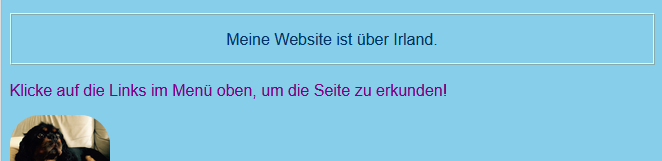
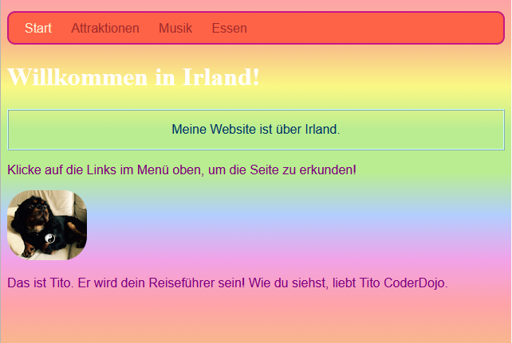

## Individueller Stil

Lass uns die Startseite ein wenig aufpeppen! Mit einer anderen Art von CSS-Selektor kannst Du einen einzelnen Satz von CSS-Regeln nur auf **ein bestimmtes Element** anwenden.

+ Gehe zur `index.html` und finde ein Absatz (`p`) Element oder füge eines hinzu, wenn Du keines hast. Füge dem Tag das folgende **Attribut** hinzu:

```html
    <p id="myCoolText">
        Meine Website ist über Irland.
    </p> 
```

Die `id` ist ein Name, den Du einem bestimmtem Element gibst um es zu **identifizieren**. Keine zwei Elemente auf einer Seite sollten je die gleiche `id` haben!

+ Gehe nun zu Deinem Stylesheet und füge den folgenden Code hinzu:

```css
    #myCoolText {
        color: #003366;
        border: 2px ridge #ccffff;
        padding: 15px;
        text-align: center;
    }
```

Dein Text sollte jetzt so aussehen:



Ein Selektor mit einer `#` davor wird verwendet, um CSS-Regeln auf ein bestimmtes Element Deiner Website anzuwenden. Du gibst das Element mit Hilfe des Namens an, den Du dem `id` Attribut des Elements zugewiesen hast.

+ Lass uns einen für den `Body` der Startseite machen. Geh zu `index.html` und füge dem `body` Tag eine `id` hinzu.

```html
    <body id="frontPage">
```

+ Füge im Stylesheet die folgenden CSS-Regeln hinzu:

```css
    #frontPage {
        background: #48D1CC;
        background: linear-gradient(#fea3aa, #f8b88b, #faf884, #baed91, #baed91, #b2cefe, #f2a2e8, #fea3aa);
    }
```

Du solltest etwas bekommen, das so aussieht:



Du hast gerade einen **Verlauf** (engl.: gradient) verwendet! Das ist der Name für den Effekt, bei dem eine Farbe in eine andere übergeht. Hinweis: Die erste `background` Eigenschaft, über der mit dem Verlauf, bestimmt eine Standardfarbe für Browser, die keine Verläufe unterstützen.

Wenn Du den Code genauso eingetippt hast und keinen schönen Regenbogeneffekt, wie oben, bekommen hast, unterstützt Dein Browser möglicherweise keine Farbverläufe.

Du kannst viele verschiedene Effekte mit Farbverläufen erstellen. Wenn Du mehr erfahren möchtest, klicke [hier](http://dojo.soy/html2-css-gradients){:target="_ blank"}.

\--- challenge \---

## Herausforderung: Mehr Elemente gestalten

+ Versuche einem anderen Element eine `id` zu geben und dieses Element, wie oben, mithilfe eines id-Selektors, mit einer `#`, zu gestalten. Wie wäre es, ein Bild mit einem `border-radius` (Rand-Radius) von `100%` zu gestalten, damit es vollständig rund ist? Alle anderen Bilder auf der Website bleiben unverändert. 

\--- hints \---

\--- hint \---

Du gibst einem Element eine `id` indem Du dem HTML-Tag das `id` Attribut hinzufügst, wie folgt:

```html
          
```

Wähle einen beliebigen Namen als `id` aus.

\--- /hint \---

\--- hint \---

Um Stilregeln für ein bestimmtes Element zu definieren, verwendest Du das `#` Symbol und den Namen, den Du dem Element als `id` gegeben hast.

```css
  #titoPicture {
    border-radius: 100%;
  }
```

Hinweis: Der Name, den Du vor den CSS-Regeln eingibst, sollte **genau** dem Namen entsprechen, den Du in das `id` Attribut des Elements eingegeben hast.

\--- /hint \---

\---/hints\---


\--- /challenge \---