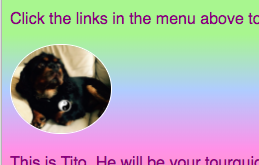

## Individueller Stil

Lass uns die Homepage ein wenig aufpeppen! Bei einer anderen Art von CSS - Selektor können Sie einen einzigartigen Satz von CSS - Regeln nur anwenden **ein bestimmtes Element**.

+ Gehe zu `index.html` und finde einen Absatz (`p`) oder füge einen hinzu, wenn du keinen hast. Fügen Sie den folgenden **Attribut** mit dem Tag:

```html
    <p id="myCoolText">
        Meine Website ist über Irland.
    </p> 
```

Die `- ID` ist ein Name , den Sie ein bestimmtes Element geben zu **identifizieren** es. Keine zwei Elemente auf einer Seite sollten die gleiche `ID`!

+ Gehen Sie nun zu Ihrem Stylesheet und fügen Sie den folgenden Code hinzu:

```css
    #myCoolText {Farbe: # 003366; Grenze: 2px Grat #ccffff; Auffüllen: 15px; Textausrichtung: Mitte; }
```

Ihr Text sollte jetzt so aussehen:


Ein Selektor mit einer `#` davor wird verwendet, um CSS-Regeln auf ein bestimmtes Element Ihrer Website anzuwenden. Sie geben das Element mit Hilfe des Namens an, dem Sie das Attribut `id` des Elements zugewiesen haben.

+ Lassen Sie uns eins für die `Körper` der Homepage machen. Gehe zu `index.html` und füge eine `ID` zum `body` -Tag hinzu.

```html
    <body id="frontPage">
```

+ Fügen Sie im Stylesheet die folgenden CSS-Regeln hinzu:

```css
    #frontPage {Hintergrund: # 48D1CC; Hintergrund: linear-gradient (# fea3aa, #f8b88b, #faf884, #baed91, #baed91, #b2cefe, #f2a2e8, #fea3aa); }
```

Du solltest etwas bekommen, das so aussieht:


Du hast gerade einen **Gradient**! Das ist der Name für den Effekt, bei dem eine Farbe in eine andere übergeht. Hinweis: Die erste `Hintergrund` Eigenschaft über dem Gradienten 1 legt eine Standardfarbe für Browser fest, die keine Gradienten unterstützen.

Wenn Sie den Code perfekt eingegeben haben und den schönen Regenbogeneffekt nicht erhalten haben, könnte es sein, dass Ihr Browser keine Farbverläufe unterstützt.

Sie können viele verschiedene Effekte mit Farbverläufen machen. Wenn Sie mehr erfahren möchten, gehen Sie [hier](http://dojo.soy/html2-css-gradients){: target = "_ blank"}.

\--- Herausforderung \---

## Herausforderung: Stil weitere Elemente

+ Versuchen Sie, einem anderen Element eine `ID` und dieses Element mit dem ID-Selektor mit einer `#` wie oben zu gestalten. Wie wäre es mit einem Bild einen `Rand-Radius` von `100%` so dass es vollständig abgerundet ist? Alle anderen Bilder auf der Website bleiben unverändert. 

\--- Hinweise \---

\--- Hinweis \---

Sie geben einem Element eine `ID` indem Sie dem HTML-Tag das `ID` Attribut hinzufügen:

```html
          
```

Wählen Sie einen beliebigen `ID` Namen.

\--- /Hinweis \---

\--- Hinweis \---

Um Stilregeln für ein bestimmtes Element zu definieren, verwenden Sie das Symbol `#` und den Namen, den Sie dem Element als seine `ID`.

```css
  #titoPicture {border-radius: 100%; }
```

Hinweis: Der Namen , den Sie geben vor den CSS - Regeln sollte **genau** Spiel den Namen , den Sie den des Elements setzt in `id` - Attribute.

\--- /Hinweis \---

\--- / Hinweise \---



\--- /Herausforderung \---