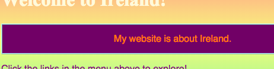

## Untersuche den Code auf anderen Websiten!

**Hinweis:** Um diesen Schritt abzuschließen, musst Du einen dieser Web-Browser verwenden: Chrome, Firefox oder Internet Explorer/Edge. Falls Du zu keinem von diesen Zugang hast, kannst Du einfach mit der nächsten Karte fortfahren.

Auf dieser Karte erfährst Du, wie Du mit dem **Inspektor-Tool** einen Blick auf den Code einer Website werfen kannst und wie Du einige Änderungen vornimmst, die nur Du sehen kannst!

+ Bevor Du beginnst, stelle sicher, dass Dein Projekt gespeichert ist. Aktualisiere dann Deine Website, indem Du in deinem Browser auf das Aktualisierungssymbol klickst.

+ Markiere auf Deiner Webseite (die tatsächliche Seite, nicht der Code), den Text mit dem Rahmen, den Du auf der vorherigen Karte hinzugefügt hast, dann klicke mit der rechten Maustaste darauf und wähle die Option **Untersuchen** aus dem erscheinenden Menü. (Je nachdem, welchen Browser Du verwendest, heißt die Option möglicherweise auch "Element untersuchen" oder ähnlich. Wenn du Probleme hast, eine Menüoption zu finden, bitte einfach jemanden in deinem Dojo um Hilfe.)


Eine neue Box wird in Deinem Webbrowser erscheinen, mit vielen Tabs und Code: die **Entwicklerwerkzeuge** oder kurz **dev tools** (vom englischen "Developer tools"). Hier kannst Du den Code für das Objekt sehen, welches Du angeklickt hast, sowie den Code für die gesamte Seite!

### Den HTML-Code Untersuchen

+ Suche nach dem Reiter, der Dir den HTML-Code für die Seite anzeigt (Er wird vermutlich "Elements" oder "Inspector" heißen). Der Code sollte ungefähr so aussehen, wie Du ihn in Deine HTML-Datei eingegeben hast! Du kannst das kleine Dreieck an der rechten Seite anklicken, um Code auszuklappen der versteckt ist.


+ Doppelklicke auf den Text zwischen den Tags. Du solltest ihn jetzt bearbeiten können! Gib irgendwas ein und drücke <kbd>Enter</kbd>.


+ Siehst Du, wie sich der Text auf deiner Website aktualisiert? Hinweis: Nur Du kannst diese Änderungen sehen.


+ Jetzt **lade** die Seite **neu** und sieh was passiert. Deine Änderungen sollten verschwinden!

+ Klicke in der linken oberen Ecke der Entwicklerwerkzeuge auf das Symbol, das wie ein kleines Rechteck mit einem Pfeil aussieht. Jetzt kannst Du den Cursor über die Webseite bewegen und der HTML-Inspektor zeigt Dir den Code an, der sie beschreibt.

 

### Den CSS-Code untersuchen

+ Schauen wir uns als nächstes den CSS-Code an. Suche nach dem **Styles** Reiter ind den Entwicklertools (Er wird vielleicht "Stilbearbeitung" oder ähnlich heißen). Du solltest eine Reihe von CSS-Regeln sehen, einschließlich derjenigen, die Du für diesen Absatz erstellt has, `#myCoolText`.


+ Klicke in den `#myCoolText` Regeln auf den Wert neben der `color` Eigenschaft. Versuche einen anderen Wert einzugeben. Beobachte, wie der Text auf Deiner Webseite sofort die Farbe ändert! 


Hinweis: Du kannst auch auf das farbige Quadrat klicken, um die Farbe mit einem Farbwähler-Werkzeug zu ändern.

+ Klicke auf den Leerraum hinter der Farbe. Eine neue Zeile beginnt, in die Du mehr CSS eingeben kannst. Gib das Folgende ein und drücke <kbd>Enter</kbd>:

```css
  background-color: #660066;
```

Du solltest sehen, dass sich der Hintergrund für diesen Text ändert.

 

## \--- collapse \---

## title: Wie funktioniert das?

Wenn Du den Website-Code mit den Entwicklertools änderst, änderst Du **vorübergehend** das Aussehen **in Deinem Browser**. Du änderst nicht wirklich die Dateien, aus denen die Website besteht.

Wenn Du die Seite neu lädst, lädst du die Website wieder aus ihren Daten (im Internet oder auf deinem Computer). Deshalb verschwinden Deine Änderungen.

Nun, da du das weißt, kannst du etwas Spaß dabei haben mit dem Code auf anderen Webseiten zu spielen!

\--- /collapse \---

+ Versuche diese Werkzeuge zu nutzen, um einen Blick auf den Code von anderen Websites zu werfen. Du kannst sogar Änderungen vornehmen, wenn Du willst! Denk daran, nur Du kannst diese Änderungen sehen, und alles wird zurückgesetzt sobald du die Seite neu lädst.