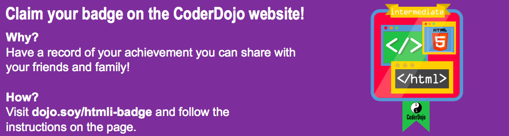

## Teach Tito to roll over!

You can make your website more **interactive** by making cool stuff happen when you hover over things with the mouse! 

- Find your CSS rules for the **img** elements, or create some if you don't have any. Add in a border, and then add a new block of rules right underneath:

```css
  img {
    border: 2px solid White;
  }
  img:hover {
    border: 2px dashed Navy;
  }
```

You've just used a special type of CSS block called a **pseudo-class**. The `:hover` bit is the **pseudo-class**. It's a bit like a **class**, but it comes built in: you can add `:hover` style rules to any **element**, **class** or **id** selector in your stylesheet without needing to add anything extra in your HTML code.

- What do you think will happen? Check what pages on your website have pictures on them \(add a picture if there aren't any!\), then move the mouse over a picture to find out!

- Let's use this new `:hover` **pseudo-class** together with a **CSS class** to make links glow when you hover over them! Add a link to your web page and include an **attribute** to specify the **class** name. Remember, links are defined using the **a** tag.

```html
    <p>
      Visit the <a class="niceLinks" href="https://en.wikipedia.org/wiki/Ireland">Wikipedia page</a> to learn even more about Ireland!
    </p>
```

- Add the following code to your stylesheet, then run your code to see your lovely links in action.

```css
  .niceLinks {
    text-decoration: none;
    color: magenta;
  }
  .niceLinks:hover {
    color: deepskyblue;
  }
```

- Why not add the **attribute** `class="niceLinks"` to all of the links in your menu bar as well?

You can combine all of these tricks with animations too! 

- Find the `#imgTito` CSS block in your stylesheet again \(if you are working with your own project you can use any picture and `id`\). Add the following code to your stylesheet file:

```css
  #imgTito {
    border-radius: 100%;
    width: 100px;
  }
  #imgTito:hover {
    animation-name: rollOver;
    animation-duration: 1s;
    animation-iteration-count: 1;
  }
  @keyframes rollOver {
    0% {
      transform: rotate(0deg);
    }
    100% {
      transform: rotate(-360deg);
    }
  }
```

- Can you guess what will happen?

- Now shout "Roll over!" as you move the mouse over the picture!

- Can you use the `glowPulse` animation from the previous card to make the `niceLinks` keep changing colours when the mouse is hovering over them? \(Hint: use a value of `infinite` for the `animation-iteration-count`\)




