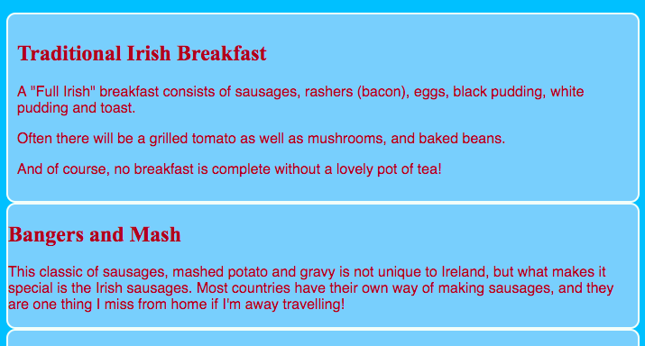
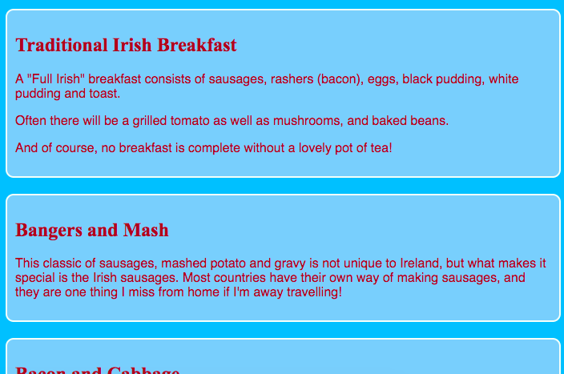
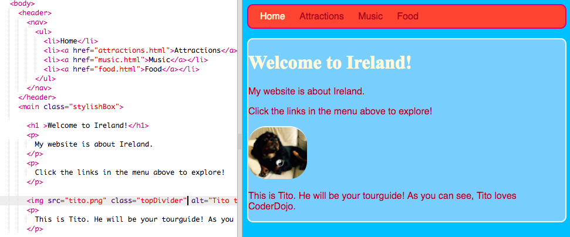

## Design some themes

Writing CSS rules for elements such as `section` and `p` is great, but what if you want to make some of them look different? On this card you will learn how to apply different sets of style rules to elements of the same type and create a different theme for each page on your website!


+ Go to your stylesheet file and add the following. Be sure to include the dot in front!
  
```css
  .topDivider {
    border-top-style: solid;
    border-top-width: 2px;
    border-top-color: #F5FFFA;
    padding-bottom: 10px;
  }
```

+ Now go to `attractions.html` \(or the page you're working on if you're using your own project\) and add the following **attribute** to each `section` tag:

```html
  <section class="topDivider">
```

You should see a line appear above each section on the page. Congratulations – you've just used your first **CSS class**!

+ Look at how your web page looks now and compare it to the other pages that have `section` elements. You'll see that only the ones where you added the attribute `class="topDivider"` will have the line on top.

--- collapse ---
---
title: How does it work?
---

Remember that when you use a CSS **selector** such as `section` or `p` or `nav ul`, the style rules apply to **all** the elements of that type on your website. That's not always what you want.

With CSS **classes** you're able to just change **some** of them. 

Putting a dot in front of your selector makes it into a **class selector**. A class can have any name, it doesn't have to be the name of a HTML element.

```css
  .myAwesomeClass {
    /* my cool style rules go here */
  }
```

You choose which elements the style rules apply to by adding the `class` **attribute** to those elements, in the HTML code. You put the name of the class in as the value for the attribute, **without** the dot, like this:

```html
  class="myAwesomeClass"
```

--- /collapse ---

--- collapse ---
---
title: Stuff to rewrite or cut out
---

The class can contain any rules you like. Sometimes you might make a bunch of CSS classes that each do only one or two things.

You can add more than one class to an element too; in fact, you can add as many CSS CSS classes to an element as you like. Just write the names of all the classes you want to use inside the `class` attribute, and separate them with spaces.

Sometimes you might make a CSS class that does only one thing. For example, you might want to easily apply the same borders to several different elements. On some of those elements, maybe you also want to make the text stand out, but not on others. In that case you would make one CSS class that defines the border styling, and another that defines the text styling. You can apply any or both of the classes to whichever elements you like on your website.

- note about using them to separate different parts of the styling? don't have to define **all** the rules for an element, just a particular set that you might want to reuse on other elements ???

--- /collapse ---

 + Ready to try another? Add the following CSS code to `styles.css`

```css
  .stylishBox {
    background-color: #FFFFCC;
    color: #A52A2A;
    border-style: solid;
    border-width: 2px;
    border-color: #F5FFFA;
    border-radius: 10px;
  }
```

+ Then, on a different page of your website, add the class to some elements there. I'm going to add it to the `section` elements on the Food page of my website, like this: `<section class="stylishBox">`

It looks great, but my sections are all squashed together.



You can apply as many CSS classes to an element as you like. Just write the names of all the classes you want to use inside the `class` attribute (remember, without the dot!), separating them with spaces.

+ Let's make another CSS class to give the sections some margin and padding. In `styles.css`, create the following CSS class:

```css
  .someSpacing {
    padding: 10px;
    margin-top: 20px;
  }
```

+ In your `html` code, add the new class to each of the elements you were working on, like this:

```html
  <section class="stylishBox someSpacing">
```



So CSS classes let you **choose** which elements to style, and **reuse** the same set of style rules on any elements you want.

+ Go to `index.html` and add the `stylishBox` class to the `main` element, or another element on the page.

```html
    <main class="stylishBox">	
```

Here's what my home page looks like now. I've also added the `topDivider` class to the `img` tag with the picture of Tito.



--- challenge ---

## Challenge: Make some new classes

+ Why not experiment with some more CSS classes to make the other pages have their own themes? You can name a CSS class anything you like. It's common to give it a name that describes what it does or what it's for!

+ As an extra challenge, use CSS **classes** to define a few different picture sizes for your website, for example `.smallPictures` and `.mediumPictures`. Then remove the `width` attribute from each of your `img` elements and add the appropriate class instead.

--- hints ---

--- hint ---

You can make a CSS class that defines just the width of an element like this:

```css
  .smallPictures {
    width: 100px;
  }
```

--- /hint ---

--- hint ---

The size of this picture is being controlled by the `width` attribute:

```html
    		
```

Here, the `width` attribute has been removed and the size is controlled by the CSS class instead:

```html
    		
```

By using a CSS class you can easily change the width of all the pictures at once just by changing one line of code your stylesheet!

--- /hint ---

--- /hints ---


--- /challenge ---
