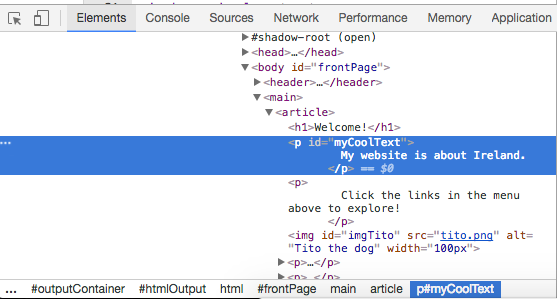
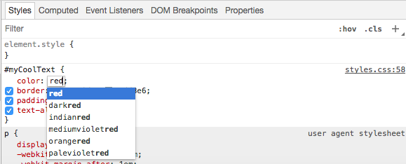

## Inspector Gadget

Here's a neat trick that will make trying out different styles quicker and easier. 

- Before you start, make sure to your project is saved. Then on your web page \(the actual page, not the code\) right click on some text and select the option **Inspect** from the menu that appears.

A whole new pane will appear in your web browser with lots of tabs and code: the **Developer Tools**, or **Dev Tools** for short. Here you can see the code for the thing you clicked on, as well as the code for the whole page!

- At the top right of this new pane, click on the three dots next to the **x** icon. In the menu that appears, look at the top item, the one that says **Dock side**. Choose the **bottom** option.

When you're familiar with the tools, you can choose to move the panel wherever you prefer.

- Press the `Esc` key on your keyboard once or twice until the Dev Tools is split into two main panels rather than a super-crowded three \(you don't need to see the Console right now\). 

The panels you will be using are **Elements** on the left and **Styles** on the right. You can drag the border in between them to change their sizes. You can also drag the top border of the Dev Tools to make it bigger or smaller. 

- In the top left corner of the Dev Tools, click the tiny square icon with the arrow. This lets you select any element on the page to see the code. 

- Click on the new text on your webpage, "This is a paragraph with its own special style!". The **HTML** code will be highlighted in the **Elements** panel of the Dev Tools. It should look pretty much the same as how you typed it in your html file!



- In the **Styles** tab on the right panel of the Dev Tools you will see the **CSS** code for the selected element. Notice how there are a few sets of CSS rules. One is the block you created specifically for that paragraph: `#myCoolText`.

Here's the fun part! 

- Click on the colour name or the HEX code next to the **color** property of `#myCoolText`. Now you can type in a different value. Try `red`. If you like you can choose one of the suggestions that appear while you type. Watch the text on your webpage change colour straight away! 



Note: You can also click the coloured square instead of the text: this lets you use a colour picker tool. 

How is this special? Surely it's the same as changing your code?! 

- To see why it's different, Refresh the page. Notice how the text went back to its original colour? 

When you change code using the Dev Tools you are **temporarily** changing what it looks like **in your browser**. You aren't actually changing the files in your website. This is handy because it means you can **test** out loads of different values and **instantly** see what they look like, **without touching your code files**.

- Click in the space after the colour. A new line starts, where you can type more CSS. Enter the following:

```css
  background-color: LightBlue;
```

- Try adding or changing some more styles, like the border. If you want to delete a style, untick the little blue box beside it, you'll see it get crossed out.

- Have a scroll through the **Elements** panel and see if you can locate other elements you recognise from your own code. They should become highlighted on your webpage as you move over the code with your mouse. When you click an element, its style rules will be shown on the right.

- Click on the tiny grey triangles to expand elements that have more code inside them.

You can use the Developer Tools to check out the code on other websites too! 

- Why not visit a few websites, right click and Inspect. See if you understand any of the code you see. You can even make temporary changes! It's not going to change the website itself: Everything you do here is **local** \(in your browser\), which means only you see it.

Remember, all these changes are **temporary**. When you reload the page, it will all reset. 


