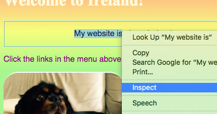
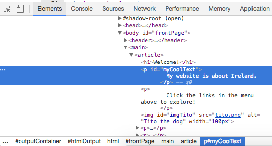
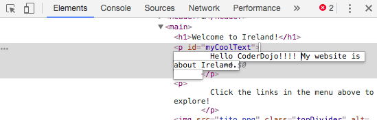

## See the code on other websites!

On this card you'll learn how to sneak a peek at the code on any website using the **Inspector tool**, and also see how you can make some changes that only you can see!

+ Before you start, make sure your project is saved. Then refresh your website by clicking the refresh icon in your browser. 

+ On your web page \(the actual page, not the code\) highlight the text with the border that you added on the previous card, then right click on it and select the option **Inspect** from the menu that appears.



A whole new box will appear in your web browser with lots of tabs and code: the **Developer Tools**, or **Dev Tools** for short. Here you can see the code for the thing you clicked on, as well as the code for the whole page!

+ Press the `Esc` key on your keyboard once or twice until the **Console** tab disappears out of the way. A mentor can help you move things around or resize the tabs if you can't see them properly.

+ Look for the **Elements** tab. It shows you the HTML code for the page. It should look pretty much the same as how you typed it in your HTML file! You can click the little triangles to expand code that is hidden.




+ Double click on the text in between the tags. You should be able to edit it now! Type something in and press enter.



+ Do you see the text update on your website?


+ Now **refresh** the page and watch what happens. Your changes should disappear!

--- collapse ---
---
title: How does it work? 
---

+ To see why it's different, Refresh the page. Notice how the text went back to its original colour? 

When you change code using the Dev Tools you are **temporarily** changing what it looks like **in your browser**. You aren't actually changing the files in the website.

You can use the Developer Tools to check out the code on other websites too! 

+ Why not visit a few websites, right click and Inspect. See if you understand any of the code you see. You can even make temporary changes! It's not going to change the website itself: Everything you do here is **local** \(in your browser\), which means only you see it.

Remember, all these changes are **temporary**. When you reload the page, it will all reset. 

--- /collapse ---

Once the Developer Tools box is open, you can more easily inspect any part of the website.

+ In the top left corner of the Dev Tools box, click the tiny square icon with the arrow. Then click on the piece of text as before, the one with the border you added.


+  Let's have a look at the CSS code for the text now. Look for the **Styles** tab in the Developer Tools box. You should see a bunch of CSS code, including the rules you created for that paragraph, `#myCoolText`.


+ Click on the colour name or the HEX code next to the **color** property of `#myCoolText`. Now you can type in a different value. Try `red`. If you like you can choose one of the suggestions that appear while you type. Watch the text on your webpage change colour straight away! 


Note: You can also click the coloured square instead of the text: this lets you use a colour picker tool. 


+ Click in the space after the colour. A new line starts, where you can type more CSS. Enter the following:

```css
  background-color: LightBlue;
```

+ Try using these tools to look at the code on another website. You can even make changes if you like! Remember, any changes you make will disappear when you refresh the page, and only will see them.


