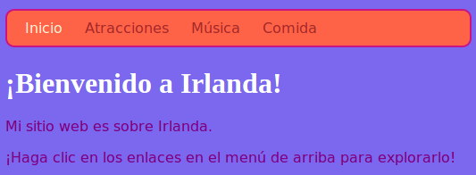

## Todos los colores!

Como ya has visto, puedes escribir muchos nombres de colores diferentes como palabras, y el navegador los reconocerá. Pero una forma más común de establecer colores es usar algo llamado **códigos hexadecimales** ('hex' es la abreviatura de **hexadecimales**, una manera especial de contar).

+ Eche un vistazo a su hoja de estilo ****. Ese es el archivo que tiene `.css` en el nombre.

+ Dentro de las reglas de CSS para `cuerpo`, establezca el color de fondo en el código hexadecimal `# 7B68EE`:

```html
  color de fondo: # 7B68EE;
```

Nota: Si está usando una Mac, puede escribir `#` presionando las teclas <kbd>alt</kbd> y <kbd>3</kbd> al mismo tiempo.

Su sitio web ahora debería tener un fondo morado.

 

+ ¿No eres fanático del morado? Vaya a [esta página web](http://dojo.soy/html2-colors){: target = "_ blank"} y elija otro color para su hoja de estilo: en lugar de escribir el nombre del color, escriba el código hexadecimal. 


Los códigos de color le permiten crear cualquier color, incluso si no está en ninguna lista de nombres de colores.

+ Intenta inventar tu propio código de color. Debe comenzar con un `#`. Esto le dice al navegador que es un código hexadecimal en lugar de un nombre de color. El resto del código está compuesto por seis caracteres. Pueden ser cualquier número de **0 a 9** y cualquier letra de **A a F**.

## \--- colapso \---

## título: ¿Cómo funciona?

Cada color se fabrica mezclando diferentes cantidades de **rojo**, **verde**y **azul**. A veces verá esto escrito como **RGB**. Cada uno de estos colores está representado por dos de los seis dígitos en su código HEX. `00` es el mínimo, y `FF` es el máximo.

**Hexadecimal** es una forma de contar que hace que los números sean más cortos para escribir utilizando las letras AF como dígitos adicionales. El número `255` está escrito como `FF` en hexadecimal. No necesita preocuparse por aprender a contar números hexadecimales. En cambio, experimente con diferentes códigos hexadecimales para acostumbrarse a usarlos.

+ Aquí hay algunos colores básicos para probar en su sitio web. Intenta poner números más pequeños en lugar de `FF` para ver cómo cambian los tonos.

|      | R  | GRAMO | segundo |   Resultado    |
| ---- | -- | ----- | ------- |:--------------:|
| \ # | FF | 00    | 00      |      rojo      |
| \ # | 00 | FF    | 00      |     Verde      |
| \ # | 00 | 00    | FF      |      Azul      |
| \ # | FF | FF    | 00      |    Amarillo    |
| \ # | FF | 00    | FF      |    Magenta     |
| \ # | 00 | FF    | FF      |      Cyan      |
| \ # | FF | 8c    | 00      | Naranja oscuro |

\--- /colapso \---

Mezclar el color perfecto puede requerir mucha experimentación. Afortunadamente, hay muchas herramientas de selección de colores en línea que lo ayudan a obtener el código hexadecimal para cualquier color que desee.


+ Pruebe [este selector de color](http://dojo.soy/html2-color-picker){: target = "_ blank"} para elegir algunos códigos de color hexadecimales para usar para el resto de los estilos en su sitio web.