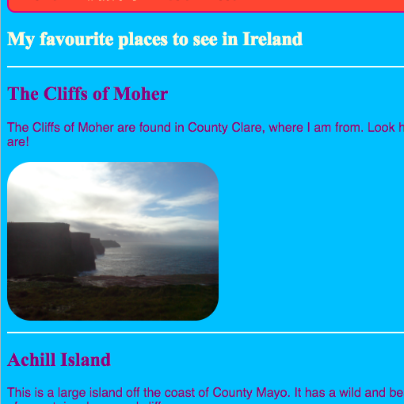
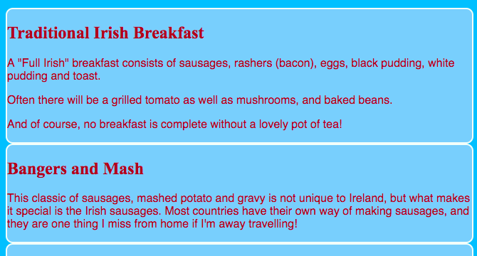

## Diseña algunos temas

Escribir reglas CSS para elementos como `sección` y `p` es genial, pero ¿qué pasa si quieres que algunas se vean diferentes de otras? En esta tarjeta, aprenderá cómo aplicar diferentes conjuntos de reglas de estilo a elementos del mismo tipo y creará un tema diferente para cada página de su sitio web.

+ Vaya a su archivo de hoja de estilos y agregue lo siguiente: ¡asegúrese de incluir el punto al frente!

```css
  .topDivider {border-top-style: sólido; border-top-width: 2px; border-top-color: # F5FFFA; fondo de relleno: 10px; }
```

+ Ahora vaya a `attractions.html` (o al archivo HTML en el que está trabajando si está utilizando su propio proyecto) y añada los siguientes **atributos** a cada etiqueta de `secciones`:

```html
  <section class="topDivider">
```

Debería ver una línea aparecer encima de cada sección en la página. Felicidades, ¡acabas de usar tu primera **CSS clase**!



+ Mira cómo se ve tu página web ahora y compárala con las otras páginas que tienen `elementos de la sección`. Verá que solo aquellos en los que agregó el atributo `class = "topDivider"` tendrán la línea en la parte superior.

## \--- colapso \---

## título: ¿Cómo funciona?

Recuerde que cuando utiliza un selector de CSS **** como `sección` o `p` o `nav ul`, las reglas de estilo se aplican a **todos los** elementos de ese tipo en su sitio web.

Con CSS **clases**, puede cambiar el estilo de solo **** elementos.

Poner un punto delante de tu selector lo convierte en un selector de clase ****. Una clase puede tener cualquier nombre, por lo que no tiene que ser el nombre de un elemento HTML. Por ejemplo:

```css
  .myAwesomeClass {/ * mis reglas de estilo genial van aquí * /}
```

Para elegir a qué elementos se aplican las reglas de estilo, agregue el atributo `class` **** a esos elementos en el código HTML: ponga el nombre de la clase como el valor para el atributo, **sin** el punto, como este:

```html
  class = "myAwesomeClass"
```

\--- /colapso \---

+ ¿Listo para probar otra clase? Agregue el siguiente código CSS a `styles.css`:

```css
  .stylishBox {background-color: # 87CEFA; color: # A52A2A; border-style: sólido; ancho del borde: 2px; color de borde: # F5FFFA; radio del borde: 10px; }
```

+ Luego, en una página diferente de su sitio web, agregue la clase a algunos elementos allí. Voy a agregarlo a los `elementos de la sección` en la página de Alimentos de mi sitio web, así: `<section class="stylishBox">`.

Se ve genial, pero ahora mis secciones están aplastadas juntas.



Puede aplicar tantas clases de CSS a un elemento como desee. Simplemente escriba los nombres de todas las clases que desea usar dentro del atributo `clase` (¡recuerde, sin el punto!), Separándolas con espacios.

+ Hagamos otra clase de CSS para dar a las secciones cierto margen y relleno. En el archivo `styles.css` , crea la siguiente clase de CSS:

```css
  .someSpacing {relleno: 10px; margen superior: 20px; }
```

+ En su código de `html` , agregue la nueva clase a cada uno de los elementos en los que estaba trabajando, como este:

```html
  <section class="stylishBox someSpacing">
```


Así que las clases de CSS le permiten **elegir** qué elementos de estilo, y le permiten **reutilizar** el mismo conjunto de reglas de estilo en cualquier elemento que desee.

+ Vaya a `index.html` y agregue la clase `elegantBox` al `elemento principal` , u otro elemento en la página. ¡Puedes eliminarlo nuevamente después!

```html
    <main class="stylishBox">   
```

Así es como se ve mi página de inicio con la clase CSS. También agregué la clase `topDivider` a la etiqueta `img` con la imagen de Tito.


\--- desafío \---

## Desafío: hacer algunas clases nuevas

+ Use CSS **clases** para definir algunos tamaños de imagen diferentes para su sitio web, por ejemplo `.smallPictures` y `.mediumPictures`. A continuación, elimine el atributo `ancho` de cada uno de los `elementos img` y agregue la clase adecuada en su lugar.

\--- consejos \---

\--- insinuación \---

Puedes hacer una clase de CSS que defina solo el ancho de un elemento como este:

```css
  .smallPictures {ancho: 100px; }
```

\--- /insinuación \---

\--- insinuación \---

Aquí hay una etiqueta `img` con un atributo `ancho`:

```html
         
```

Cuando elimina el atributo `width` y controla el tamaño con la clase CSS, se ve así:

```html
         
```

Al usar una clase CSS, puede cambiar fácilmente el ancho de todas las imágenes a la vez cambiando solo una línea de código en su hoja de estilos.

\--- /insinuación \---

\--- / consejos \---

\--- / desafío \---