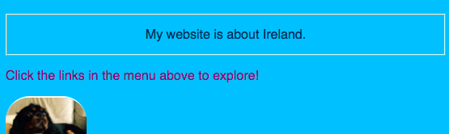

## Estilo individual

¡Vamos a animar un poco la página de inicio! Con otro tipo de selector CSS, puedes aplicar un conjunto único de reglas CSS a **un elemento específico**.

+ Ve a `index.html` y encuentra un elemento de párrafo (`p`), o añade uno si no tienes ninguno. Añade el siguiente **atributo** a la etiqueta:

```html
    <p id="myCoolText">
        Mi sitio web es sobre Irlanda.
    </p> 
```

El `id` es un nombre que le das a un elemento particular para **identificarlo**. ¡No debe haber dos elementos en una página que tengan el mismo `id`!

+ Ahora ve a tu hoja de estilos y agrega el siguiente código:

```css
    #myCoolText {
        color: #003366;
        border: 2px ridge #ccffff;
        padding: 15px;
        text-align: center;
    }
```

Tu texto debería verse así ahora:



Un selector con un `#` enfrente se usa para aplicar reglas CSS a un elemento específico en tu sitio web. Especificas el elemento con la ayuda del nombre que asignaste al atributo `id` del elemento.

+ Hagamos uno para el `body` de la página de inicio. Ve a `index.html` y añade un `id` a la etiqueta `body`.

```html
    <body id="frontPage">
```

+ En la hoja de estilos, añade las siguientes reglas de CSS:

```css
    #frontPage {
        background: #48D1CC;
        background: linear-gradient(#fea3aa, #f8b88b, #faf884, #baed91, #baed91, #b2cefe, #f2a2e8, #fea3aa);
    }
```

Deberías obtener algo que se vea así:


¡Usaste un **gradiente**! Ese es el nombre dado al efecto donde un color se desvanece en otro. Nota: La primera propiedad `background` sobre el gradiente determina un color predeterminado para los navegadores que no admiten gradientes.

Si escribiste el código a la perfección y no obtuviste el encantador efecto arco iris anterior, es posible que tu navegador no admita degradados.

Puedes crear muchos efectos diferentes con degradados. Si quieres saber más, ve [aquí](http://dojo.soy/html2-css-gradients){:target="_blank"}.

\--- challenge \---

## Desafío: diseñando algunos elementos más

+ Intenta darle a otro elemento un `id` y diseñar ese elemento usando el selector de ID con un `#` como el anterior. ¿Qué hay de hacer que una imagen tenga un `border-radius` de `100%` para que esté completamente redondeada? Cualquier otra imagen en el sitio web seguirá siendo la misma. 

\--- hints \---

\--- hint \---

Le das a un elemento un `id` agregando el atributo `id` a la etiqueta HTML, como este:

```html
          
```

Elige cualquier nombre `id` que te guste.

\--- /hint \---

\--- hint \---

Para definir reglas de estilo para un elemento específico, usa el símbolo `#` y el nombre que le diste al elemento como su `id`.

```css
  #titoPicture {
    border-radius: 100%;
  }
```

Nota: El nombre que escribas en frente de las reglas CSS deberían coincidir **exactamente** con el nombre que pusiste en el atributo `id` del elemento.

\--- /hint \---

\--- /hints \---


\--- /challenge \---