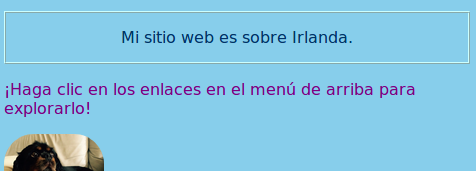
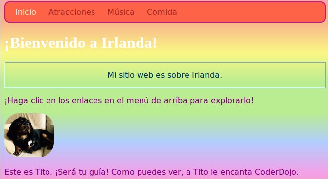
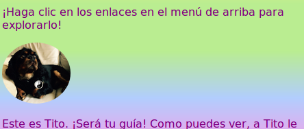

## Estilo individual

¡Vamos a animar un poco la página de inicio! Con otro tipo de selector CSS, puede aplicar un conjunto único de reglas CSS a solo **un elemento específico**.

+ Vaya a `index.html` y encuentre un elemento de párrafo (`p`), o agregue uno si no tiene ninguno. Agregue el siguiente **atributo** a la etiqueta:

```html
    <p id="myCoolText">
        Mi sitio web es sobre Irlanda.
    </p> 
```

El `id` es un nombre que le das a un elemento particular para **identificarlo**. ¡No hay dos elementos en una página que tengan el mismo `id`!

+ Ahora ve a tu hoja de estilos y agrega el siguiente código:

```css
    #myCoolText {color: # 003366; borde: cresta 2px #ccffff; relleno: 15px; text-align: center; }
```

Tu texto debería verse así ahora:



Un selector con un `#` enfrente se usa para aplicar reglas CSS a un elemento específico en su sitio web. Usted especifica el elemento con la ayuda del nombre que asignó al atributo `id` del elemento.

+ Hagamos uno para el `cuerpo` de la página de inicio. Vaya a `index.html` y agregue un `id` a la etiqueta `body`.

```html
    <body id="frontPage">
```

+ En la hoja de estilos, agregue las siguientes reglas de CSS:

```css
    #frontPage {background: # 48D1CC; fondo: gradiente lineal (# fea3aa, # f8b88b, # faf884, # baed91, # baed91, # b2cefe, # f2a2e8, # fea3aa); }
```

Deberías obtener algo que se vea así:



¡Usaste un **gradiente**! Ese es el nombre dado al efecto donde un color se desvanece en otro. Nota: La primera propiedad `background` sobre el gradiente uno determina un color predeterminado para los navegadores que no admiten gradientes.

Si escribió el código a la perfección y no obtuvo el encantador efecto arcoiris anterior, es posible que su navegador no admita degradados.

Puede hacer muchos efectos diferentes con degradados. Si quieres saber más, ve [aquí](http://dojo.soy/html2-css-gradients){: target = "_ blank"}.

\--- desafío \---

## Desafío: estilo algunos elementos más

+ Intente darle a otro elemento un `id` y diseñar ese elemento usando el selector de ID con un `#` como el anterior. ¿Qué hay de hacer que una imagen tenga un `radio de borde` de `100%` para que esté completamente redondeada? Cualquier otra imagen en el sitio web seguirá siendo la misma. 

\--- consejos \---

\--- insinuación \---

Le das a un elemento un `id` agregando el atributo `id` a la etiqueta HTML, como este:

```html
          
```

Elige cualquier nombre `id` que te guste.

\--- /insinuación \---

\--- insinuación \---

Para definir reglas de estilo para un elemento específico, usa el símbolo `#` y el nombre que le dio al elemento como su `id`.

```css
  #titoPicture {border-radius: 100%; }
```

Nota: El nombre que escriba en frente de las reglas CSS deberían **exactamente** coincide con el nombre de usted pone en el elemento `Identificación` atributo.

\--- /insinuación \---

\--- / consejos \---



\--- / desafío \---