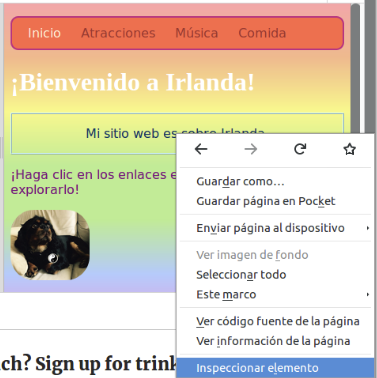
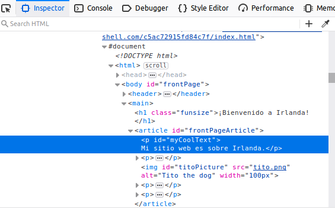
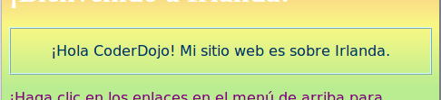
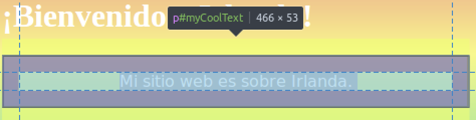
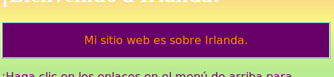

## ¡Vea el código en otros sitios web!

**Nota:** Para completar este paso, necesita usar uno de estos navegadores web: Chrome, Firefox o Internet Explorer / Edge. Si no tiene acceso a uno de ellos, puede continuar con la siguiente tarjeta.

En esta tarjeta, aprenderá cómo echarle un vistazo al código de cualquier sitio web utilizando la herramienta **inspector**, ¡y también descubrirá cómo hacer algunos cambios que solo usted puede ver!

+ Antes de comenzar, asegúrese de que su proyecto esté guardado. A continuación, actualice su sitio web haciendo clic en el ícono de actualización en su navegador.

+ En su página web (la página real, no el código), resalte el texto con el borde que agregó en la tarjeta anterior, luego haga clic con el botón derecho y seleccione la opción **Inspeccionar** en el menú que aparece. (La opción se puede llamar 'Inspeccionar Elemento' o similar, dependiendo de qué navegador esté usando. Si tiene problemas para encontrar una opción de menú, solo solicite ayuda a alguien en su Dojo).



Aparecerá un cuadro completamente nuevo en su navegador web con muchas pestañas y códigos: las **herramientas de desarrollador**, o **herramientas de desarrollo** para abreviar. ¡Aquí puede ver el código de la cosa en la que hizo clic, así como el código de toda la página!

### Inspeccionando el código HTML

+ Busque la pestaña que le muestra el código HTML de la página (podría llamarse 'Elementos' o 'Inspector'). ¡El código debería ser muy similar a como lo escribiste en tu archivo HTML! Puede hacer clic en los pequeños triángulos en el lado derecho para expandir el código que está oculto.



+ Haga doble clic en el texto entre las etiquetas. ¡Deberías poder editarlo ahora! Escriba algo y presione <kbd>Ingrese</kbd>.


+ ¿Ves la actualización de texto en tu sitio web? Nota: solo usted puede ver estos cambios.



+ Ahora **recarga** la página y mira lo que sucede. ¡Tus cambios deberían desaparecer!

+ En la esquina superior izquierda del cuadro de herramientas de desarrollo, haga clic en el icono que se parece a un pequeño rectángulo con una flecha. Ahora puede mover el cursor sobre la página web y el inspector de HTML le mostrará el código que lo describe.

 

### Inspeccionando el código CSS

+ Echemos un vistazo al código CSS a continuación. Busque la pestaña **Estilos** en las herramientas de desarrollador (podría llamarse 'Editor de Estilo' o similar). Debería ver un conjunto de reglas de CSS, incluidas las que creó para ese párrafo, `#myCoolText`.


+ En las reglas `#myCoolText` , haga clic en el valor al lado de la propiedad `color`. Intente escribir en un valor diferente. Mira el texto en tu página web ¡cambia de color de inmediato! 


Nota: también puede hacer clic en el cuadrado de color para cambiar el color con una herramienta de selección de color.

+ Haga clic en el espacio después del color. Se inicia una nueva línea, donde puede escribir más CSS. Escriba lo siguiente y presione <kbd>Ingrese</kbd>:

```css
  color de fondo: # 660066;
```

Debería ver el cambio de fondo en ese fragmento de texto.

 

## \--- colapso \---

## título: ¿Cómo funciona?

Cuando se cambia el código sitio web utilizando las herramientas de desarrollo, que son **temporalmente** cambiando lo que parece **en su navegador**. En realidad, no está cambiando los archivos que componen el sitio web.

Cuando actualiza la página, está cargando nuevamente el sitio web desde sus archivos (en Internet o en su computadora). Es por eso que tus cambios desaparecen.

¡Ahora que lo sabes, puedes divertirte jugando con el código en otros sitios web!

\--- /colapso \---

+ Intente utilizar estas herramientas para ver el código en otro sitio web. ¡Incluso puedes hacer cambios si quieres! Recuerde, solo usted puede ver los cambios que realiza, y todo se restablecerá cuando actualice la página.