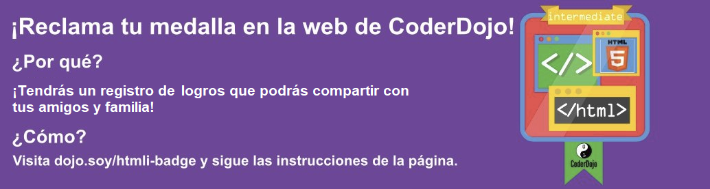

## ¡Enseña a Tito a darse la vuelta!

¡Puedes hacer tu sitio web más **interactivo** haciendo que sucedan cosas divertidas cuando desplazas objetos con el mouse!

+ Encuentra las reglas de CSS para los elementos `img`, o crea algunos si no tienes. Añade un borde y luego añade un nuevo bloque de reglas justo debajo:

```css
  img {
    border: 2px solid White;
  }
  img:hover {
    border: 2px dashed Navy;
  }
```

Acabas de utilizar un tipo especial de bloque CSS llamado **pseudo-class**.

--- collapse ---
---
title: ¿Cómo funciona?
---

Una **pseudo-clase** es un poco diferente de una **clase** que tú mismo creas. Puedes reconocerla por `:`.

Las pseudo-clases vienen integradas en elementos HTML: puedes añadir reglas de estilo `:hover` a cualquier elemento, clase o selector de `id` en tu hoja de estilos sin la necesidad de añadir nada adicional en tu código HTML.

--- /collapse ---

+ ¿Qué piensas que sucederá? Comprueba qué páginas de tu sitio web tienen imágenes (¡añade una imagen si no hay ninguna!), ¡luego mueve el cursor sobre una imagen para descubrirla!

+ ¡Usemos esta nueva pseudo-clase `:hover` junto con una clase CSS para hacer que los enlaces brillen cuando pasamos el cursor sobre ellos! Añade un enlace a tu página web e incluye un atributo para especificar el nombre de la clase. Recuerda, los enlaces se definen usando la etiqueta `<a>`, así:

```html
    <p>
      ¡Visita la página <a class="niceLinks" href="https://en.wikipedia.org/wiki/Ireland">Wikipedia</a> para aprender aún más sobre Irlanda!
    </p>
```

+ Añade el siguiente código a tu hoja de estilo, luego ejecuta tu código para ver tus encantadores enlaces en acción.

```css
  .niceLinks {
    text-decoration: none;
    color: #FFFAF0;
  }
  .niceLinks:hover {
    color: #00FF7F;
  }
```

+ ¿Por qué no añadir también el atributo `class="niceLinks"` a todos los enlaces en tu barra de menú?

¡Puedes combinar todos estos trucos con animaciones también!

+ Encuentra el bloque CSS para la imagen de Tito nuevamente (o la imagen en la que estuviste trabajando antes). Añade el siguiente código a tu archivo de hoja de estilo:

```css
  #titoPicture {
    border-radius: 100%;
    width: 100px;
  }
  #titoPicture:hover {
    animation-name: rollOver;
    animation-duration: 1s;
    animation-iteration-count: 1;
  }
  @keyframes rollOver {
    0% {
      transform: rotate(0deg);
    }
    100% {
      transform: rotate(-360deg);
    }
  }
```

+ ¿Puedes adivinar lo que sucederá?

+ ¡Ahora grita "Rueda" a medida que mueves el cursor sobre la imagen!

--- challenge ---

## Desafío: hacer enlaces de brillantes arcoíris

+ ¿Puedes usar la animación `rainbowGlow` de la tarjeta anterior para hacer que los enlaces en tu menú sigan cambiando de color cuando el cursor está sobre ellos?

--- hints ---

--- hint ---

A continuación se muestra el código para la animación `rainbowGlow`. Tiene cinco etapas definidas, y establece un color de texto diferente en cada etapa. ¡Puedes agregar más o cambiarlos como quieras!

```css
    @keyframes rainbowGlow {
        0% {
            color: #00BFFF;
        }
        25% {
            color: #00FF7F;
        }
        50% {
            color: #eeeeaf;
        }
        75% {
            color: #eeafee;
        }
        100% {
            color: #00BFFF;
        }
    }
```

--- /hint ---

--- hint ---

Para animar algo, añade las tres propiedades `animation` a tus reglas de estilo como lo hiciste anteriormente. Asegúrate siempre de que el `animation-name` coincide con el nombre de la animación que quieres usar.

--- /hint ---

--- hint ---

Puedes añadir efectos `hover` directamente al menú `nav` de esta manera:

```css
  nav ul li a:hover {
    animation-name: rainbowGlow;
    animation-duration: 1.5s;
    animation-iteration-count: infinite;
  }
```

O bien, si quieres hacer que otros enlaces de tu página web también muestren colores del arcoíris, puedes añadir la animación a la clase `.niceLinks`, así:

```css
  .niceLinks:hover {
    color: #00BFFF;
    animation-name: rainbowGlow;
    animation-duration: 1.5s;
    animation-iteration-count: infinite;
  }
```

--- /hint ---

--- /hints ---

--- /challenge ---



***

Este proyecto fue traducido por voluntarios:

Tamara Espinoza
Gabriela Aguilar Elejalde

Gracias a los voluntarios, podemos dar a las personas de todo el mundo la oportunidad de aprender en su propio idioma. Puedes ayudarnos a llegar a más personas ofreciéndote como voluntario para traducir. Más información en [rpf.io/translate](https://rpf.io/translate).