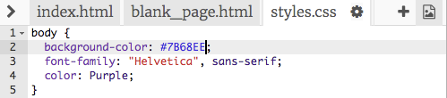

## ¡Todos los colores!

Como ya has visto, puedes escribir muchos nombres de colores diferentes como palabras, y el navegador los reconocerá. Pero una forma más común de establecer colores es usar algo llamado **códigos hexadecimales** ('hex' es la abreviatura de **hexadecimales**, una manera especial de contar).

+ Echa un vistazo a tu **hoja de estilo**. Es el archivo que tiene `.css` en el nombre.

+ Dentro de las reglas de CSS para `body`, establece el color de fondo en el código hexadecimal `#7B68EE`:

```html
  background-color: #7B68EE;
```

Nota: Si estás usando un Mac, puedes escribir `#` presionando las teclas <kbd>alt</kbd> y <kbd>3</kbd> al mismo tiempo.

Tu sitio web debería tener ahora un fondo morado.




+ ¿No eres fan del morado? Ve a [esta página web](http://dojo.soy/html2-colors){:target="_blank"} y elige otro color para tu hoja de estilo - en lugar de escribir el nombre del color, escribe el código hexadecimal. 


Los códigos de color te permiten crear cualquier color, incluso si no está en ninguna lista de nombres de colores.

+ Intenta hacer tu propio código de color. Debe comenzar con `#`. Esto le dice al navegador que es un código hexadecimal en lugar del nombre de un color. El resto del código está compuesto por seis caracteres. Pueden ser cualquier número de **0 a 9** y cualquier letra de **la A a la F**.

--- collapse ---
---
title: ¿Cómo funciona?
---

Cada color se hace mezclando diferentes cantidades de **rojo**, **verde** y **azul**. A veces verás esto escrito como **RGB**. Cada uno de estos colores está representado por dos de los seis dígitos en tu código HEX. `00` es el mínimo, y `FF` es el máximo.

**Hexadecimal** es una forma de contar que hace que los números sean más cortos para escribir utilizando las letras A-F como dígitos adicionales. El número `255` se escribe como `FF` en hexadecimal. No necesitas preocuparte por aprender a contar números hexadecimales. En cambio, experimenta con diferentes códigos hexadecimales para acostumbrarte a usarlos.

+ Aquí hay algunos colores básicos para probar en tu sitio web. Intenta poner números más pequeños en lugar de `FF` para ver cómo cambian los tonos.

|      | R  | G  | B  |   Resultado    |
| ---- | -- | -- | -- |:--------------:|
| \# | FF | 00 | 00 |      Rojo      |
| \# | 00 | FF | 00 |     Verde      |
| \# | 00 | 00 | FF |      Azul      |
| \# | FF | FF | 00 |    Amarillo    |
| \# | FF | 00 | FF |    Magenta     |
| \# | 00 | FF | FF |      Cian      |
| \# | FF | 8c | 00 | Naranja oscuro |

--- /collapse ---

Mezclar el color perfecto puede requerir mucha experimentación. Afortunadamente, en internet hay muchas herramientas de selección de colores que te ayudan a obtener el código hexadecimal para cualquier color que desees.


+ Prueba [este selector de color](http://dojo.soy/html2-color-picker){:target="_blank"} para elegir algunos códigos de color hexadecimales para usar para el resto de los estilos en tu sitio web.