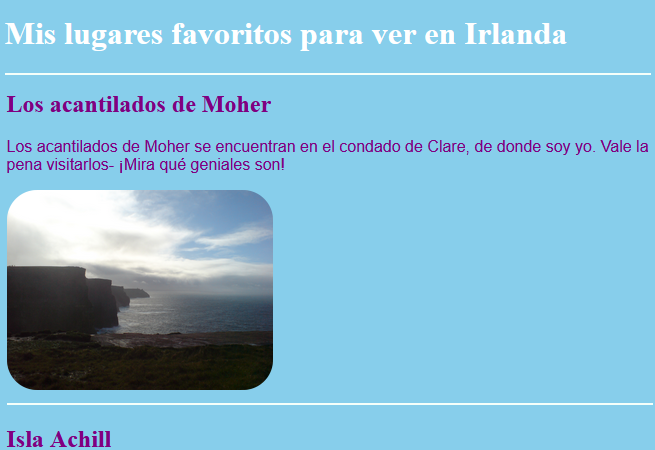
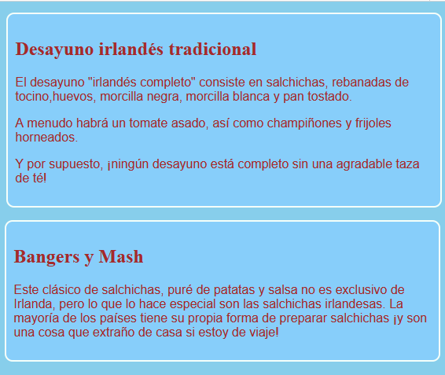
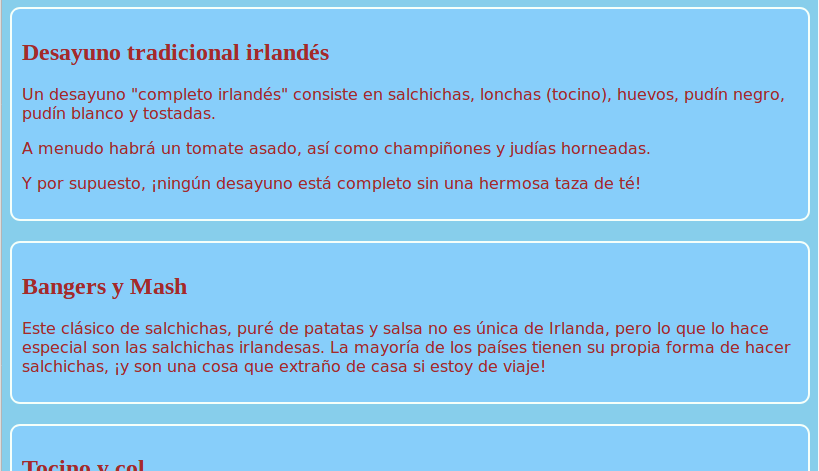
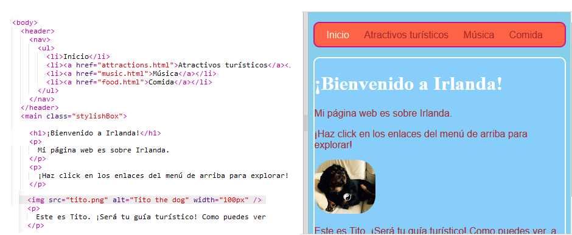

## Diseña algunos temas

Escribir reglas CSS para elementos como `section` y `p` es genial, pero ¿qué pasa si quieres que algunos se vean diferentes de otros? ¡En esta tarjeta aprenderás cómo aplicar diferentes conjuntos de reglas de estilo a elementos del mismo tipo y crearás un tema diferente para cada página de tu sitio web!

+ Ve a tu archivo de hoja de estilos y añade lo siguiente - ¡asegúrate de incluir el punto al principio!

```css
  .topDivider {
    border-top-style: solid;
    border-top-width: 2px;
    border-top-color: #F5FFFA;
    padding-bottom: 10px;
  }
```

+ Ahora ve a `attractions.html` (o al archivo HTML en el que estás trabajando si estás utilizando tu propio proyecto) y añade los siguientes **atributos** a cada etiqueta `section`:

```html
  <section class="topDivider">
```

Deberías ver una línea aparecer encima de cada sección en la página. Felicidades - ¡acabas de usar tu primera **clase de CSS**!



+ Mira cómo se ve tu página web ahora y compárala con las otras páginas que tienen elementos `section`. Verás que solo aquellos en los que añadiste el atributo `class="topDivider"` tendrán la línea en la parte superior.

--- collapse ---
---
title: ¿Cómo funciona?
---

Recuerda que cuando utilizas un **selector** de CSS como `section` o `p` o `nav ul`, las reglas de estilo se aplican a **todos** los elementos de ese tipo en tu sitio web.

Con las **clases** de CSS, solo puedes cambiar el estilo de **algunos** elementos.

Poner un punto delante de tu selector lo convierte en un **selector de clase**. Una clase puede tener cualquier nombre, por lo que no tiene que ser el nombre de un elemento HTML. Por ejemplo:

```css
  .myAwesomeClass {
    /* mis geniales reglas de estilo van aquí  */
  }
```

Para elegir a qué elementos se aplican las reglas de estilo, añade el `class` **attribute** a esos elementos en el código HTML: pon el nombre de la clase como el valor para el atributo, **sin** el punto, como este:

```html
  class="myAwesomeClass"
```

--- /collapse ---

+ ¿Listo para probar otra clase? Añade el siguiente código CSS a `styles.css`:

```css
  .stylishBox {
    background-color: #87CEFA;
    color: #A52A2A;
    border-style: solid;
    border-width: 2px;
    border-color: #F5FFFA;
    border-radius: 10px;
  }
```

+ Luego, en una página diferente de tu sitio web, añade la clase a algunos elementos. Voy a añadirlo a los elementos de `section` en la página de Alimentos de mi sitio web, así: `<section class="stylishBox">`.

Se ve genial, pero ahora mis secciones están todas aplastadas.



Puedes aplicar tantas clases de CSS a un elemento como desees. Simplemente escribe los nombres de todas las clases que deseas usar dentro del atributo `class` (¡recuerda, sin el punto!), separándolas con espacios.

+ Hagamos otra clase de CSS para dar a las secciones cierto margen y relleno. En el archivo `styles.css`, crea la siguiente clase de CSS:

```css
  .someSpacing {
    padding: 10px;
    margin-top: 20px;
  }
```

+ En tu código de `html`, añade la nueva clase a cada uno de los elementos en los que estabas trabajando, como este:

```html
  <section class="stylishBox someSpacing">
```



De esta forma las clases de CSS te permiten **elegir** a que elementos dar estilo, y te permiten **reutilizar** el mismo conjunto de reglas de estilo en cualquier elemento que desees.

+ Ve a `index.html` y añade la clase `stylishBox` al elemento `main`, o a otro elemento en la página. ¡Puedes eliminarlo nuevamente después!

```html
    <main class="stylishBox">   
```

Así es como se ve mi página de inicio con la clase CSS. También añadí la clase `topDivider` a la etiqueta `img` con la imagen de Tito.



--- challenge ---

## Desafío: hacer algunas clases nuevas

+ Usa las **clases** de CSS para definir algunos tamaños de imagen diferentes para tu sitio web, por ejemplo `.smallPictures` y `.mediumPictures`. Luego elimina el atributo `width` de cada uno de los elementos `img` y añade la clase adecuada en su lugar.

--- hints ---

--- hint ---

Puedes hacer una clase de CSS que defina solo el ancho de un elemento como este:

```css
  .smallPictures {
    width: 100px;
  }
```

--- /hint ---

--- hint ---

Aquí hay una etiqueta `img` con un atributo `width`:

```html
         
```

Cuando eliminas el atributo `width` y controlas el tamaño con la clase de CSS, se ve así:

```html
         
```

¡Al usar una clase CSS, puedes cambiar fácilmente el ancho de todas las imágenes a la vez cambiando solo una línea de código en tu hoja de estilos!

--- /hint ---

--- /hints ---

--- /challenge ---