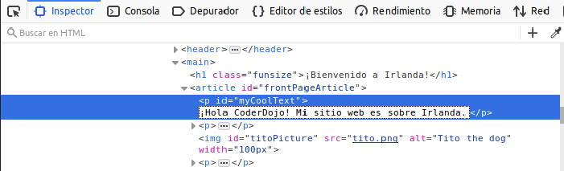

## ¡Ver el código en otros sitios web!

**Nota:** Para completar este paso, necesitas usar uno de estos navegadores web: Chrome, Firefox o Internet Explorer / Edge. Si no tienes acceso a uno de ellos, puedes continuar con la siguiente tarjeta.

En esta tarjeta, aprenderás cómo echarle un vistazo al código de cualquier sitio web utilizando la herramienta **inspector**, ¡y también descubrirás cómo hacer algunos cambios que solo tú puedes ver!

+ Antes de comenzar, asegúrate de que tu proyecto está guardado. A continuación, actualiza tu sitio web haciendo clic en el ícono de actualización en tu navegador.

+ En tu página web (la página real, no el código), resalta el texto con el borde que añadiste en la tarjeta anterior, luego haz clic con el botón derecho y selecciona la opción **Inspeccionar ** en el menú que aparece. (La opción se puede llamar 'Inspeccionar Elemento' o similar, dependiendo de qué navegador estés usando. Si tienes problemas para encontrar una opción de menú, solo pide ayuda a alguien en tu Dojo)


Aparecerá un cuadro completamente nuevo en tu navegador web con muchas pestañas y códigos: las **herramientas de desarrollador**, o **herramientas de desarrollo** para abreviar. ¡Aquí puedes ver el código de la zona en la que hiciste clic, así como el código de toda la página!

### Inspeccionando el código HTML

+ Busca la pestaña que te muestra el código HTML de la página (podría llamarse 'Elementos' o 'Inspector'). ¡El código debería ser muy similar a como lo escribiste en tu archivo HTML! Puedes hacer clic en los pequeños triángulos en el lado derecho para expandir el código que está oculto.


+ Haz doble clic en el texto entre las etiquetas. ¡Deberías poder editarlo ahora! Escribe algo y presiona <kbd>Enter</kbd>.



+ ¿Ves la actualización del texto en tu sitio web? Nota: solo tú puedes ver estos cambios.


+ Ahora **recarga** la página y mira lo que sucede. ¡Tus cambios deberían desaparecer!

+ En la esquina superior izquierda del cuadro de herramientas de desarrollo, haz clic en el icono que se parece a un pequeño rectángulo con una flecha. Ahora puedes mover el cursor sobre la página web y el inspector de HTML te mostrará el código que lo describe.

 

### Inspeccionando el código CSS

+ Echemos un vistazo al código CSS a continuación. Busca la pestaña **Estilos** en las herramientas de desarrollador (podría llamarse 'Editor de Estilo' o similar). Deberías ver un conjunto de reglas de CSS, incluidas las que creaste para ese párrafo, `#myCoolText`.


+ En las reglas `#myCoolText`, haz clic en el valor al lado de la propiedad `color`. Intenta escribir un valor diferente. Mira el texto en tu página web ¡cambia de color de inmediato! 


Nota: también puedes hacer clic en el cuadrado de color para cambiar el color con una herramienta de selección de color.

+ Haz clic en el espacio después del color. Se inicia una nueva línea, donde puedes escribir más CSS. Escribe lo siguiente y presiona <kbd>Enter</kbd>:

```css
  background-color: #660066;
```

Deberías ver el cambio de fondo en ese fragmento de texto.

 

## \--- collapse \---

## title: ¿Cómo funciona?

Cuando se cambia el código del sitio web utilizando las herramientas de desarrollo, estás cambiando **temporalmente** lo que aparece **en tu navegador**. En realidad, no estás cambiando los archivos que componen el sitio web.

Cuando actualizas la página, estás cargando nuevamente el sitio web desde sus archivos (en Internet o en tu ordenador). Es por eso que tus cambios desaparecen.

¡Ahora que lo sabes, puedes divertirte jugando con el código en otros sitios web!

\--- /collapse \---

+ Intenta utilizar estas herramientas para ver el código en otro sitio web. ¡Incluso puedes hacer cambios si quieres! Recuerda, solo tú puedes ver los cambios que realizas, y todo se restablecerá cuando actualices la página.