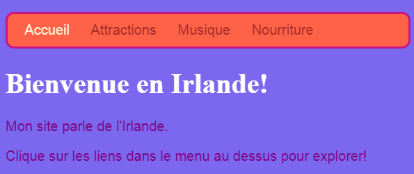

## Toutes les couleurs!

Comme tu l'as vu précédemment, tu peux saisir différents noms de couleurs sous forme de mots et le navigateur les reconnaîtra. Mais une méthode plus courante pour définir les couleurs consiste à utiliser un code appelé **codes hexadécimaux** ('hex' est l'abréviation de **hexadécimal** , une manière spéciale de compter).

+ Jette un coup d’œil à ta **feuille de style**. C'est le fichier qui a `.css` dans le nom.

+ Dans les règles CSS pour le `body`, définis la couleur d’arrière-plan sur le code hexadécimal `# 7B68EE`:

```html
  background-color: #7B68EE;
```

Note: Si tu utilises un Mac, tu peux taper `#` en appuyant sur les touches <kbd>alt</kbd> et <kbd>3</kbd> en même temps.

Ton site web devrait maintenant avoir un arrière-plan violet.

 

+ Pas fan de violet? Va sur [cette page Web](http://dojo.soy/html2-colors) {:target="_ blank"} et choisis une autre couleur pour ta feuille de style — au lieu de saisir le nom de la couleur, saisis le code hexadécimal. 


Les codes de couleur te permettent de créer n'importe quelle couleur, même si elle ne figure sur aucune liste de noms de couleurs.

+ Essaie de créer ton propre code couleur. Ça doit commencer par un `#`. Cela indique au navigateur qu'il s'agit d'un code hexadécimal au lieu d'un nom de couleur. Le reste du code est composé de six caractères. Ils peuvent être n'importe quel nombre compris entre **0 et 9** et toute lettre de **A à F**.

## \--- collapse \---

## title: Comment ça marche?

Chaque couleur est créée en mélangeant différentes quantités de **rouge** , **vert** et **bleu**. Tu le verras parfois écrit comme **RVB**. Chacune de ces couleurs est représentée par deux des six chiffres de ton code HEX. `00` est le minimum et `FF` est le maximum.

**Hexadécimal** est une façon de compter qui rend les nombres plus courts à écrire en utilisant les lettres A-F comme chiffres supplémentaires. Le nombre `255` est écrit comme `FF` en hexadécimal. Tu n'as pas à te soucier d'apprendre à compter avec des nombres hexadécimaux. Au lieu de cela, essaie différents codes hexadécimaux pour t'habituer à les utiliser.

+ Voici quelques couleurs de base pour les essayer sur ton site Web. Essaie de mettre des nombres plus petits au lieu de `FF` pour voir comment les nuances changent.

|      | R  | G  | B  |   Résultat   |
| ---- | -- | -- | -- |:------------:|
| \# | FF | 00 | 00 |    Rouge     |
| \# | 00 | FF | 00 |     Vert     |
| \# | 00 | 00 | FF |     Bleu     |
| \# | FF | FF | 00 |    Jaune     |
| \# | FF | 00 | FF |   Magenta    |
| \# | 00 | FF | FF |     Cyan     |
| \# | FF | 8c | 00 | Orange foncé |

\--- /collapse \---

Mélanger la couleur parfaite peut nécessiter beaucoup d’expérimentation. Heureusement, il existe de nombreux outils de sélection de couleurs en ligne qui t'aident à obtenir le code hexadécimal de la couleur de ton choix.


+ Essaie [ce sélecteur de couleur](http://dojo.soy/html2-color-picker) {:target="_ blank"} pour choisir des codes de couleur hexadécimaux à utiliser pour le reste des styles de ton site Web.