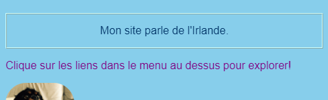
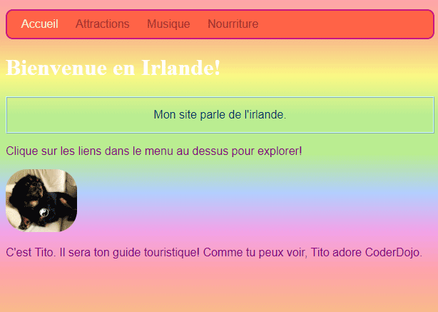
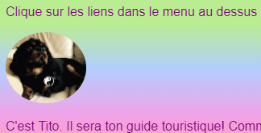

## Style individuel

Améliorons un peu la page d'accueil! Avec un autre type de sélecteur CSS, tu peux appliquer un ensemble unique de règles CSS à **un seul élément spécifique**.

+ Va sur `index.html` et trouve un paragraphe (`p`), ou en ajoute un si tu n’en as pas. Ajoute l' **attribut** suivant à la balise:

```html
    <p id="myCoolText">
        Mon site parle de l'Irlande.
    </p> 
```

L'`id` est un nom que tu attribues à un élément particulier pour l' **identifier**. Deux éléments d’une page ne doivent jamais avoir le même `id`!

+ Maintenant, va à ta feuille de style et ajoute le code suivant:

```css
    #myCoolText {
        color: #003366;
        border: 2px ridge #ccffff;
        padding: 15px;
        text-align: center;
    }
```

Ton code devrait ressembler à ceci:



Un sélecteur avec un `#` devant est utilisé pour appliquer les règles CSS à un élément spécifique de ton site Web. Tu spécifies l'élément à l'aide du nom que tu as attribué à l'attribut de `id`.

+ Faisons-en un pour le `body` de la page d'accueil. Va sur `index.html` et ajoute une balise `id` au `body`.

```html
    <body id="frontPage">
```

+ Dans la feuille de style, ajoute les règles CSS suivantes:

```css
    #frontPage {
        background: #48D1CC;
        background: linear-gradient(#fea3aa, #f8b88b, #faf884, #baed91, #baed91, #b2cefe, #f2a2e8, #fea3aa);
    }
```

Tu devrais voir quelque chose comme ça:



Tu viens d'utiliser un **gradient**! C'est le nom donné à l'effet où une couleur s'estompe dans une autre. Note: La première propriété `background` au-dessus du gradient, détermine une couleur par défaut pour les navigateurs qui ne supportent pas les dégradés.

Si tu as saisi le code à la perfection et que tu n'as pas obtenu le bel effet arc-en-ciel ci-dessus, il se peut que ton navigateur ne prenne pas en charge les dégradés.

Tu peux faire beaucoup d'effets différents avec des dégradés. Si tu veux en savoir plus, va [ici](http://dojo.soy/html2-css-gradients){:target="_blank"}.

--- challenge ---

## Défi: stylise encore plus d'éléments

+ Essaie de donner un autre élément `id` et styliser cet élément à l'aide du sélecteur d'identifiant avec un `#` comme ci-dessus. Que dirais-tu de faire en sorte qu'une photo ait un `border-radius` de `100%` pour que tout soit arrondi? Toutes les autres images sur le site Web resteront les mêmes. 

--- hints ---


--- hint ---

Tu attribues à un élément `id` en ajoutant l'attribut `id` à la balise HTML, comme ceci:

```html
          
```

Choisis n'importe quel nom `id` que tu aimes.

--- /hint ---

--- hint ---

Pour définir des règles de style pour un élément spécifique, utilise le symbole `#` et le nom que tu as attribué à l'élément en tant que son `id`.

```css
  #titoPicture {
    border-radius: 100%;
  }
```

Note: le nom que tu tapes en face des règles CSS devrait **exactement** correspondre au nom que tu as placé dans l'attribut de l'élément `id`.

--- /hint ---

--- /hints ---



--- /challenge ---