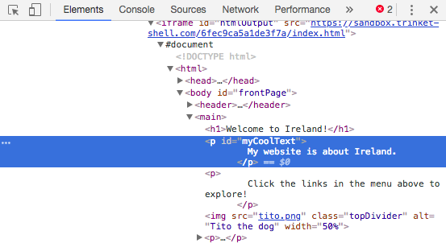

## Voir le code sur d'autres sites!

**Remarque:** Pour effectuer cette étape, vous devez utiliser l'un de ces navigateurs Web: Chrome, Firefox ou Internet Explorer / Edge. Si vous n'avez pas accès à l'un d'entre eux, vous pouvez simplement continuer sur la prochaine carte.

Sur cette carte, vous apprendrez à jeter un coup d'œil sur le code de n'importe quel site Web en utilisant l'outil **inspecteur**, et vous découvrirez également comment apporter des modifications que vous seul pouvez voir!

+ Avant de commencer, assurez-vous que votre projet est enregistré. Ensuite, actualisez votre site Web en cliquant sur l'icône d'actualisation dans votre navigateur.

+ Sur votre page Web (la page réelle, pas le code) mettez en surbrillance le texte avec la bordure que vous avez ajoutée sur la carte précédente, puis faites un clic droit dessus et sélectionnez l'option **Inspecter** dans le menu qui apparaît. (L'option peut s'appeler 'Inspecter élément' ou similaire, selon le navigateur que vous utilisez. Si vous avez des difficultés à trouver une option de menu, demandez à quelqu'un de votre Dojo de vous aider.)


Une toute nouvelle boîte apparaîtra dans votre navigateur web avec beaucoup d'onglets et de code: les **outils de développement**, ou **outils de développement** pour faire court. Ici vous pouvez voir le code de la chose sur laquelle vous avez cliqué, ainsi que le code de la page entière!

### Inspecter le code HTML

+ Recherchez l'onglet qui affiche le code HTML de la page (il peut s'appeler 'Elements' ou 'Inspector'). Le code devrait ressembler à peu près à la façon dont vous l'avez tapé dans votre fichier HTML! Vous pouvez cliquer sur les petits triangles sur le côté droit pour développer le code caché.



+ Double-cliquez sur le texte entre les balises. Vous devriez être capable de l'éditer maintenant! Tapez quelque chose dans et appuyez sur <kbd>Entrez</kbd>.


+ Voyez-vous la mise à jour du texte sur votre site Web? Remarque: vous seul pouvez voir ces changements.


+ Maintenant **reload** la page et de regarder ce qui se passe. Vos changements devraient disparaître!

+ Dans le coin supérieur gauche de la boîte à outils de développement, cliquez sur l'icône qui ressemble à un petit rectangle avec une flèche. Maintenant, vous pouvez déplacer votre curseur sur la page Web, et l'inspecteur HTML vous montrera le code qui le décrit.

 

### Inspecter le code CSS

+ Jetons un coup d'oeil au code CSS suivant. Recherchez l'onglet **Styles** dans les outils de développement (il peut s'appeler 'Éditeur de style' ou similaire). Vous devriez voir un tas de règles CSS, y compris celles que vous avez créées pour ce paragraphe, `#myCoolText`.


+ Dans les règles `#myCoolText` , cliquez sur la valeur à côté de la propriété `color`. Essayez de taper une valeur différente. Regardez le texte sur votre page web changer de couleur tout de suite! 


Remarque: vous pouvez également cliquer sur le carré coloré pour changer la couleur à l'aide d'un outil de sélection de couleur.

+ Cliquez dans l'espace après la couleur. Une nouvelle ligne commence, où vous pouvez taper plus de CSS. Tapez ce qui suit et appuyez sur <kbd>Entrez</kbd>:

```css
  couleur de fond: # 660066;
```

Vous devriez voir le changement d'arrière-plan sur ce morceau de texte.

 

## \--- effondrer \---

## title: Comment ça marche?

Lorsque vous modifiez le code de site Web en utilisant les outils de développement, vous êtes **temporairement** changer quoi il ressemble **dans votre navigateur**. Vous ne modifiez pas réellement les fichiers qui composent le site Web.

Lorsque vous actualisez la page, vous rechargez le site à partir de ses fichiers (sur Internet ou sur votre ordinateur). C'est pourquoi vos changements disparaissent.

Maintenant que vous le savez, vous pouvez vous amuser avec le code sur d'autres sites!

\--- /effondrer \---

+ Essayez d'utiliser ces outils pour regarder le code sur un autre site Web. Vous pouvez même faire des changements si vous le souhaitez! Rappelez-vous, vous seul pouvez voir les changements que vous faites, et tout sera réinitialisé lorsque vous actualisez la page.