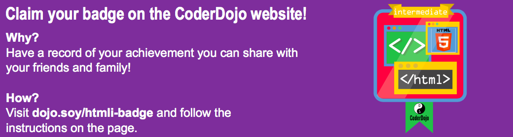

## टीटो को उलटना सिखाएं!

आप अपनी वेबसाइट को और अधिक ** इंटरैक्टिव बना सकते हैं ** जब आप माउस कर्सर के साथ चीजों पर मँडराते हैं तो सुन्दर चीजें होती हैं!

+ ` img के लिए अपने CSS नियम खोजें ` यदि आपके पास कोई नहीं है, तो कुछ बनाएं। सीमा को जोड़ें, और फिर नीचे नियमों का एक नया ब्लॉक जोड़ें:

```css
  img {
    सीमा: 2px ठोस सफेद;
  }
  img: होवर {
    बॉर्डर: 2 पीएक्सड नेवी;
}
```

आपने बस एक विशेष प्रकार के CSS ब्लॉक का उपयोग किया है जिसे ** सूडो क्लासेज कहा जाता है ** ।

## \--- collapse \---

## शीर्षक: यह कैसे काम करता है?

एक ** सूडो क्लास** ** क्लास से थोड़ा अलग है ** जो आप अपने आप बनाते हो। आप इसे ` से पहचान सकते हैं: ` ।

सूडो क्लासेज स्टाइल शीट(style sheet) HTML तत्वों में निर्मित होती हैं: आप `: होवर जोड़ सकते हैं ` किसी भी तत्व, वर्ग, या ` आईडी के लिए नियम ` अपने HTML कोड में कुछ भी अतिरिक्त जोड़ने की आवश्यकता के बिना अपनी स्टाइल शीट(style sheet) में चयनकर्ता।

\--- /collapse \---

+ आपको क्या लगता है क्या होगा? जांचें कि आपकी वेबसाइट पर कौन से पृष्ठ हैं, उन पर चित्र हैं (यदि कोई चित्र नहीं है!), तो पता लगाने के लिए अपने कर्सर को चित्र पर ले जाएं!

+ आइए इस नए `: होवर का उपयोग करें ` जब आप उन पर मंडराते हैं तो लिंक चमकाने के लिए सीएसएस क्लास के साथ सूडो क्लास! अपने वेब पेज पर एक लिंक जोड़ें और क्लास नाम निर्दिष्ट करने के लिए एक विशेषता शामिल करें। याद रखें, लिंक को `<a>` टैग का उपयोग करके परिभाषित किया गया है, जैसे:

```html
    <p>
      Visit the <a class="niceLinks" href="https://en.wikipedia.org/wiki/Ireland">Wikipedia page</a> to learn even more about Ireland!
    </p>
```

+ निम्नलिखित कोड को अपनी स्टाइल शीट में जोड़ें, फिर कार्रवाई में अपने प्यारे लिंक को देखने के लिए अपना कोड चलाएं।

```css
  .niceLinks {
    टेक्स्ट-डेकोरेशन: कोई नहीं;
    रंग: # FFFAF0;
  }
  .niceLinks: होवर {
    रंग: # 00FF7F;
}
```

+ आपके मेन्यू बार के सभी लिंक में विशेषता क्यों न जोड़ें ` वर्ग = "niceLinks" `?

आप इन सभी ट्रिक्स को एनिमेशन के साथ भी जोड़ सकते हैं!

+ फिर से टीटो की तस्वीर के लिए सीएसएस ब्लॉक ढूंढें (या जो भी तस्वीर आप पहले काम कर रहे थे)। निम्नलिखित कोड को अपने स्टाइल शीटफ़ाइल में जोड़ें

```css
  #titoPicture {
    border-radius: 100%;
    width: 100px;
  }
  #titoPicture:hover {
    animation-name: rollOver;
    animation-duration: 1s;
    animation-iteration-count: 1;
  }
  @keyframes rollOver {
    0% {
      transform: rotate(0deg);
    }
    100% {
      transform: rotate(-360deg);
    }
  }
```

+ क्या आप अनुमान लगा सकते हैं कि क्या होगा?

+ अब चिल्लाओ "रोल ओवर!" जैसा कि आप तस्वीर पर कर्सर ले जाते हैं!

\--- challenge \---

## चुनौती: चमक इंद्रधनुष लिंक बनाते हैं

+ क्या आप ` इंद्रधनुषग्लो का उपयोग कर सकते हैं ` आपके मेनू में लिंक बनाने के लिए पिछले कार्ड से एनीमेशन रंग बदलते रहते हैं जब कर्सर उनके ऊपर मंडराता है?

\--- hints \---

\--- hint \---

नीचे ` इंद्रधनुषग्लो का कोड है ` एनीमेशन। इसमें पांच चरण परिभाषित हैं, और यह प्रत्येक चरण में एक अलग पाठ रंग निर्धारित करता है। आप अधिक जोड़ सकते हैं या उन्हें बदल सकते हैं जैसा आप चाहते हैं!

```css
    @keyframes इन्द्रधनुष {
        0% {
            रंग: # 00BFFF;
        }
        25% {
            रंग: # 00FF7F;
        }
        50% {
            रंग: #eeef;
        }
        75% {
            रंग: # अल्पाहार;
        }
        100% {
            रंग: # 00BFFF;
        }
}
```

\--- /hint \---

\--- hint \---

किसी चीज़ को ऐनमट करने के लिए, आप तीन ` एनीमेशन जोड़ें ` अपनी शैली के नियमों के अनुसार जैसा कि आपने ऊपर किया है। हमेशा सुनिश्चित करें कि ` एनीमेशन-नाम ` आपके द्वारा उपयोग किए जाने वाले एनीमेशन के नाम से मेल खाता है।

\--- /hint \---

\--- hint \---

आप ` हॉवर ` प्रभाव सीधे `   मेन्यू में` जोड़ सकते हैं

```css
  nav ul li a: hover {
    एनीमेशन-नाम: इंद्रधनुषगोला;
    एनीमेशन-अवधि: 1.5 s;
    एनीमेशन-पुनरावृत्ति-गणना: अनंत;
}
```

या, यदि आप अपनी वेबसाइट के फ़्लैश इंद्रधनुष रंगों पर अन्य लिंक बनाना चाहते हैं, तो आप एनिमेशन को `.niceLinks क्लास से जोड़ सकते हैं। `

```css
  nav ul li a: hover {
    एनीमेशन-नाम: इंद्रधनुषगोला;
    एनीमेशन-अवधि: 1.5 s;
    एनीमेशन-पुनरावृत्ति-गणना: अनंत;
}
```

\--- /hint \---

\--- /hints \---

\--- /challenge \---

