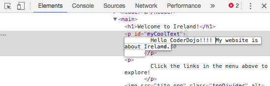
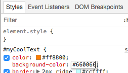

## अन्य वेबसाइटों पर कोड देखें!

** ध्यान दें: ** इस चरण को पूरा करने के लिए, आपको इनमें से किसी एक वेब ब्राउज़र का उपयोग करने की आवश्यकता है: क्रोम, फ़ायरफ़ॉक्स, या इंटरनेट एक्सप्लोरर / एज। यदि आपके पास उनमें से एक तक पहुंच नहीं है, तो आप अगले कार्ड पर जारी रख सकते हैं।

इस कार्ड पर आप सीखेंगे कि **इंस्पेक्टर टूल (inspector tool) ** का उपयोग करके किसी भी वेबसाइट के कोड में एक तिरछी नज़र कैसेडालें, और आपको यह भी पता चलेगा कि कुछ बदलाव कैसे किए जा सकते हैं जो केवल आप देख सकते हैं!

+ शुरू करने से पहले, सुनिश्चित करें कि आपने प्रोजैक्ट का काम बचा लिया है। फिर अपने ब्राउज़र में रिफ्रेश आइकन पर क्लिक करके अपनी वेबसाइट को रिफ्रेश करें।

+ अपने वेब पेज पर (वास्तविक पृष्ठ, कोड नहीं) उस पाठ को हाइलाइट करें जिसे आपने पिछले कार्ड में जोड़ा था, फिर उस पर राइट-क्लिक करें और दिखाई देने वाले मेनू से विकल्प का चयन करें **Inspect**। (आपके द्वारा उपयोग किए जा रहे ब्राउज़र के आधार पर विकल्प को 'निरीक्षण तत्व' या समान कहा जा सकता है। यदि आपको मेनू विकल्प खोजने में परेशानी हो रही है, तो बस अपने Dojo में किसी से मदद के लिए पूछें।)


आपके वेब ब्राउज़र में बहुत सारे टैब और कोड के साथ एक नया बॉक्स दिखाई देगा | संक्षेप में:**developer tools** या **dev tools**। यहां आप जिस चीज पर क्लिक करते हैं, उसके लिए कोड और साथ ही पूरे पेज के लिए कोड देख सकते हैं!

### HTML कोड का निरीक्षण

+ उस टैब को देखें जो आपको पृष्ठ के लिए HTML कोड दिखाता है (इसे 'एलिमेंट्स' या 'इंस्पेक्टर' कहा जा सकता है)। कोड को बहुत अधिक उसी तरह दिखना चाहिए जैसे आपने अपनी HTML फ़ाइल में टाइप किया था! छिपे हुए कोड का विस्तार करने के लिए आप दाईं ओर के छोटे त्रिकोणों पर क्लिक कर सकते हैं।


+ टैग के बीच में टेक्स्ट पर डबल-क्लिक करें। आपको इसे अभी संपादित करने में सक्षम होना चाहिए! कुछ टाइप करें और दबाएं <kbd>Enter</kbd> ।



+ क्या आप अपनी वेबसाइट पर टेक्स्ट अपडेट देखते हैं? नोट: केवल आप इन परिवर्तनों को देख सकते हैं।


+ अब पृष्ठ को ** पुनः लोड करें ** (reload) और देखो क्या होता है। आपके परिवर्तन गायब हो जाने चाहिए!

+ डेव टूल्स बॉक्स के ऊपरी बाएं कोने में, एक तीर के साथ एक छोटे आयत की तरह दिखने वाले आइकन पर क्लिक करें। अब आप अपने कर्सर को वेब पेज पर ले जा सकते हैं, और HTML इंस्पेक्टर आपको उसका वर्णन करने वाला कोड दिखाएगा।

 

### CSS कोड का निरीक्षण

+ चलिए आगे CSS कोड पर एक नजर डालते हैं। डेवलपर टूल में **Styles** टैब देखें (इसे 'स्टाइल एडिटर' या समान कहा जा सकता है)। आपको CSS नियमों का एक गुच्छा देखना चाहिए, जिसमें उस पैराग्राफ, `#myCoolText` के लिए बनाए गए शामिल हैं।


+ `#myCoolText` नियम में, `color` संपत्ति के बगल में मूल्य पर क्लिक करें। किसी भिन्न मान में टाइप करने का प्रयास करें। सीधे अपने वेब पेज पर पाठ का रंग परिवर्तन देखें! 


नोट: आप रंगीन पिकर टूल का उपयोग करके रंग बदलने के लिए रंगीन वर्ग पर भी क्लिक कर सकते हैं।

+ रंग के बाद खाली जगह में क्लिक करें। एक नई लाइन शुरू होती है, जहां आप अधिक CSS टाइप कर सकते हैं। निम्नलिखित टाइप करें और दबाएं <kbd>Enter</kbd>:

```css
  background-color: #660066;
```

आपको पाठ के उस टुकड़े पर पृष्ठभूमि परिवर्तन देखना चाहिए।

 

## \--- collapse \---

## title: यह कैसे काम करता है?

जब आप डेवलपर टूल का उपयोग करके वेबसाइट कोड बदलते हैं, तो आप **अस्थायी** रूप से यह आपके ब्राउज़र में ** जैसा दिखता है उसे बदल रहे** होते हैं । आप वास्तव में उन फ़ाइलों को नहीं बदल रहे हैं जो वेबसाइट बनाती हैं।

जब आप पृष्ठ को रीफ्रेश करते हैं, तो आप वेबसाइट को फिर से इसकी फाइलों (इंटरनेट या अपने कंप्यूटर पर) से लोड कर रहे हैं। इसलिए आपके परिवर्तन गायब हो जाते हैं।

अब जब आप जानते हैं कि, आप अन्य वेबसाइटों पर कोड के साथ कुछ गड़बड़ कर सकते हैं!

\--- /collapse \---

+ किसी अन्य वेबसाइट पर कोड को देखने के लिए इन उपकरणों का उपयोग करने का प्रयास करें। आप चाहें तो बदलाव भी कर सकते हैं! याद रखें, केवल आप अपने द्वारा किए गए परिवर्तनों को देख सकते हैं, और जब आप पृष्ठ को रीफ्रेश करेंगे तो सब कुछ रीसेट हो जाएगा।