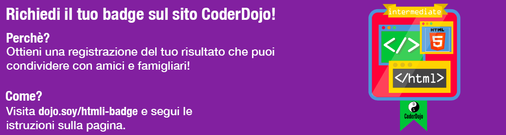

## Insegna a Tito a girarsi!

È possibile rendere il tuo sito web più **interattivo** facendo accadere cose interessanti quando si passa sopra le cose con il cursore del mouse!

+ Trova le tue regole CSS per gli elementi `img` o creane alcune se non ne hai. Aggiungi un bordo e aggiungi un nuovo blocco di regole subito sotto:

```css
  img {
    border: 2px solid White;
  }
  img:hover {
    border: 2px dashed Navy;
  }
```

Hai appena usato un tipo speciale di blocco CSS chiamato **pseudo-classe**.

## \--- collapse \---

## title: Come funziona?

Una **pseudo-classe** è un po' diversa da una **classe** che crei da solo. Puoi riconoscerla dai "due punti" (`:`).

Le pseudo-classi sono incorporate negli elementi HTML: puoi aggiungere regole di stile `:hover` a qualsiasi elemento, classe o selettore `id` nel tuo foglio di stile senza aggiungere nulla di extra nel tuo codice HTML.

\--- /collapse \---

+ Cosa pensi che succederà? Verifica quali pagine del tuo sito web contengono immagini (aggiungi una foto se non ce ne sono!), quindi sposta il cursore su un'immagine per scoprirlo!

+ Usiamo questa nuova pseudo-classe `:hover` insieme a una classe CSS per far risplendere i link quando passi il mouse su di loro! Aggiungi un link alla tua pagina web e includi un attributo per specificare il nome della classe. Ricorda, i collegamenti sono definiti usando il tag `<a>`, in questo modo:

```html
    <p>
      Visit the <a class="niceLinks" href="https://en.wikipedia.org/wiki/Ireland">Wikipedia page</a> to learn even more about Ireland!
    </p>
```

+ Aggiungi il seguente codice al tuo foglio di stile, quindi esegui il codice per vedere i tuoi adorabili link in azione.

```css
  .niceLinks {
    text-decoration: none;
    color: #FFFAF0;
  }
  .niceLinks:hover {
    color: #00FF7F;
  }
```

+ Perché non aggiungere l'attributo `class="niceLinks"` a tutti i link nella barra dei menu?

Puoi anche combinare tutti questi trucchi con le animazioni!

+ Trova di nuovo il blocco CSS per l'immagine di Tito (o qualsiasi altra immagine a cui stavi lavorando in precedenza). Aggiungi il seguente codice al tuo foglio di stile:

```css
  #titoPicture {
    border-radius: 100%;
    width: 100px;
  }
  #titoPicture:hover {
    animation-name: rollOver;
    animation-duration: 1s;
    animation-iteration-count: 1;
  }
  @keyframes rollOver {
    0% {
      transform: rotate(0deg);
    }
    100% {
      transform: rotate(-360deg);
    }
  }
```

+ Riesci a indovinare cosa accadrà?

+ Ora urla "Girati!" mentre muovi il cursore sull'immagine!

\--- challenge \---

## Sfida: crea collegamenti color arcobaleno luccicante

+ Riesci ad usare l'animazione `rainbowGlow` dalla scheda precedente per far sì che i collegamenti nel tuo menu continuino a cambiare colore quando il cursore passa sopra di loro?

\--- hints \---

\--- hint \---

Di seguito è riportato il codice per l'animazione `rainbowGlow`. Ha cinque fasi definite e imposta un diverso colore del testo in ogni fase. Puoi aggiungerne altri o cambiarli come preferisci!

```css
    @keyframes rainbowGlow {
        0% {
            color: #00BFFF;
        }
        25% {
            color: #00FF7F;
        }
        50% {
            color: #eeeeaf;
        }
        75% {
            color: #eeafee;
        }
        100% {
            color: #00BFFF;
        }
    }
```

\--- /hint \---

\--- hint \---

Per animare qualcosa, aggiungi le tre proprietà `animation` alle sue regole di stile come hai fatto sopra. Assicurati sempre che `animation-name` corrisponda al nome dell'animazione che desideri utilizzare.

\--- /hint \---

\--- hint \---

Puoi aggiungere effetti `hover` direttamente al menu `nav` come questi:

```css
  nav ul li a:hover {
    animation-name: rainbowGlow;
    animation-duration: 1.5s;
    animation-iteration-count: infinite;
  }
```

Oppure, se desideri creare altri collegamenti sul tuo sito web con i colori dell'arcobaleno, puoi aggiungere l'animazione alla classe `.niceLinks`, in questo modo:

```css
  .niceLinks:hover {
    color: #00BFFF;
    animation-name: rainbowGlow;
    animation-duration: 1.5s;
    animation-iteration-count: infinite;
  }
```

\--- /hint \---

\--- /hints \---

\--- /challenge \---

