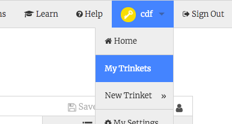

## Prepararsi

- Vai al progetto trinket iniziale su [dojo.soy/html2-website-start](http://dojo.soy/html2-website-start){: target = "_ blank"}. Gli esempi in queste Sushi Cards si basano principalmente su questo progetto.

- Se preferisci, puoi lavorare con un sito web che hai già realizzato.

## \--- chiudi \---

## titolo: ho un account su Trinket

- Fai clic sul pulsante **Remix** nell'angolo in alto a destra del progetto (se non hai effettuato l'accesso, ti verrà richiesto di farlo. Dopo aver effettuato l'accesso, sarà necessario fare nuovamente clic sul pulsante **Remix**). Questo crea una copia del progetto con cui puoi lavorare. 

Dovrebbe dire **remixato** dopo aver fatto clic su di esso:

\--- / chiudi \---

## \--- chiudi \---

## titolo: non ho un account su Trinket

Anche se non hai un account, puoi comunque lavorare con Trinket.

### Salvare il tuo lavoro

Puoi salvare il tuo lavoro utilizzando una delle opzioni nel menu **Condividi**. È possibile scaricare il progetto o ottenere un collegamento che è possibile salvare, ad esempio in un documento, o inviare tramite e-mail. **Nota**: ogni volta che apporti una modifica al progetto, otterrai un nuovo collegamento.

### Come registrarsi per un account

Se vuoi creare un account su Trinket, procedi nel seguente modo. Questo vi permetterà di accedere al tuo lavoro con facilità da qualsiasi computer, e per **remix** progetti qualcun altro ha condiviso con te (che significa salvare una copia a cui è possibile apportare modifiche).

- Nella scheda del browser con il progetto del gingillo di avviamento, fai clic su **Registrati per il tuo account gratuito**. Avrai bisogno di un indirizzo email per iscriverti.

- Inserisci il tuo indirizzo email e scegli una password, o chiedi a qualcuno di farlo per te.

- Ora puoi accedere a tutti i progetti salvati o remixati facendo clic sul tuo nome utente e andando su **My Trinkets**. 

\--- / chiudi \---