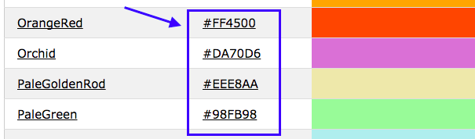

## Tutti i colori!

Come hai visto prima, puoi digitare molti nomi di colori diversi come parole e il browser li riconoscerà. Ma un modo più comune per impostare i colori è quello di usare qualcosa chiamato **codici esadecimali** (o 'codici hex': 'hex' è l'abbreviazione di **esadecimale**, un modo speciale di contare).

+ Dai uno sguardo al tuo **foglio di stile, o stylesheet**. È il file che ha `.css` nel nome.

+ All'interno delle regole CSS per `body`, imposta, come colore di sfondo (background color), il codice esadecimale `#7B68EE`:

```html
  background-color: #7B68EE;
```

Nota: se stai usando un Mac, puoi digitare `#` premendo i tasti <kbd>alt</kbd> e <kbd>3</kbd> contemporaneamente.

Il tuo sito web dovrebbe ora avere uno sfondo viola.

 

+ Non sei un fan del viola? Vai su [questa pagina web](http://dojo.soy/html2-colors){: target="_blank"} e scegli un altro colore per il tuo foglio di stile — invece di digitare il nome del colore, digita il codice esadecimale. 



I codici colore ti consentono di creare qualsiasi colore, anche se non è in nessun elenco di nomi di colori.

+ Prova a creare il tuo codice colore. Deve iniziare con `#`. Ciò indica al browser che si tratta di un codice esadecimale anziché di un nome di colore. Il resto del codice è composto da sei caratteri. Possono essere qualsiasi numero da **0 a 9** e qualsiasi lettera da **A a F**.

## \--- collapse \---

## title: Come funziona?

Ogni colore è composto mescolando diverse quantità di **rosso**, **verde** e **blu**. A volte lo vedrai scritto come **RGB**. Ognuno di questi colori è rappresentato da due delle sei cifre del codice HEX. `00` è il minimo e `FF` è il massimo.

**Esadecimale** è un modo di contare che rende i numeri più brevi da scrivere utilizzando le lettere A-F come cifre aggiuntive. Il numero `255` è scritto come `FF` in esadecimale. Non devi preoccuparti di imparare a contare con numeri esadecimali. Invece, sperimenta diversi codici esadecimali per abituarti a utilizzarli.

+ Ecco alcuni colori di base da provare sul tuo sito web. Prova a inserire numeri più piccoli invece di `FF` per vedere come cambiano le tonalità.

|      | R  | G  | B  |    Risultato    |
| ---- | -- | -- | -- |:---------------:|
| \# | FF | 00 | 00 |      Rosso      |
| \# | 00 | FF | 00 |      Verde      |
| \# | 00 | 00 | FF |       Blu       |
| \# | FF | FF | 00 |     Giallo      |
| \# | FF | 00 | FF |     Magenta     |
| \# | 00 | FF | FF |      Ciano      |
| \# | FF | 8c | 00 | Arancione scuro |

\--- /collapse \---

Mescolare il colore perfetto può richiedere un sacco di sperimentazione. Fortunatamente, ci sono molti strumenti online per la selezione del colore che ti aiutano ad ottenere il codice esadecimale per qualsiasi colore tu voglia.


+ Prova [questo selettore di colori](http://dojo.soy/html2-color-picker){:target="_blank"} per scegliere alcuni codici esadecimali da utilizzare per gli altri stili del tuo sito web.