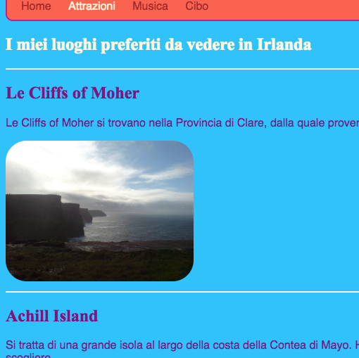
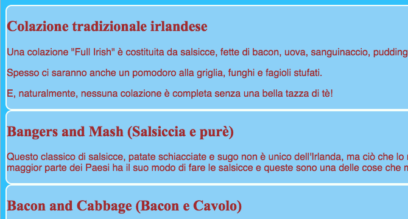
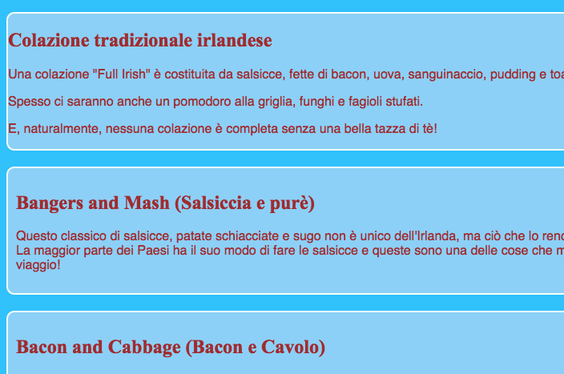
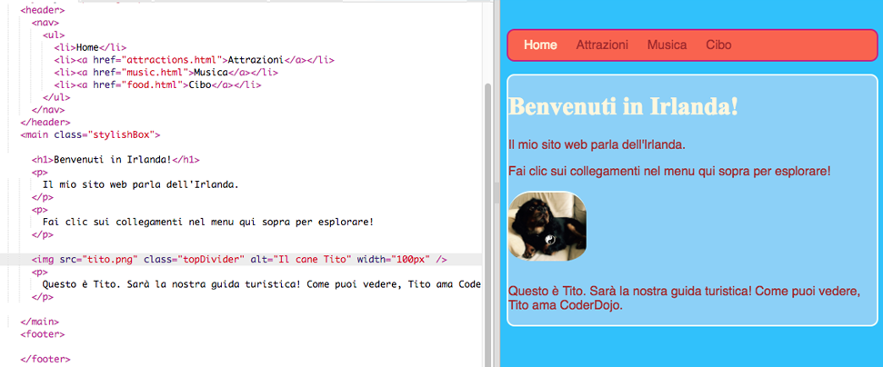

## Disegna alcuni temi

Scrivere regole CSS per elementi come `sezioni` e `p` è grandioso, ma cosa succede se si desidera che alcune di esse siano diverse dalle altre? Su questa scheda imparerai come applicare diversi set di regole di stile a elementi dello stesso tipo e creare un tema diverso per ogni pagina del tuo sito web!

+ Vai al tuo foglio di stile e aggiungi quanto segue: assicurati di includere il punto in primo piano!

```css
  .topDivider {border-top-style: solido; border-top-width: 2px; border-top-color: # F5FFFA; imbottitura-fondo: 10px; }
```

+ Ora vai a `attractions.html` (o al file HTML su cui stai lavorando se stai utilizzando il tuo progetto) e aggiungi il seguente **attributo** a ogni tag di `sezioni`:

```html
  <section class="topDivider">
```

Dovresti vedere una linea sopra ogni sezione della pagina. Congratulazioni: hai appena usato la tua prima **classe CSS**!



+ Guarda come appare la tua pagina web ora e confrontala con le altre pagine che hanno `elementi della sezione`. Vedrai che solo quelli in cui hai aggiunto l'attributo `class = "topDivider"` avrà la riga in cima.

## \--- chiudi \---

## titolo: come funziona?

Ricorda che quando usi un selettore CSS **** come `sezioni` o `p` o `nav ul`, le regole di stile si applicano a **tutti e** gli elementi di quel tipo sul tuo sito web.

Con CSS **classi**, puoi modificare lo stile di solo **alcuni** elementi.

Mettere un punto davanti al tuo selettore lo trasforma in un selettore di classe ****. Una classe può avere qualsiasi nome, quindi non deve essere il nome di un elemento HTML. Per esempio:

```css
  .myAwesomeClass {/ * le mie fantastiche regole di stile vanno qui * /}
```

Per scegliere a quali elementi si applicano le regole di stile, devi aggiungere l'attributo `classe` **** a quegli elementi nel codice HTML: inserisci il nome della classe come valore dell'attributo, **senza** il punto, in questo modo:

```html
  class = "myAwesomeClass"
```

\--- / chiudi \---

+ Pronto a provare un'altra lezione? Aggiungi il seguente codice CSS a `styles.css`:

```css
  .stylishBox {background-color: # 87CEFA; colore: # A52A2A; border-style: solido; larghezza del bordo: 2px; border-color: # F5FFFA; border-radius: 10px; }
```

+ Quindi, su una pagina diversa del tuo sito web, aggiungi la classe ad alcuni elementi presenti. Ho intenzione di aggiungerlo alla `sezione` elementi nella pagina di cibo del mio sito, in questo modo: `<section class="stylishBox">`.

Sembra fantastico, ma ora le mie sezioni sono tutte schiacciate insieme.



Puoi applicare tutte le classi CSS a un elemento a tuo piacimento. Basta scrivere i nomi di tutte le classi che vuoi usare all'interno dell'attributo `classe` (ricorda, senza il punto!), Separandole con spazi.

+ Facciamo un'altra classe CSS per dare alle sezioni un margine e un riempimento. Nel file `styles.css` , creare la seguente classe CSS:

```css
  .someSpacing {padding: 10px; margin-top: 20px; }
```

+ Nel tuo codice `html` , aggiungi la nuova classe a ciascuno degli elementi su cui stavi lavorando, in questo modo:

```html
  <section class="stylishBox someSpacing">
```



Così classi CSS consentono di **sceglie** quali elementi di stile, e ti lasciano **riutilizzo** lo stesso insieme di regole di stile su tutti gli elementi che si desidera.

+ Vai a `index.html` e aggiungi la `stylishBox` class ai `principali` , o un altro elemento nella pagina. Puoi rimuoverlo di nuovo in seguito!

```html
    <main class="stylishBox">   
```

Ecco come appare la mia home page con la classe CSS. Ho anche aggiunto la classe `topDivider` al tag `img` con l'immagine di Tito.



\--- sfida \---

## Sfida: crea nuove classi

+ Utilizza le classi CSS **** per definire alcune dimensioni di immagine diverse per il tuo sito Web, ad esempio `.smallPictures` e `.mediumPictures`. Quindi rimuovi l'attributo `larghezza` da ciascuno dei tuoi `elementi img` e aggiungi invece la classe appropriata.

\--- suggerimenti \---

\--- suggerimento \---

Puoi creare una classe CSS che definisca solo la larghezza di un elemento come questo:

```css
  .smallPictures {width: 100px; }
```

\--- / suggerimento \---

\--- suggerimento \---

Ecco un tag `img` con un attributo `width`:

```html
         
```

Quando rimuovi l'attributo `larghezza` e controlli invece la dimensione con la classe CSS, assomiglia a questo:

```html
         
```

Usando una classe CSS, puoi modificare facilmente la larghezza di tutte le immagini contemporaneamente cambiando solo una riga di codice nel tuo foglio di stile!

\--- / suggerimento \---

\--- / suggerimenti \---

\--- / challenge \---