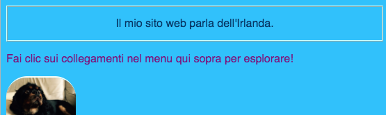
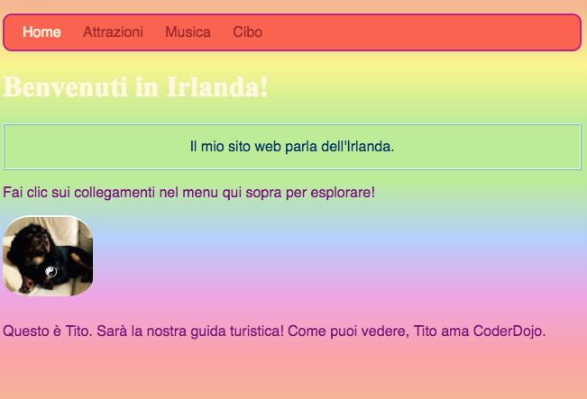
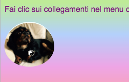

## Stile individuale

Diamo un po 'di jazz alla home page! Con un altro tipo di selettore CSS, puoi applicare un unico set di regole CSS a solo **un elemento specifico**.

+ Vai a `index.html` e trova un paragrafo (`p`) elemento, o aggiungi uno in se non ne hai. Aggiungere il seguente **attributo** al tag:

```html
    <p id="myCoolText">
        mio sito web parla dell'Irlanda.
    </p> 
```

`id` è un nome a cui attribuisci un elemento particolare **identifica** it. Nessun elemento in una pagina dovrebbe mai avere lo stesso `id`!

+ Ora vai al tuo foglio di stile e aggiungi il seguente codice:

```css
    #myCoolText {color: # 003366; border: 2px ridge #ccffff; imbottitura: 15px; allineamento del testo: centro; }
```

Il tuo testo dovrebbe apparire così ora:



Un selettore con uno `#` davanti ad esso viene utilizzato per applicare le regole CSS a un elemento specifico sul tuo sito web. Si specifica l'elemento con l'aiuto del nome assegnato dell'elemento `id` attributo.

+ Facciamo una per il `corpo` della home page. Vai a `index.html` e aggiungi un `id` al tag `body`.

```html
    <body id="frontPage">
```

+ Nel foglio di stile, aggiungi le seguenti regole CSS:

```css
    #frontPage {background: # 48D1CC; sfondo: sfumatura lineare (# fea3aa, # f8b88b, # faf884, # baed91, # baed91, # b2cefe, # f2a2e8, # fea3aa); }
```

Dovresti ottenere qualcosa che assomigli a questo:



Abbiamo appena utilizzato un **gradiente di**! Questo è il nome dato all'effetto in cui un colore si sfuma in un altro. Nota: Il primo `sfondo` di proprietà di sopra di quella sfumatura determina un colore predefinito per i browser che non supportano i gradienti.

Se hai digitato perfettamente il codice e non hai ottenuto l'effetto arcobaleno sopra, potrebbe essere che il tuo browser non supporti gradienti.

Puoi fare molti effetti diversi con i gradienti. Se vuoi saperne di più, vai [qui](http://dojo.soy/html2-css-gradients){: target = "_ blank"}.

\--- sfida \---

## Sfida: crea altri elementi

+ Prova a dare a un altro elemento un `id` e lo styling usando il selettore ID con un `#` come sopra. Che ne dite di fare una foto hanno un `border-radius` su `100%` in modo che sia completamente arrotondato? Qualsiasi altra foto sul sito web rimarrà la stessa come sono. 

\--- suggerimenti \---

\--- suggerimento \---

Dai un elemento a `id` aggiungendo l'attributo `id` al tag HTML, in questo modo:

```html
          
```

Scegli un qualsiasi `id` nome che ti piace.

\--- / suggerimento \---

\--- suggerimento \---

Per definire le regole di stile per un elemento specifico, usa il simbolo `#` e il nome che hai dato all'elemento come suo `id`.

```css
  #titoPicture {border-radius: 100%; }
```

Nota: Il nome digitato davanti alle regole CSS dovrebbero **esattamente** corrisponde al nome si mette nel dell'elemento `id` attributo.

\--- / suggerimento \---

\--- / suggerimenti \---



\--- / challenge \---