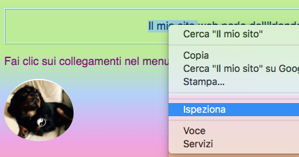
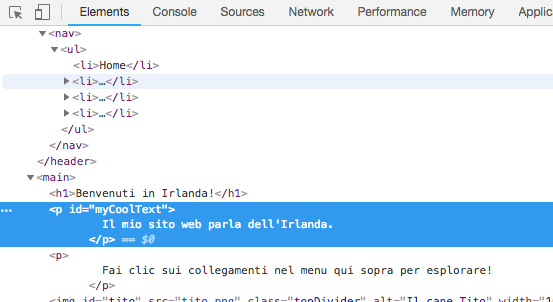
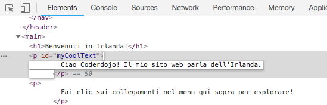
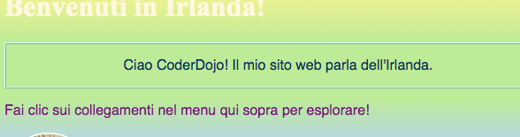
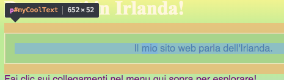
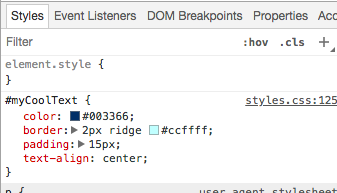
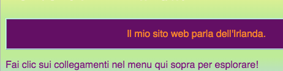

## Guarda il codice su altri siti web!

**Nota:** Per completare questo passaggio, è necessario utilizzare uno di questi browser Web: Chrome, Firefox o Internet Explorer / Edge. Se non hai accesso a uno di questi, puoi semplicemente continuare con la carta successiva.

Su questa scheda imparerai come dare una sbirciatina al codice di qualsiasi sito web usando lo strumento **inspector**e scoprirai anche come apportare alcune modifiche che solo tu puoi vedere!

+ Prima di iniziare, assicurati che il tuo progetto sia salvato. Quindi aggiorna il tuo sito Web facendo clic sull'icona Aggiorna nel browser.

+ Nella tua pagina web (la pagina attuale, non il codice) evidenzia il testo con il bordo che hai aggiunto alla scheda precedente, quindi fai clic con il tasto destro del mouse su di esso e seleziona l'opzione **Ispeziona** dal menu che appare. (L'opzione potrebbe essere chiamata 'Ispeziona elemento' o simile, a seconda del browser che stai utilizzando. Se hai difficoltà a trovare un'opzione di menu, chiedi a qualcuno al tuo Dojo di aiutarti.)



Una nuova finestra apparirà nel tuo browser web con un sacco di schede e codice: gli **strumenti di sviluppo**o **strumenti di sviluppo** in breve. Qui puoi vedere il codice per la cosa su cui hai cliccato, così come il codice per l'intera pagina!

### Ispezione del codice HTML

+ Cerca la scheda che mostra il codice HTML per la pagina (potrebbe essere chiamato "Elementi" o "Impostazioni"). Il codice dovrebbe apparire più o meno come è stato digitato nel tuo file HTML! Puoi fare clic sui piccoli triangoli sul lato destro per espandere il codice nascosto.



+ Fai doppio clic sul testo tra i tag. Dovresti essere in grado di modificarlo ora! Digitare qualcosa e premere <kbd>Inserire</kbd>.



+ Vedi l'aggiornamento del testo sul tuo sito web? Nota: solo tu puoi vedere queste modifiche.



+ Ora **ricarica** pagina e guarda cosa succede. Le tue modifiche dovrebbero scomparire!

+ Nell'angolo in alto a sinistra della casella degli strumenti dev, fai clic sull'icona che assomiglia ad un minuscolo rettangolo con una freccia. Ora puoi spostare il cursore sulla pagina web e l'ispettore HTML mostrerà il codice che lo descrive.

 

### Ispezionando il codice CSS

+ Diamo un'occhiata al codice CSS successivo. Cerca la scheda **Stili** negli strumenti di sviluppo (potrebbe essere chiamata 'Style Editor' o simile). Dovresti vedere un gruppo di regole CSS, incluse quelle che hai creato per quel paragrafo, `#myCoolText`.



+ Nelle regole `#myCoolText` , fare clic sul valore accanto alla proprietà `color`. Prova a digitare un valore diverso. Guarda il testo sulla tua pagina web cambiare subito il colore! 


Nota: puoi anche fare clic sul quadratino colorato per cambiare il colore usando uno strumento di selezione colori.

+ Fai clic nello spazio dopo il colore. Inizia una nuova riga, in cui è possibile digitare più CSS. Digitare quanto segue e premere <kbd>Inserire</kbd>:

```css
  background-color: # 660066;
```

Dovresti vedere il cambio di sfondo su quel pezzo di testo.

 

## \--- chiudi \---

## titolo: come funziona?

Quando modifichi il codice del sito web utilizzando gli strumenti per sviluppatori, sei temporaneamente **** modifica l'aspetto di **nel tuo browser**. In realtà non stai cambiando i file che compongono il sito web.

Quando si aggiorna la pagina, si sta ricaricando nuovamente il sito Web dai suoi file (su Internet o sul computer). Ecco perché le tue modifiche scompaiono.

Ora che lo sai, puoi divertirti a scherzare con il codice su altri siti web!

\--- / chiudi \---

+ Prova a utilizzare questi strumenti per guardare il codice su un altro sito web. Puoi persino apportare modifiche, se lo desideri! Ricorda, solo tu puoi vedere le modifiche che apporti e tutto verrà ripristinato quando aggiorni la pagina.