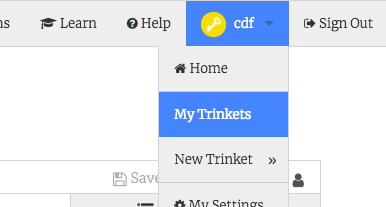

## セットアップを開始する

- [dojo.soy/html2-website-start](http://dojo.soy/html2-website-start){：target = "_ blank"}でスターター・トリンケット・プロジェクトに行きます。 これらの寿司カードの例は、主にこのプロジェクトに基づいています。

- 必要に応じて、すでに作成したWebサイトで作業することもできます。

## \---崩壊\---

## title：私はTrinketに関するアカウントを持っています

- プロジェクトの右上隅にある **リミックス** ボタンをクリックします（ログインしていない場合は、これを行うように求められます）。 ログインしたら、もう一度 **Remix** ボタンをクリックする必要があります）。 これにより、作業するプロジェクトのコピーが作成されます。 

それは言うべき **リミックス** あなたがそれをクリックした後：

\--- /崩壊\---

## \---崩壊\---

## title：私はTrinketのアカウントを持っていません

あなたがアカウントを持っていなくても、あなたはまだTrinketで働くことができます。

### あなたの仕事を保存する

**Share** メニューのオプションのいずれかを使用して作業を保存できます。 プロジェクトをダウンロードするか、ドキュメントなどに保存したり、電子メールで送信したりすることができます。 **注**：プロジェクトを変更するたびに、新しいリンクが表示されます。

### アカウントにサインアップする方法

Trinketでアカウントを作成する場合は、以下の手順に従ってください。 これにより、どのコンピュータからでも簡単に作業にアクセスでき、他の誰かがあなたと共有している</strong> プロジェクトをリミックスして **にすることができます（変更を加えることができるコピーを保存することを意味します）。
 

- スターター小物プロジェクトとブラウザのタブで、クリックしてください **あなたの無料アカウントにサインアップ**。 登録するにはメールアドレスが必要です。

- あなたのメールアドレスを入力し、パスワードを選択するか、誰かにあなたのためにこれをするように頼んでください。

- ユーザー名をクリックして **My Trinkets**移動して、保存済みまたはリミックスされたすべてのプロジェクトにアクセスできるようになりました。 

\--- /崩壊\---