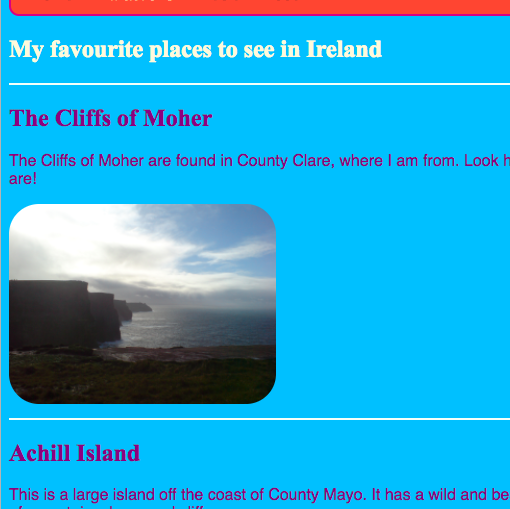

## いくつかのテーマをデザインする

`section`や`p`のような要素に対してCSSルールを書くのは素晴らしいことですが、それらのいくつかを他とは違ったものにしたい場合はどうすればよいのでしょう。 このカードでは、同じタイプの要素に異なるスタイルルールのセットを適用し、Webサイト上の各ページに異なるテーマを作成する方法を学習します。

+ スタイルシートファイルに移動し、次の行を追加します。必ず、先頭にドットを追加してください。

```css
  .topDivider {
    border-top-style: solid;
    border-top-width: 2px;
    border-top-color: #F5FFFA;
    padding-bottom: 10px;
  }
```

+ 次に、`attractive.html`(独自のプロジェクトを使用している場合は作業中のHTMLファイル)に移動し、各`section`タグに次の**属性**を追加します。

```html
  <section class="topDivider">
```

ページの各セクションの上に線が表示されます。 おめでとうございます。初めて**CSSクラス**を使いました!



+ Webページの外観を確認し、`section`要素を持つ他のページと比較します。 属性`class="topDivider"`を追加した行のみが一番上に表示されます。

## \--- collapse \---

## title:どのように動作するのか?

`section`、`p`、`nav ul`などのCSS**セレクタ**を使用する場合、スタイル・ルールはWebサイト上のそのタイプの**すべての**要素に適用されます。

CSSの**class**では、要素の**いくつか**だけのスタイルを変更することができます。

セレクタの前にドットを置くと、そのセレクタは**class セレクタ**になります。 クラスには任意の名前を付けることができるで、HTML要素の名前である必要はありません。 例:

```css
  .myAwesomeClass {
    /* my cool style rules go here */
  }
```

スタイル・ルールを適用するエレメントを選択するには、HTMLコード内のエレメントに`class`**attribute**を追加します。次のように、ドットを**付けず**に、クラスの名前を属性の値として入力します。

```html
  class="myAwesomeClass"
```

\--- /collapse \---

+ 別のクラスを試す準備はできていますか? 次のCSSコードを`styles.css`に追加します。

```css
  .stylishBox {
    background-color: #87CEFA;
    color: #A52A2A;
    border-style: solid;
    border-width: 2px;
    border-color: #F5FFFA;
    border-radius: 10px;
  }
```

+ 次に、Webサイトの別のページで、その要素にクラスを追加します。 WebサイトのFoodページの`section`要素に、次のように追加します。`<section class="stylishBox">`

いいですね、でも今は全部つぶれてしまいました。


要素には、必要な数のCSSクラスを適用できます。 `class`属性の中に、使用するすべてのクラスの名前をスペースで区切って入力します(ドットは付けないでください)。

+ セクションにマージンとパディングを与えるために、別のCSSクラスを作成しましょう。 `styles.css`ファイルで、次のCSSクラスを作成します。

```css
  .someSpacing {
    padding: 10px;
    margin-top: 20px;
  }
```

+ `html`コードで、作業していた各要素に次のように新しいクラスを追加します。

```html
  <section class="stylishBox someSpacing">
```


そのため、CSSクラスを使用すると、スタイルを設定する要素を**選択**できます。また、CSSクラスを使用すると、任意の要素に対して同じスタイル・ルールのセットを**再利用**できます。

+ `index.html`に移動し、`main`要素またはページ上の別の要素に`stylishBox`クラスを追加します。 後でまた外してもOK!

```html
    <main class="stylishBox">   
```

CSSクラスを使用した場合のホーム・ページは次のようになります。 また、`img`タグにティートの画像と共に`topDivider`クラスを追加しました。


\--- challenge \---

## Challenge: いくつかの新しいクラスを作成する

+ CSS**クラス**を使用して、Webサイトの画像サイズをいくつか定義します。たとえば、`.smallPictures`や`.mediumPictures`などです。 次に、各`img`要素から`width`属性を削除し、代わりに適切なクラスを追加します。

\--- hints \---

\--- hint \---

次のように、要素の幅だけを定義するCSSクラスを作成できます。

```css
  .smallPictures {
    width: 100px;
  }
```

\--- /hint \---

\--- hint \---

`width`属性を持つ`img`タグを以下に示します。

```html
         
```

`width`属性を削除し、代わりにCSSクラスでサイズを制御すると、次のようになります。

```html
         
```

CSSクラスを使用すると、スタイルシートの1行のコードを変更するだけで、すべての画像の幅を一度に簡単に変更できます。

\--- /hint \---

\--- /hints \---

\--- /challenge \---