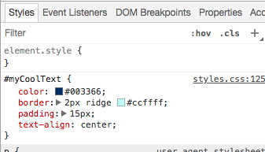

## 他のウェブサイトのコードを見てください！

**注：** この手順を完了するには、Chrome、Firefox、またはInternet Explorer / EdgeのいずれかのWebブラウザーを使用する必要があります。 そのうちの1つにアクセスできない場合は、次のカードに進むことができます。

このカードでは、 **インスペクタツール**を使用して、どのウェブサイトのコードを覗いてみるかを学び、あなただけが見ることができるいくつかの変更を行う方法も学びます！

+ 開始する前に、プロジェクトが保存されていることを確認してください。 ブラウザの更新アイコンをクリックしてウェブサイトをリフレッシュします。

+ Webページ（コードではなく実際のページ）で、前のカードに追加した枠線でテキストを強調表示し、右クリックして、表示されるメニューからオプション **Inspect** を選択します。 （このオプションは、使用しているブラウザに応じて、 'Inspect Element'などと呼ばれることがあります。 メニューオプションを見つけるのが難しい場合は、Dojoの誰かに助けを求めるだけです）。

![強調表示されたテキストの[検査]オプションの選択](images/highlightTextAndInspect.png)

あなたのウェブブラウザには、タブとコードがたくさんある新しいボックスが表示されます： **開発者ツール**、または **つの開発者ツール** です。 ここでは、クリックしたもののコードと、ページ全体のコードが表示されます。

### HTMLコードの検査

+ ページのHTMLコードを示すタブ（「Elements」または「Inspector」と呼ばれることがあります）を探します。 コードはHTMLファイルに入力したのと同じように見えるはずです。 右側の小さな三角形をクリックすると、非表示のコードが展開されます。

+ タグ間のテキストをダブルクリックします。 今すぐ編集できるはずです！ 何かを入力して <kbd>を押し<kbd></kbd>入力します。</li> </ul> 
    
    

      
    

    
    <ul>
      <li>
        あなたのウェブサイトでテキストの更新が見えますか？ 注：これらの変更はあなただけが見ることができます。
      </li>
    </ul>
    
    

      
    

    
    <ul>
      <li>
        

          今 <strong>リロード</strong> ページと何が起こるかを監視します。 あなたの変更は消えるはずです！
        

      </li>
      <li>
        

          devツールボックスの左上隅に、小さな四角形の矢印が付いたアイコンをクリックします。 これで、カーソルをWebページに移動すると、HTMLインスペクタでコードを説明するコードが表示されます。
        

      </li>
    </ul>
    
    

       
    

    
    <h3>
      CSSコードの検査
    </h3>
    
    <ul>
      <li>
        次にCSSコードを見てみましょう。 探し <strong>スタイル</strong> 開発ツールのタブ（それはスタイルエディタ」または類似したと呼ばれるかもしれません）。 あなたは、その段落のために作成したCSS規則を含めて、CSS規則の束を見るべきです <code>#myCoolText</code>。
      </li>
    </ul>
    
    

      
    

    
    <ul>
      <li>
        <code>#myCoolText</code> ルールで、 <code>色</code> プロパティの隣の値をクリックします。 別の値を入力してみてください。 あなたのウェブページ上のテキストを見てすぐに色を変更してください！
      </li>
    </ul>
    
    

      
    

    
    

      注：カラーピッカーツールを使用して、色付きの四角形をクリックして色を変更することもできます。
    

    
    <ul>
      <li>
        色の後のスペースをクリックします。 新しい行が始まります。ここで、より多くのCSSを入力できます。 次のように入力し、 <kbd>を押し<kbd></kbd>：</li> </ul> 
        
        <pre><code class="css">  背景色：＃660066;
</code></pre>
        
        

          そのテキストの背景の変更が表示されます。
        

        
        

           
        

        
        <h2>
          ---崩壊---
        </h2>
        
        <h2>
          タイトル：どのように機能するのですか？
        </h2>
        
        

          あなたが開発者ツールを使用して、ウェブサイトのコードを変更すると、あなたは <strong>一時</strong> 、それがどのように見えるかを変更する <strong>ブラウザで</strong>。 あなたは実際にウェブサイトを構成するファイルを変更していません。
        

        
        

          ページを更新すると、そのファイル（インターネットまたはコンピュータ上）から再度Webサイトをロードしています。 それがあなたの変化が消えていく理由です。
        

        
        

          今すぐ知っている、あなたは他のウェブサイト上のコードを混乱させるいくつかの楽しみを持つことができます！
        

        
        

          --- /崩壊---
        

        
        <ul>
          <li>
            これらのツールを使用して、別のWebサイトのコードを確認してみてください。 あなたは好きなだけ変更することもできます！ 変更した内容はあなただけが見ることができ、ページを更新するとすべてがリセットされることを覚えておいてください。
          </li>
        </ul>