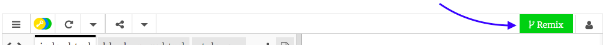

## ಹೊಂದಿಸಲಾಗುತ್ತಿದೆ

- [dojo.soy/html2-website-start](http://dojo.soy/html2-website-start){:target="_blank"} ನಲ್ಲಿ starter trinket ಯೋಜನೆಗೆ ಹೋಗಿ. ಈ ಸುಶಿ ಕಾರ್ಡ್(sushi card) ‌ಗಳಲ್ಲಿನ ಉದಾಹರಣೆಗಳು ಮುಖ್ಯವಾಗಿ ಈ ಯೋಜನೆಯನ್ನು ಆಧರಿಸಿವೆ.

- ನೀವು ಬಯಸಿದರೆ, ನೀವು ಈಗಾಗಲೇ ಮಾಡಿದ ವೆಬ್‌ಸೈಟ್‌ನೊಂದಿಗೆ ನೀವು ಕೆಲಸ ಮಾಡಬಹುದು.

## \--- collapse \---

## title: Trinket ‌ನಲ್ಲಿ ನನ್ನ ಖಾತೆ ಇದೆ

- ಯೋಜನೆಯ ಮೇಲಿನ ಬಲಮೂಲೆಯಲ್ಲಿರುವ **Remix** ಬಟನ್ ಮೇಲೆ ಕ್ಲಿಕ್ ಮಾಡಿ(ನೀವು sign in ಆಗದಿದ್ದಲ್ಲಿ, ಹಾಗೆ ಮಾಡಲು ನಿಮ್ಮನ್ನು ಕೇಳಲಾಗುತ್ತದೆ. ನೀವು sign in ಮಾಡಿದ ನಂತರ, ನೀವು ಮತ್ತೆ **Remix** ಬಟನ್ ಕ್ಲಿಕ್ ಮಾಡಬೇಕಾಗುತ್ತದೆ). ಇದು ನಿಮ್ಮೊಂದಿಗೆ ಕೆಲಸ ಮಾಡಲು ಯೋಜನೆಯ ನಕಲನ್ನು ರಚಿಸುತ್ತದೆ. 

ನೀವು ಅದನ್ನು ಕ್ಲಿಕ್ ಮಾಡಿದ ನಂತರ ಅದು **Remixed** ಎಂದು ಹೇಳಬೇಕು:

\--- /collapse \---

## \--- collapse \---

## title: Trinket ‌ನಲ್ಲಿ ನನ್ನ ಖಾತೆ ಇಲ್ಲ

ನಿಮಗೆ ಖಾತೆ ಇಲ್ಲದಿದ್ದರೂ ಸಹ, ನೀವು ಇನ್ನೂ Trinket ‌ನೊಂದಿಗೆ ಕೆಲಸ ಮಾಡಬಹುದು.

### ನಿಮ್ಮ ಕೆಲಸವನ್ನು ಸೇವ್ ಮಾಡಲಾಗುತ್ತಿದೆ

**Share** ಮೆನುವಿನಲ್ಲಿರುವ ಆಯ್ಕೆಗಳಲ್ಲಿ ಒಂದನ್ನು ಬಳಸಿಕೊಂಡು ನಿಮ್ಮ ಕೆಲಸವನ್ನು ನೀವು ಉಳಿಸಬಹುದು. ನೀವು ಯೋಜನೆಯನ್ನು ಡೌನ್‌ಲೋಡ್ ಮಾಡಬಹುದು ಅಥವಾ ನೀವು ಸೇವ್ ಮಾಡಬಹುದಾದ ಲಿಂಕ್ ಅನ್ನು ಪಡೆಯಬಹುದು, ಉದಾಹರಣೆಗೆ ಡಾಕ್ಯುಮೆಂಟ್‌(document), ಅಥವಾ ಇಮೇಲ್ ಮೂಲಕ ಕಳುಹಿಸಬಹುದು. **ಗಮನಿಸಿ**: ಪ್ರತಿ ಬಾರಿ ನೀವು ಯೋಜನೆಯಲ್ಲಿ ಬದಲಾವಣೆ ಮಾಡಿದಾಗ, ನೀವು ಹೊಸ ಲಿಂಕ್ ಅನ್ನು ಪಡೆಯುತ್ತೀರಿ.

### ಒಂದು ಖಾತೆಗೆ ಸೈನ್ ಅಪ್(sign up) ಮಾಡುವುದು ಹೇಗೆ

ನೀವು Trinker ‌ನಲ್ಲಿ ಖಾತೆಯನ್ನು ರಚಿಸಲು ಬಯಸಿದರೆ, ಕೆಳಗಿನ ಹಂತಗಳನ್ನು ಅನುಸರಿಸಿ. ಇದು ಯಾವುದೇ ಕಂಪ್ಯೂಟರ್‌ನಿಂದ ನಿಮ್ಮ ಕೆಲಸವನ್ನು ಸುಲಭವಾಗಿ ಪ್ರವೇಶಿಸಲು ಮತ್ತು ಬೇರೊಬ್ಬರು ನಿಮ್ಮೊಂದಿಗೆ ಹಂಚಿಕೊಂಡಿರುವ **remix** ಯೋಜನೆಗಳಿಗೆ ಅನುಮತಿಸುತ್ತದೆ.(ಇದರರ್ಥ ನೀವು ಬದಲಾವಣೆಗಳನ್ನು ಮಾಡಬಹುದಾದ ನಕಲನ್ನು ಉಳಿಸಿ).

- starter trinket ಯೋಜನೆಯೊಂದಿಗೆ ಬ್ರೌಸರ್ ಟ್ಯಾಬ್ ನಲ್ಲಿ, **Sign Up For Your Free Account** ಮೇಲೆ ಕ್ಲಿಕ್ ಮಾಡಿ. ಸೈನ್ ಅಪ್ ಮಾಡಲು ನಿಮಗೆ ಇಮೇಲ್ ವಿಳಾಸದ ಅಗತ್ಯವಿದೆ.

- ನಿಮ್ಮ ಇಮೇಲ್ ವಿಳಾಸವನ್ನು ನಮೂದಿಸಿ ಮತ್ತು ಪಾಸ್‌ವರ್ಡ್ ಆಯ್ಕೆ ಮಾಡಿ, ಅಥವಾ ನಿಮಗಾಗಿ ಇದನ್ನು ಮಾಡಲು ಯಾರನ್ನಾದರೂ ಕೇಳಿ.

- ನಿಮ್ಮ username ಕ್ಲಿಕ್ ಮಾಡುವ ಮೂಲಕ ಮತ್ತು **My Trinkets** ಗೆ ಹೋಗುವ ಮೂಲಕ ನೀವು ಈಗ ನಿಮ್ಮ ಉಳಿಸಿದ ಅಥವಾ ರೀಮಿಕ್ಸ್ ಮಾಡಿದ ಎಲ್ಲಾ ಯೋಜನೆಗಳನ್ನು ಪ್ರವೇಶಿಸಬಹುದು. 

\--- /collapse \---