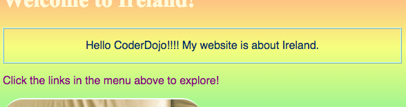

## ಇತರ ವೆಬ್‌ಸೈಟ್‌ಗಳಲ್ಲಿ ಕೋಡ್ ನೋಡಿ!

**ಗಮನಿಸಿ:** ಈ ಹಂತವನ್ನು ಪೂರ್ಣಗೊಳಿಸಲು, ನೀವು ಈ ವೆಬ್ ಬ್ರೌಸರ್‌ಗಳಲ್ಲಿ ಒಂದನ್ನು ಬಳಸಬೇಕಾಗುತ್ತದೆ: ಕ್ರೋಮ್(chrome), ಫೈರ್‌ಫಾಕ್ಸ್(Firefox) ಅಥವಾ ಇಂಟರ್ನೆಟ್ ಎಕ್ಸ್‌ಪ್ಲೋರರ್(internet explorer) / ಎಡ್ಜ್(Edge). ಅವುಗಳಲ್ಲಿ ಒಂದಕ್ಕೆ ನಿಮಗೆ ಪ್ರವೇಶವಿಲ್ಲದಿದ್ದರೆ, ನೀವು ಮುಂದಿನ ಕಾರ್ಡ್‌ಗೆ ಮುಂದುವರಿಯಬಹುದು.

**inspector** ಉಪಕರಣವನ್ನು ಬಳಸಿಕೊಂಡು ಯಾವುದೇ ವೆಬ್‌ಸೈಟ್‌ನ ಕೋಡ್‌ನಲ್ಲಿ ಇಣುಕಿ ನೋಡುವುದು ಹೇಗೆ ಎಂದು ಈ ಕಾರ್ಡ್‌ನಲ್ಲಿ ನೀವು ಕಲಿಯುವಿರಿ, ಮತ್ತು ನೀವು ಮಾತ್ರ ನೋಡಬಹುದಾದ ಕೆಲವು ಬದಲಾವಣೆಗಳನ್ನು ಹೇಗೆ ಮಾಡಬೇಕೆಂದು ಸಹ ನೀವು ಕಂಡುಕೊಳ್ಳುವಿರಿ!

+ ನೀವು ಪ್ರಾರಂಭಿಸುವ ಮೊದಲು, ನಿಮ್ಮ ಯೋಜನೆಯನ್ನು ಸೇವ್(save) ಮಾಡಲಾಗಿದೆಯೇ ಎಂಬುದನ್ನು ಖಚಿತಪಡಿಸಿಕೊಳ್ಳಿ. ನಿಮ್ಮ ಬ್ರೌಸರ್‌ನಲ್ಲಿ refresh ಐಕಾನ್(icon) ಕ್ಲಿಕ್ ಮಾಡುವ ಮೂಲಕ ನಿಮ್ಮ ವೆಬ್‌ಸೈಟ್ ಅನ್ನು ರಿಫ್ರೆಶ್ ಮಾಡಿ.

+ ನಿಮ್ಮ ವೆಬ್ ಪುಟದಲ್ಲಿ (ನಿಜವಾದ ಪುಟ, ಕೋಡ್ ಅಲ್ಲ) ಹಿಂದಿನ ಕಾರ್ಡ್‌ನಲ್ಲಿ ನೀವು ಸೇರಿಸಿದ ಗಡಿಯೊಂದಿಗೆ ಪಠ್ಯವನ್ನು ಹೈಲೈಟ್ ಮಾಡಿ, ನಂತರ ಕಾಣಿಸಿಕೊಳ್ಳುವ ಮೆನುವಿನಿಂದ ಅದರ ಮೇಲೆ ಬಲ ಕ್ಲಿಕ್ ಮಾಡಿ ಮತ್ತು **inspect** ಆಯ್ಕೆಯನ್ನು ಆರಿಸಿ. (ನೀವು ಯಾವ ಬ್ರೌಸರ್ ಅನ್ನು ಬಳಸುತ್ತಿರುವಿರಿ ಎಂಬುದರ ಆಧಾರದ ಮೇಲೆ ಆಯ್ಕೆಯನ್ನು 'Inspect Element' ಅಥವಾ ಅಂತಹುದೇ ಎಂದು ಕರೆಯಬಹುದು. ಮೆನು ಆಯ್ಕೆಯನ್ನು ಕಂಡುಹಿಡಿಯುವಲ್ಲಿ ನಿಮಗೆ ತೊಂದರೆ ಇದ್ದರೆ, ಸಹಾಯಕ್ಕಾಗಿ ನಿಮ್ಮ Dojo ದಲ್ಲಿ ಯಾರನ್ನಾದರೂ ಕೇಳಿ.)


ನಿಮ್ಮ ವೆಬ್ ಬ್ರೌಸರ್‌ನಲ್ಲಿ ಸಾಕಷ್ಟು ಹೊಸ ಟ್ಯಾಬ್‌ಗಳು ಮತ್ತು ಕೋಡ್‌ಗಳೊಂದಿಗೆ ಸಂಪೂರ್ಣ ಹೊಸ ಬಾಕ್ಸ್ ಕಾಣಿಸುತ್ತದೆ: ಸಂಕ್ಷಿಪ್ತವಾಗಿ **developer tools**, ಅಥವಾ **dev tools**. ಇಲ್ಲಿ ನೀವು ಕ್ಲಿಕ್ ಮಾಡಿದ ವಿಷಯದ ಕೋಡ್ ಮತ್ತು ಇಡೀ ಪುಟದ ಕೋಡ್ ಅನ್ನು ನೀವು ನೋಡಬಹುದು!

### HTML ಕೋಡ್ ಪರಿಶೀಲಿಸಲಾಗುತ್ತಿದೆ

+ ಪುಟಕ್ಕಾಗಿ HTML ಕೋಡ್ ಅನ್ನು ನಿಮಗೆ ತೋರಿಸುವ ಟ್ಯಾಬ್‌ಗಾಗಿ ನೋಡಿ (ಇದನ್ನು 'Elements' ಅಥವಾ 'Inspector' ಎಂದು ಕರೆಯಬಹುದು). ನಿಮ್ಮ HTML ಫೈಲ್‌ನಲ್ಲಿ ನೀವು ಅದನ್ನು ಹೇಗೆ ಟೈಪ್ ಮಾಡಿದ್ದೀರಿ ಎಂಬುದರಂತೆಯೇ ಕೋಡ್ ಬಹುಮಟ್ಟಿಗೆ ಕಾಣುತ್ತದೆ! ಮರೆಮಾಡಲಾಗಿರುವ ಕೋಡ್ ಅನ್ನು ವಿಸ್ತರಿಸಲು ನೀವು ಬಲಭಾಗದಲ್ಲಿರುವ ಸಣ್ಣ ತ್ರಿಕೋನಗಳನ್ನು ಕ್ಲಿಕ್ ಮಾಡಬಹುದು.


+ ಟ್ಯಾಗ್‌ಗಳ ನಡುವಿನ ಪಠ್ಯದ ಮೇಲೆ ಡಬಲ್ ಕ್ಲಿಕ್ ಮಾಡಿ. ನೀವು ಈಗ ಅದನ್ನು ಸಂಪಾದಿಸಲು ಸಾಧ್ಯವಾಗಬೇಕು! ಏನನ್ನಾದರೂ ಟೈಪ್ ಮಾಡಿ ಮತ್ತು <kbd>Enter</kbd> ಒತ್ತಿರಿ.


+ ನಿಮ್ಮ ವೆಬ್‌ಸೈಟ್‌ನಲ್ಲಿ ಪಠ್ಯ ನವೀಕರಣವನ್ನು ನೀವು ನೋಡುತ್ತೀರಾ? ಗಮನಿಸಿ: ನೀವು ಮಾತ್ರ ಈ ಬದಲಾವಣೆಗಳನ್ನು ನೋಡಬಹುದು.



+ ಈಗ **reload** ಮಾಡಿ ಮತ್ತು ಪುಟ ಮತ್ತು ಏನಾಗುತ್ತದೆ ನೋಡಿ. ನಿಮ್ಮ ಬದಲಾವಣೆಗಳು ಕಣ್ಮರೆಯಾಗಬೇಕು!

+ dev tools ಪೆಟ್ಟಿಗೆಯ ಮೇಲಿನ ಎಡ ಮೂಲೆಯಲ್ಲಿ, ಬಾಣದೊಂದಿಗೆ ಸಣ್ಣ ಆಯತದಂತೆ ಕಾಣುವ ಐಕಾನ್ ಕ್ಲಿಕ್ ಮಾಡಿ. ಈಗ ನೀವು ನಿಮ್ಮ ಕರ್ಸರ್ ಅನ್ನು ವೆಬ್ ಪುಟದ ಮೂಲಕ ಚಲಿಸಬಹುದು, ಮತ್ತು ಅದನ್ನು ವಿವರಿಸುವ ಕೋಡ್ ಅನ್ನು HTML inspector ನಿಮಗೆ ತೋರಿಸುತ್ತದೆ.

 

### CSS ಕೋಡ್ ಪರಿಶೀಲಿಸಲಾಗುತ್ತಿದೆ

+ ಮುಂದಿನ CSS ಕೋಡ್ ಅನ್ನು ನೋಡೋಣ. developer tools ನಲ್ಲಿ **Styles** ಟ್ಯಾಬ್ ಗಾಗಿ ನೋಡಿ (ಇದನ್ನು 'Style Editor' ಅಥವಾ ಅಂತಹುದೇ ಎಂದು ಕರೆಯಬಹುದು). ಆ ವಾಕ್ಯಖಂಡಕ್ಕಾಗಿ ನೀವು ರಚಿಸಿದ ನಿಯಮಗಳನ್ನು ಸೇರಿದಂತೆ ನೀವು CSS ನಿಯಮಗಳ ಗುಂಪನ್ನು ನೋಡಬೇಕು, `#myCoolText`.


+ `#myCoolText` ನಿಯಮಗಳಲ್ಲಿ, `color` ಗುಣದ ಮುಂದಿನ ಮೌಲ್ಯದ ಮೇಲೆ ಕ್ಲಿಕ್ ಮಾಡಿ. ಬೇರೆ ಮೌಲ್ಯದಲ್ಲಿ ಟೈಪ್ ಮಾಡಲು ಪ್ರಯತ್ನಿಸಿ. ನಿಮ್ಮ ವೆಬ್ ಪುಟದಲ್ಲಿನ ಪಠ್ಯದ ಬಣ್ಣವನ್ನು ನೇರವಾಗಿ ಬದಲಾಯಿಸಿ ನೋಡಿ! 


ಗಮನಿಸಿ: colour picker ಉಪಕರಣವನ್ನು ಬಳಸಿಕೊಂಡು ಬಣ್ಣವನ್ನು ಬದಲಾಯಿಸಲು ನೀವು ಬಣ್ಣದ ಚೌಕವನ್ನು ಕ್ಲಿಕ್ ಮಾಡಬಹುದು.

+ ಬಣ್ಣದ ನಂತರ ಜಾಗದಲ್ಲಿ ಕ್ಲಿಕ್ ಮಾಡಿ. ಹೊಸ ಸಾಲು ಪ್ರಾರಂಭವಾಗುತ್ತದೆ, ಅಲ್ಲಿ ನೀವು ಹೆಚ್ಚು CSS ಅನ್ನು ಟೈಪ್ ಮಾಡಬಹುದು. ಕೆಳಗಿನವುಗಳನ್ನು ಟೈಪ್ ಮಾಡಿ ಮತ್ತು <kbd>Enter</kbd> ಒತ್ತಿರಿ:

```css
  background-color: #660066;
```

ಆ ಪಠ್ಯದ ಹಿನ್ನೆಲೆ ಬದಲಾವಣೆಯನ್ನು ನೀವು ನೋಡಬೇಕು.

 

## \--- collapse \---

## title: ಇದು ಹೇಗೆ ಕೆಲಸ ಮಾಡುತ್ತದೆ?

ಡೆವಲಪರ್ ಪರಿಕರಗಳನ್ನು ಬಳಸಿಕೊಂಡು ನೀವು ವೆಬ್‌ಸೈಟ್ ಕೋಡ್ ಅನ್ನು ಬದಲಾಯಿಸಿದಾಗ, ನೀವು **ತಾತ್ಕಾಲಿಕವಾಗಿ** **ನಿಮ್ಮ ಬ್ರೌಸರ್‌ನಲ್ಲಿ** ತೋರುತ್ತಿರುವಂತೆ ಬದಲಾಯಿಸುತ್ತಿರುವಿರಿ. ವೆಬ್‌ಸೈಟ್ ಅನ್ನು ರಚಿಸುವ ಫೈಲ್‌ಗಳನ್ನು ನೀವು ನಿಜವಾಗಿಯೂ ಬದಲಾಯಿಸುತ್ತಿಲ್ಲ.

ನೀವು ಪುಟವನ್ನು ರಿಫ್ರೆಶ್(refresh) ಮಾಡಿದಾಗ, ನೀವು ವೆಬ್‌ಸೈಟ್ ಅನ್ನು ಅದರ ಫೈಲ್‌ಗಳಿಂದ ಮತ್ತೆ ಲೋಡ್ ಮಾಡುತ್ತಿದ್ದೀರಿ (ಇಂಟರ್ನೆಟ್ ಅಥವಾ ನಿಮ್ಮ ಕಂಪ್ಯೂಟರ್‌ನಲ್ಲಿ). ಅದಕ್ಕಾಗಿಯೇ ನಿಮ್ಮ ಬದಲಾವಣೆಗಳು ಕಣ್ಮರೆಯಾಗುತ್ತವೆ.

ಈಗ ಅದು ನಿಮಗೆ ತಿಳಿದಿದೆ, ಇತರ ವೆಬ್‌ಸೈಟ್‌ಗಳಲ್ಲಿನ ಕೋಡ್‌ನೊಂದಿಗೆ ನೀವು ಸ್ವಲ್ಪ ಮೋಜು ಮಾಡಬಹುದು!

\--- /collapse \---

+ ಮತ್ತೊಂದು ವೆಬ್‌ಸೈಟ್‌ನಲ್ಲಿ ಕೋಡ್ ನೋಡಲು ಈ ಪರಿಕರಗಳನ್ನು ಬಳಸಲು ಪ್ರಯತ್ನಿಸಿ. ನೀವು ಬಯಸಿದರೆ ನೀವು ಬದಲಾವಣೆಗಳನ್ನು ಸಹ ಮಾಡಬಹುದು! ನೆನಪಿಡಿ, ನೀವು ಮಾಡಿದ ಬದಲಾವಣೆಗಳನ್ನು ನೀವು ಮಾತ್ರ ನೋಡಬಹುದು, ಮತ್ತು ನೀವು ಪುಟವನ್ನು ರಿಫ್ರೆಶ್ ಮಾಡಿದಾಗ ಎಲ್ಲವೂ ಮರುಹೊಂದಿಸುತ್ತದೆ.