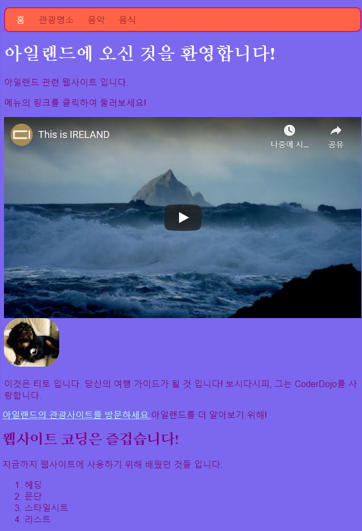
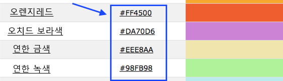

## 모든 색상!

앞에서 본 것처럼 다양한 색상 이름을 단어로 입력하면 브라우저가 이를 인식합니다. 그러나 색상을 설정하는 더 일반적인 방법은 **16진수 코드(hex code)**를 사용하는 것입니다.

+ **스타일 시트**를 살펴보십시오. 파일이름에 `.css`가 있는 파일입니다.

+ `body` 내 CSS 규칙에 16진수 코드로 배경색 `#7B68EE`을 지정하세요.

```html
  background-color: #7B68EE;
```

참고: Mac을 사용하는 경우 `#` 문자는 <kbd>Alt</kbd>와 <kbd>3</kbd> 키를 동시에 눌러 입력합니다.

당신의 웹 사이트는 이제 보라색 배경을 가지게 됩니다.

 

+ 보라색을 좋아하지 않으신다구요? [이 웹 페이지로 이동](http://dojo.soy/html2-colors){:target="_blank"}하여 스타일 시트에 사용할 다른 색상을 선택하세요. 색상 이름을 입력하는 대신에 16진수 코드를 입력해보세요. 



색상 코드를 사용하면 색상이름 목록에 없는 경우에도 색상을 만들 수 있습니다.

+ 자신만의 색상 코드를 만들어보십시오. 색상코드는 `#`으로 시작해야 합니다. # 문자는 이것이 색상이름이 아니라 16진수 코드임을 브라우저에 알려주는 역할을 합니다. #문자 다음에는 6개의 문자가 뒤따르게 됩니다. 이 문자는 **0에서 9**까지의 숫자 혹은 **A에서 F**까지의 문자로 구성됩니다.

## \--- collapse \---

## title: 어떻게 동작하나요?

모든 색상은 **적색**, **녹색**, **청색**의 조합으로 만들어집니다. 이를 영어로는 **RGB**라고 표현합니다. 이 세가지 색깔은 16진수 코드를 이루는 6자리 중 각각 2개 문자씩으로 나타내어집니다. `00`이 최소치, `FF`가 최대치를 나타냅니다.

**16진수**는 A에서 F 문자를 추가로 사용하여 큰 숫자를 더 짧게 나타내기 위한 방법입니다. 숫자 `255`는 16진수로 `FF`로 나타낼 수 있습니다. 16진수로 계산하는 방법에 대해서는 굳이 배울 필요 없습니다. 대신에, 여러가지 16진수 코드를 사용해보고 익숙해 지십시오.

+ 웹 사이트에서 사용해 볼 수 있는 기본 색상은 다음과 같습니다. `FF` 대신에 작은 숫자를 입력해 보고, 음영이 어떻게 변하는 지 확인해 보세요.

|      | R  | G  | B  |    결과    |
| ---- | -- | -- | -- |:--------:|
| \# | FF | 00 | 00 |    적색    |
| \# | 00 | FF | 00 |    녹색    |
| \# | 00 | 00 | FF |    청색    |
| \# | FF | FF | 00 |   노란색    |
| \# | FF | 00 | FF |   마젠타    |
| \# | 00 | FF | FF |    시안    |
| \# | FF | 8c | 00 | 어두운 오렌지색 |

\--- /collapse \---

완벽한 색상을 만드려면 많은 실험이 필요할 수도 있습니다. 운 좋게도, 인터넷에는 원하는 색상의 16진수 코드를 얻을 수 있는 온라인 색상 선택 도구가 많이 있습니다.


+ 내 웹사이트에 사용할 나머지 색상들을 선택하기 위해 [이 컬러픽커](http://dojo.soy/html2-color-picker){:target="_blank"}를 사용해 보세요.