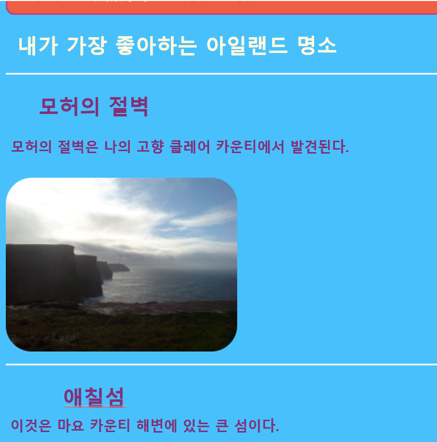
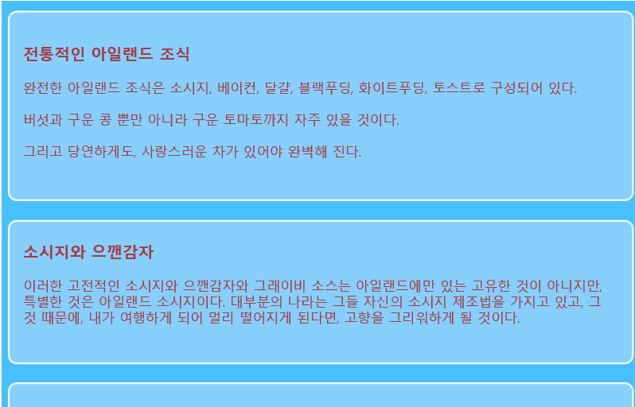
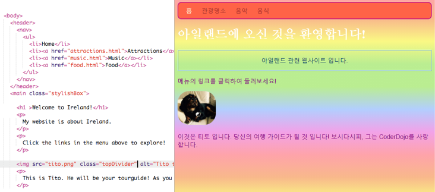

## 몇가지 테마의 디자인

`section` 및 `p` 과 같은 요소에 대한 CSS 규칙을 작성하는 것은 좋지만, 일부 요소를 다른 요소와 다르게 보이게 하려면 어떻게 해야 합니까? 이 카드에서는 동일한 유형의 요소에 다른 스타일 규칙 세트를 적용하고 웹 사이트의 각 페이지에 대해 다른 테마를 만드는 방법을 배웁니다!

+ 스타일 시트 파일로 이동하여 다음을 추가하십시오. 앞에 마침표를 포함해야 하는 것을 명심하세요!

```css
  .topDivider {
    border-top-style: solid;
    border-top-width: 2px;
    border-top-color: #F5FFFA;
    padding-bottom: 10px;
  }
```

+ 이제 `attractions.html` (만약 자신의 프로젝트를 사용하는 경우, 당신이 하고 있는 HTML파일)로 이동한 후, 각 `섹션` 태그에 다음의 **속성**을 추가하세요:

```html
  <section class="topDivider">
```

페이지의 각 섹션 위에 선이 표시되어야 합니다. 축하합니다 — 당신은 방금 처음으로 **CSS 클래스**를 사용하셨습니다!



+ 웹 페이지가 지금 어떻게 보이는지 살펴보고 `섹션`요소를 가진 다른 페이지와 비교해보세요. `class = "topDivider"` 속성을 추가 했던 항목에만 맨 위에 줄이 있을 것 입니다.

## \--- collapse \---

## title: 어떻게 동작하나요?

`section`, `p`, `nav ul` 등 CSS **selector**를 사용했을 때, 웹사이트 내 **모든** 요소들에 반영됨을 기억하세요.

CSS **클래스**를 사용하면, 요소 중 **몇 개의** 스타일 만 변경할 수 있습니다.

선택자 앞에 점을 넣으면 **클래스 선택자**가 됩니다. 클래스는 모든 이름을 가질 수 있으므로, HTML 요소의 이름이 아니어도 됩니다. 예를 들면:

```css
  .myAwesomeClass {
    /* my cool style rules go here */
  }
```

스타일 규칙이 적용되는 요소를 선택하려면, HTML 요소들에 `클래스` **속성**을 추가해야 합니다: 속성에 대한 값의 클래스명을 **마침표 없이** 넣으세요. 다음의 예시를 참고하세요:

```html
  class="myAwesomeClass"
```

\--- /collapse \---

+ 또 다른 클래스를 시도 할 준비가 되셨나요? 다음 코드를 `styles.css`에 추가하십시오:

```css
  .stylishBox {
    background-color: #87CEFA;
    color: #A52A2A;
    border-style: solid;
    border-width: 2px;
    border-color: #F5FFFA;
    border-radius: 10px;
  }
```

+ 그런 다음, 웹 사이트의 다른 페이지에서 클래스를 일부 요소에 추가하십시오. 내 웹 사이트의 Food 페이지에있는 `섹션` 요소에 다음과 같이 추가하겠습니다. `<section class="stylishBox">`.

멋있어 보이지만, 이제는 나의 섹션이 모두 함께 뭉개졌습니다.



원하는만큼 CSS 클래스를 요소에 적용 할 수 있습니다. 사용하려는 모든 클래스의 이름을 `클래스` 속성 (마침표가 없다는 것을 명심하세요!) 에 공백으로 구분하여 작성하십시오.

+ 섹션에 여백과 패딩(고정길이 부여)을 제공하는 또 다른 CSS 클래스를 만들어 봅시다. `styles.css` 파일에서 다음의 CSS 클래스를 생성하세요.

```css
  .someSpacing {
    padding: 10px;
    margin-top: 20px;
  }
```

+ `html` 코드에서 작업 중인 각 요소에 새 클래스를 다음과 같이 추가하세요:

```html
  <section class="stylishBox someSpacing">
```


따라서 CSS 클래스는 어떤 요소를 스타일 할 지 당신이 **선택하도록** 하고, 당신이 원하는 것과 같은 스타일 규칙의 모든 요소들을 **재사용하도록** 합니다.

+ `index.html`로 이동하여 `stylishBox` 클래스를 `메인` 요소 또는 페이지의 다른 요소에 추가하십시오. 나중에 다시 제거 할 수 있습니다!

```html
    <main class="stylishBox">   
```

다음은 CSS 클래스를 사용한 내 홈페이지의 모습입니다. 또한 Tito 사진과 함께 `topDivider` 클래스를 `img` 태그에 추가했습니다.



\--- challenge \---

## 과제: 몇 가지 변경하기

+ CSS **클래스** 을 사용하여 웹 사이트에 대해 몇 가지 다른 그림 크기를 정의하십시오 (예를 들어 `.smallPictures` 및 `.mediumPictures`). 그런 다음 `img` 요소 각각에서 `너비` 속성을 제거하고 대신 적절한 클래스를 추가하십시오.

\--- hints \---

\--- hint \---

다음과 같이 요소의 너비 만 정의하는 CSS 클래스를 만들 수 있습니다:

```css
  .smallPictures {
    width: 100px;
  }
```

\--- /hint \---

\--- hint \---

다음은 `width` 속성이 있는 `img` 태그입니다:

```html
         
```

`width` 속성을 제거하고 대신 CSS 클래스를 사용하여 크기를 제어하면, 다음과 같습니다:

```html
         
```

CSS 클래스를 사용하면 스타일 시트에서 한 줄의 코드 만 변경하여 한 번에 모든 그림의 너비를 쉽게 변경할 수 있습니다!

\--- /hint \---

\--- /hints \---

\--- /challenge \---