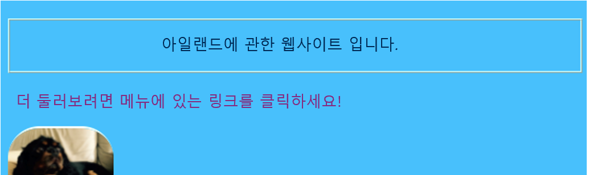
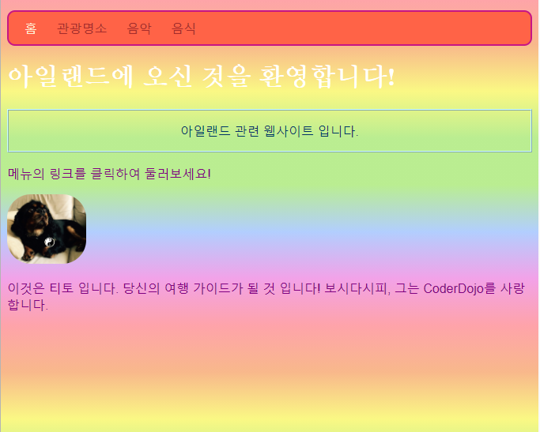

## 개별 레이아웃

홈페이지를 조금 더 생생하게 채워봅시다! CSS 선택기의 또 다른 종류로, 당신은 고유의 CSS 규칙들을 오직 **하나의 특정 요소**에 적용 할 수 있습니다.

+ `index.html`로 이동하여 단락 (`p`) 요소를 찾거나, 없는 경우 하나를 추가하십시오. 다음의 **속성**을 태그에 추가하십시오:

```html
    <p id="myCoolText">
        저의 웹사이트는 아일랜드에 대해 다룹니다.
    </p> 
```

`id`는 **식별**하기 위한 특정 요소를 부여하는 이름입니다. 한 페이지 안의 두 요소들이 동일한 `id`를 가져서는 안됩니다!

+ 이제 스타일 시트로 이동하여 다음의 코드를 추가하십시오:

```css
    #myCoolText {
        color: #003366;
        border: 2px ridge #ccffff;
        padding: 15px;
        text-align: center;
    }
```

다음과 같은 코드가 될 것입니다:



앞에 `#` 있는 선택기는 웹 사이트의 특정 요소에 CSS 규칙을 적용하는 데 사용됩니다. 당신은 요소의 `id` 속성을 할당 한 이름을 사용하여 요소를 지정합니다.

+ 홈페이지의 `body` 에 대해 한번 해보겠습니다. `index.html`로 이동하여 `body` 태그에 `id`를 추가합니다.

```html
    <body id="frontPage">
```

+ 스타일 시트에서 다음의 CSS 규칙을 추가하세요:

```css
    #frontPage {
        background: #48D1CC;
        background: linear-gradient(#fea3aa, #f8b88b, #faf884, #baed91, #baed91, #b2cefe, #f2a2e8, #fea3aa);
    }
```

아래와 같이 출력될 것입니다.



방금 **그래디언트**를 사용했습니다! 그래디언트는 한 색상이 다른 색상으로 스며드는 효과를 줍니다. 참고: 그래디언트 위의 첫 번째 `배경` 속성은 그래디언트를 지원하지 않는 브라우저의 기본 색상을 결정합니다.

코드를 완벽하게 입력했지만 위의 멋진 무지개 효과를 얻지 못했다면, 브라우저가 그래디언트를 지원하지 않는 것일 수 있습니다.

경사도를 사용하여 다양한 효과를 만들 수 있습니다. 더 배우고 싶다면, [여기](http://dojo.soy/html2-css-gradients){:target="_blank"}로 이동하세요.

\--- challenge \---

## 과제: 더 많은 요소의 스타일링

+ 또 다른 요소에 `id`와 위와 같은 ID 선택기를 `#` 과 함께 사용하여 해당 요소의 스타일을 지정하십시오. 완전히 둥글게 하기 위해 `border-radius`값이 `100 %`인 하나의 그림을 만드는 것은 어떻습니까? 웹 사이트의 다른 모든 사진들은 그대로 유지됩니다. 

\--- hints \---

\--- hint \---

다음과 같이 HTML 태그에 `id` 속성을 추가하여 요소에 `id` 을 부여합니다.

```html
          
```

원하는 `id` 이름을 선택하십시오.

\--- /hint \---

\--- hint \---

특정 요소에 대한 스타일 규칙을 정의하려면, `#` 기호와 `id`로써 요소에 부여한 이름을 사용합니다.

```css
  #titoPicture {
    border-radius: 100%;
  }
```

참고: CSS 규칙 앞에 입력한 이름은 요소의 `id` 속성에 넣은 값과 **정확히** 일치해야 합니다.

\--- /귀뜸말 \---

\--- /hints \---


\--- /challenge \---