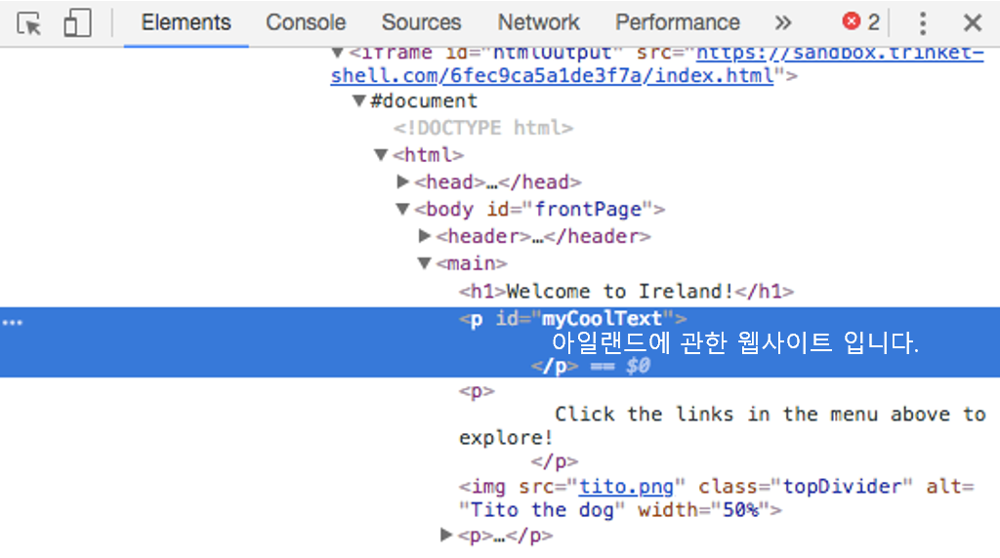
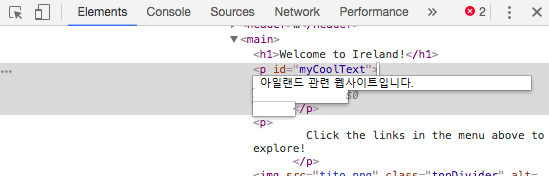
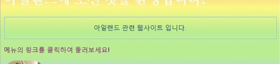
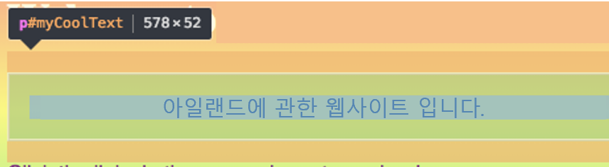
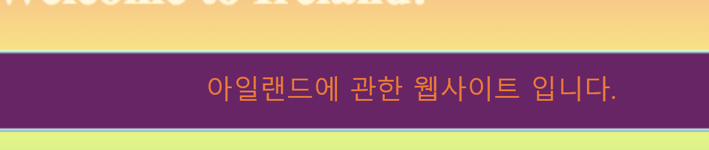

## 다른 웹 사이트에서 코드를 확인하세요!

**참고:** 이 단계를 완료하려면 Chrome, Firefox 또는 Internet Explorer / Microsoft Edge 웹 브라우저 중 하나를 사용해야 합니다. 그 중 하나에 접근할 수 없는 경우, 그냥 다음 섹션으로 계속 진행할 수 있습니다.

이 카드에서는 **개발자 도구**를 사용하여 웹 사이트의 코드를 살짝 들여다 보는 방법을 배우고, 자신 만 볼 수 있는 몇 가지 변화를 수행하는 방법도 알아볼 것입니다!

+ 시작하기 전에 프로젝트가 저장되었는지 확인하십시오. 그런 다음 브라우저에서 새로 고침 아이콘을 클릭하여 웹 사이트를 새로 고칩니다.

+ 웹 페이지 (코드가 아닌 실제 페이지) 에서 이전 카드에 추가 한 테두리가 있는 텍스트를 강조 표시 한 다음, 마우스 오른쪽 버튼으로 클릭하고 나타나는 메뉴에서 **Inspect** 옵션을 선택합니다. (이 옵션은 사용 중인 브라우저에 따라 '요소 검사' 또는 이와 유사 할 수 있습니다. 메뉴 옵션을 찾는 데 문제가 있으면 Dojo의 누군가 에게 도움을 요청하십시오.)


많은 탭과 코드가 있는 완전히 새로운 상자가 웹 브라우저에 나타납니다: **개발자 도구** 입니다. 여기에서 클릭 한 항목에 대한 코드와 전체 페이지에 대한 코드를 볼 수 있습니다!

### HTML 코드 검사

+ 페이지의 HTML 코드를 표시하는 탭을 찾습니다 ( 'Elements' 또는 'Inspector' 탭 일지도 모릅니다). 코드는 HTML 파일에 입력 한 것과 거의 동일해야 합니다! 오른쪽에 있는 작은 삼각형을 클릭하여 숨겨진 코드를 확장 할 수 있습니다.



+ 태그 사이의 텍스트를 더블 클릭 합니다. 당신은 이제 그것을 수정할 수 있습니다! 무언가를 입력하고 <kbd>Enter</kbd>를 누르십시오.



+ 웹 사이트에 업데이트한 텍스트가 표시됩니까? 참고: 이러한 변경 사항은 본인만 볼 수 있고, 실제 웹사이트에 수정내용이 반영되지는 않습니다.



+ 이제 페이지를 **새로고침**하고 무엇이 일어나는지 봅시다. 위에서 언급한 대로 웹페이지가 변경되지 않을 것입니다!

+ 개발 도구 상자의 왼쪽 상단에서, 화살표가 있는 작은 직사각형 모양의 아이콘을 클릭합니다. 이제 웹 페이지 위로 커서를 이동할 수 있으며, HTML 검사기가 이를 설명하는 코드를 표시합니다.

 

### CSS 코드 검사

+ 다음으로 CSS 코드를 살펴 보겠습니다. 개발자 도구에서 **스타일** 탭을 찾습니다 ( '스타일 편집기' 또는 이와 유사한 이름으로 불릴 수 있음). 해당 단락에 대해 만든 규칙을 포함하여 여러 CSS 규칙이 표시되어야 합니다. `#myCoolText`.


+ `#myCoolText` 규칙에서 `색상` 속성 옆에 있는 값을 클릭합니다. 다른 값을 입력 해보십시오. 웹 페이지의 글자 색이 바로 바뀐 것을 보십시오! 


참고: 또한 색상을 변경하기 위해 색상 선택 도구를 사용하여 색상이 있는 사각형을 클릭 할 수도 있습니다.

+ 색상 뒤의 공간을 클릭하십시오. 더 많은 CSS를 입력할 수 있는 새 줄이 시작됩니다. 무언가를 입력하고 <kbd>Enter</kbd>를 누르십시오:

```css
  background-color: #660066;
```

해당 글자 부분의 배경이 변경되는 것을 볼 수 있습니다.

 

## \--- collapse \---

## title: 어떻게 동작하나요?

당신이 개발자 도구를 사용하여 웹 사이트의 코드를 변경하는 경우는 **일시적으로** **본인의 브라우저에** 보여지는 것을 변경하는 것 입니다. 실제로 웹 사이트를 구성하는 파일을 변경하는 것이 아닙니다.

페이지 새로고침을 할 때, html 파일 (인터넷 서버 또는 컴퓨터에 저장된 파일) 에서 웹 사이트를 리로드 하게 됩니다. 이것이 당신이 만든 변화가 나타나지 않는 이유 입니다.

이제 그걸 알게 되었으니, 다른 웹 사이트의 코드를 재미있게 다룰 수 있습니다!

\--- /collapse \---

+ 이 도구들을 사용하여 또 다른 웹 사이트의 코드를 살펴보십시오. 원하는 경우 변경할 수도 있습니다! 변경 사항은 본인만 볼 수 있으며, 페이지를 새로고침 하면 모든 항목이 재설정 됩니다.