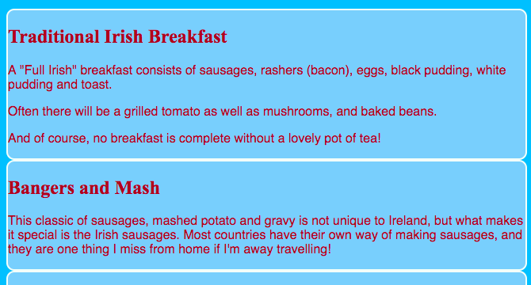

## काही थीम डिझाइन करा

`section` आणि `p` सारख्या घटकांसाठी CSS नियम लिहिणे चांगले आहे, परंतु आपण त्यातील काही इतरांपेक्षा वेगळ्या दिसू इच्छित असल्यास काय करावे? या कार्डवर आपण एकाच प्रकारच्या घटकांवर शैलीच्या नियमांचे भिन्न संच कसे लागू करावे आणि आपल्या वेबसाइटवरील प्रत्येक पृष्ठासाठी एक भिन्न थीम कशी तयार करावी ते शिकाल!

+ आपल्या स्टाईल शीट फाईलवर जा आणि खालील जोडा - समोर टिंब समाविष्ट करण्याचे सुनिश्चित करा!

```css
  .topDivider {
    border-top-style: solid;
    border-top-width: 2px;
    border-top-color: #F5FFFA;
    padding-bottom: 10px;
  }
```

+ आता `attractions.html` वर जा (किंवा आपण आपला स्वतःचा प्रकल्प वापरत असल्यास) आपण ज्या HTML फाईलवर कार्य करत आहात) आणि प्रत्येक `section` ला खालील **attribute** (विशेषता) जोडा:

```html
  <section class="topDivider">
```

आपल्याला पृष्ठावरील प्रत्येक भागाच्या वर एक ओळ दिसेल. अभिनंदन - आपण नुकताच आपला प्रथम **CSS Class** वापरला आहे!


+ आपले वेबपेज आता कसे दिसते ते पहा आणि `section` घटक असलेल्या इतर पृष्ठांची तुलना करा. आपल्याला असे दिसेल की फक्त जिथे गुणविशेष `class="topDivider"` जोडलेले आहेत तिथे वरती एक ओळ असेल.

## \--- collapse \---

## title: हे कसं काम करतं?

लक्षात ठेवा जेव्हा आपण CSS **selector** (निवडकर्ता) वापरता तेव्हा जसे `section` किंवा `p` किंवा `nav ul`, शैली नियम आपल्या वेबसाइटवर त्या प्रकारचे **सर्व** घटकला लागू होतात.

CSS ** classes ** सह, आपण फक्त **काहींची** घटकांची स्टाइल बदलण्यास सक्षम आहात.

आपल्या निवडकर्त्यासमोर टिंब ठेवून **class selector** (वर्ग निवडकर्त्यामध्ये) बनेल. क्लासला कोणतेही नाव असू शकते, म्हणून ते HTML घटकाचे नाव असू शकत नाही. उदाहरणार्थ:

```css
  .myAwesomeClass {
    / * माझे मस्त शैली नियम येथे आहेत * /
}
```

शैलीतील नियम कोणत्या घटकांवर लागू होतात हे निवडण्यासाठी `class` ** attribute ** आपण HTML कोडमधील त्या घटकांना गुणजोडा: वर्गाचे नाव विशेषतेचे मूल्य म्हणून ** without ** बिंदू, याप्रमाणेः:

```html
  class="myAwesomeClass"
```

\--- /collapse \---

+ दुसरा क्लास वापरण्यास तयार आहात? खालील CSS कोड `styles.css` मध्ये जोडा:

```css
  .stylishBox {
    background-color: #87CEFA;
    color: #A52A2A;
    border-style: solid;
    border-width: 2px;
    border-color: #F5FFFA;
    border-radius: 10px;
  }
```

+ मग आपल्या वेबसाइटच्या वेगळ्या पृष्ठावर, तेथील काही घटकांमध्ये क्लास जोडा. मी हे माझ्या वेबसाइटच्या खाद्य पृष्ठावरील `section` घटकांमध्ये याप्रमाणे जोडत आहे: `<section class="stylishBox">`.

हे छान दिसत आहे, परंतु आता माझे विभाग सर्व एकत्रित आहेत.



आपल्यास पाहिजे त्या घटकावर आपण अनेक CSS क्लास लागू करू शकता. आपण वापरू इच्छित सर्व वर्गांची नावे फक्त `class` गुणाविशेषतामध्ये लिहा (लक्षात ठेवा, बिंदूशिवाय!), त्यांना रिक्त स्थानांसह विभक्त करा.

+ विभागांना काही मार्जिन आणि पॅडिंग देण्यासाठी आणखी एक CSS क्लास बनवू या. `styles.css` फाईलमध्ये, खालील CSS क्लास तयार करा:

```css
  .someSpacing {
    padding: 10px;
    margin-top: 20px;
  }
```

+ आपल्या `html` कोडमध्ये, आपण ज्या घटकांवर कार्य करीत होता त्या प्रत्येकात नवीन वर्ग जोडा:

```html
  <section class="stylishBox someSpacing">
```


तर CSS क्लास आपल्याला कोणत्या घटकांना शैली द्यावी ती **निवडू** करू देतात आणि ते आपल्याला आपल्याला पाहिजे असलेल्या कोणत्याही घटकांवर शैली नियमांचा समान संच **पुन्हा वापरु** देतात.

+ `index.html` वर जा आणि `stylishBox` वर्ग `main` घटक किंवा पृष्ठावरील अन्य घटक जोडा. आपण नंतर हे पुन्हा काढू शकता!

```html
    <main class="stylishBox">   
```

CSS क्लास सह माझे मुख्यपृष्ठ कसे दिसते ते येथे आहे. मी `topDivider` क्लास देखील टिटोच्या चित्रासह `img` टॅग जोडला आहे.


\--- challenge \---

## आव्हान: काही नवीन क्लास तयार करा

+ आपल्या वेबसाइटसाठी काही भिन्न चित्र आकार परिभाषित करण्यासाठी CSS ** classes ** वापरा, उदाहरणार्थ `.smallPictures` आणि `.mediumPictures`. नंतर आपल्या प्रत्येक `img` घटकांमधून `width` गुणविशेष काढा आणि त्याऐवजी योग्य वर्ग जोडा.

\--- hints \---

\--- hint \---

आपण यासारख्या घटकाची रुंदी परिभाषित करणारा एक CSS क्लास बनवू शकता:

```css
  .smallPictures {
    width: 100px;
  }
```

\--- /hint \---

\--- hint \---

येथे `width` विशेषतासह `img` टॅग आहे:

```html
         
```

जेव्हा आपण `width` गुणविशेष काढता तेव्हा त्याऐवजी CSS वर्गासह आकार नियंत्रित करता, ते असे दिसते:

```html
         
```

CSS क्लास वापरुन, आपण आपल्या स्टईल शीटमध्ये फक्त कोडची एकआच ओळ बदलून एकाच वेळी सर्व चित्रांची रुंदी सहजपणे बदलू शकता!

\--- /hint \---

\--- /hints \---

\--- /challenge \---