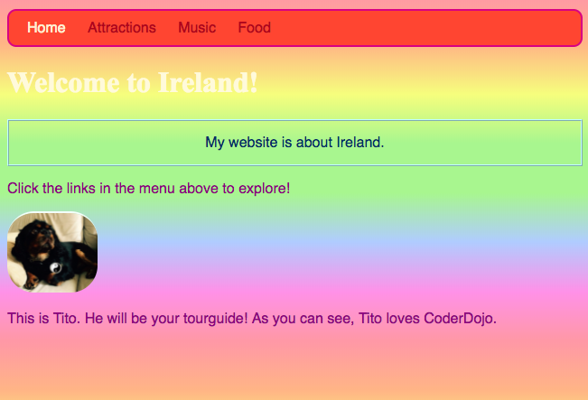

## वैयक्तिक शैली

चला होम पेज थोडे रोमांचक करूया! दुसर्‍या प्रकारच्या CSS निवडकर्त्यासह, आपण फक्त **one specific element** CSS नियमांचा एक अनोखा सेट लागू करू शकता.

+ `index.html` वर जा आणि एक परिच्छेद (`p`) घटक शोधा किंवा आपल्याकडे काही नसल्यास तयार करा. खालील **attribute** टॅगवर जोडा:

```html
    <p id="myCoolText">
        My website is about Ireland.
    </p> 
```

आपण एखादा विशिष्ट घटकाला **identify** करण्यासाठी हे `id` नाव दिलेलं आहे. पृष्ठावरील कोणत्याही दोन घटकांमध्ये कधीही समान `id` असू नये!

+ आता आपल्या स्टाईल शीट वर जा आणि खालील कोड जोडा:

```css
    #myCoolText {
        color: #003366;
        border: 2px ridge #ccffff;
        padding: 15px;
        text-align: center;
    }
```

तुमचं टेक्स्ट आता असा दिसायला हवं:


आपल्या वेबसाइटवर एक निवडकर्ता समोर `#` चिन्ह सह एका विशिष्ट घटकावर CSS नियम लागू करण्यासाठी वापरले जाते. आपण त्या घटकाची `id` विशेषता नियुक्त केलेल्या नावाच्या मदतीने एक घटक निर्दिष्ट करता.

+ मुख्य पृष्ठचा `body` साठी असे एक करूया. `index.html` वर जा आणि `id` `body ` टॅग मध्ये जोडा.

```html
    <body id="frontPage">
```

+ स्टईल शीट मध्ये, खालील CSS नियम जोडा:

```css
    #frontPage {
        background: #48D1CC;
        background: linear-gradient(#fea3aa, #f8b88b, #faf884, #baed91, #baed91, #b2cefe, #f2a2e8, #fea3aa);
    }
```

आपल्याला असे काहीतरी मिळेल जे दिसायला हवे:



आपण आत्ताच **gradient** वापरला आहे! एक नाव दुसर्‍या रंगात फिकट पडते अशा परिणामास ते नाव आहे. टीपः ग्रेडियंट वरील प्रथम `background` गुणधर्म ग्रेडियंटना समर्थन न देणार्‍या ब्राउझरसाठी डीफॉल्ट रंग निर्धारित करतात.

जर आपण कोड अचूक टाइप केला असेल आणि आपल्याला वरील इंद्रधनुष्यांचा सुंदर प्रभाव नाही मिळाला असेल तर ही शक्यता आहे की आपला ब्राउझर ग्रेडियंटस समर्थन देत नाही.

आपण ग्रेडियंटसह बरेच भिन्न प्रभाव तयार करू शकता. आपण अधिक जाणून घेऊ इच्छित असल्यास [here](http://dojo.soy/html2-css-gradients){:target="_blank"} वर जा.

\--- challenge \---

## आव्हान: आणखी काही घटकांची शैली करा

+ वरील प्रमाणे आणि आयडी निवडकर्त्याचा वापर करुन `#` सह एकाद्या दुसर्‍या घटकास `id` आणि शैली देण्याचा प्रयत्न करा. `border-radius` ही `100%` असून एक चित्र पूर्णतः गोलाकार बनवायचे याबद्दल विचार कसा आहे? वेबसाइटवरील कोणतीही अन्य चित्रे जशी आहेत तशीच राहतील. 

\--- hints \---

\--- hint \---

आपण एका घटकास `id` देतो `id` गुणविशेष HTML टॅगमध्ये यासारखे जोडून:

```html
          
```

कोणताही `id` नाव निवडा तुम्हाला आवडेल तो.

\--- /hint \---

\--- hint \---

विशिष्ट घटकासाठी शैली नियम परिभाषित करण्यासाठी, आपण `#` चिन्ह आणि आपण त्या घटकास `id` म्हणून नाव दिले ते वापरा.

```css
  #titoPicture {
    border-radius: 100%;
  }
```

टीपः CSS नियमांसमोर आपण टाइप केलेले नाव आपण `id` घटकाच्यामध्ये ठेवलेल्या गुणविशेष शी **exactly** अचूक जुळावे.

\--- /hint \---

\--- /hints \---


\--- /challenge \---