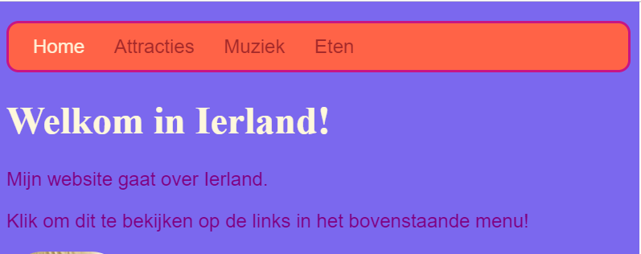

## Alle kleuren!

Zoals je al eerder hebt gezien, kun je veel verschillende kleurnamen typen als woorden en de browser herkent ze. Maar een meer gebruikelijke manier om kleuren in te stellen is om iets te gebruiken dat **hex-codes** heet ('hex' is een afkorting van **hexadecimaal**, een speciale manier om te tellen).

+ Bekijk je **style sheet**. Dat is het bestand met `.css` in de naam.

+ Zet binnen de CSS-regels voor `body`, de achtergrondkleur op de hex-code `#7B68EE`:

```html
  background-color: #7B68EE;
```

Opmerking: als je een Mac gebruikt, typ je `#` door tegelijkertijd op de <kbd>alt</kbd> en de <kbd>3</kbd> toets te drukken.

Je website zou nu een paarse achtergrond moeten hebben.

 

+ Geen fan van paars? Ga naar [deze webpagina](http://dojo.soy/html2-colors){:target="_blank"} en kies een andere kleur voor je stylesheet --- typ in plaats van de naam van de kleur de hex-code in. 


Met kleurcodes kunt je elke kleur maken, zelfs als deze niet in een lijst met kleurnamen voorkomt.

+ Probeer je eigen kleurcode te maken. Het moet beginnen met een `#`. Dit vertelt de browser dat het een hex-code is in plaats van een kleurnaam. De rest van de code bestaat uit zes tekens. Ze kunnen elk nummer van **0 tot 9** zijn en elke letter van **A tot F**.

--- collapse ---
---
title: Hoe werkt het?
---

Elke kleur wordt gemaakt door verschillende hoeveelheden **rood**, **groen** en **blauw** te mengen. Dit wordt soms als **RGB** geschreven. Elk van deze kleuren wordt weergegeven door twee van de zes cijfers in je HEX-code. `00` is het minimum en `FF` is het maximum.

**Hexadecimal** is een manier van tellen die nummers korter maakt om te schrijven door de letters A-F als extra tekens te gebruiken. Het nummer `255` wordt in hexadecimaal geschreven als `FF`. Je hoeft je geen zorgen te maken over het leren tellen met hexadecimale getallen. Experimenteer in plaats daarvan met verschillende hex-codes om te wennen aan het gebruik ervan.

+ Hier zijn enkele basiskleuren om op je website uit te proberen. Probeer kleinere getallen in te voeren in plaats van `FF` om te zien hoe de tinten veranderen.

|      | R  | G  | B  |   Resultaat   |
| ---- | -- | -- | -- |:-------------:|
| \# | FF | 00 | 00 |     Rood      |
| \# | 00 | FF | 00 |     Groen     |
| \# | 00 | 00 | FF |     Blauw     |
| \# | FF | FF | 00 |     Geel      |
| \# | FF | 00 | FF |    Magenta    |
| \# | 00 | FF | FF |     Cyaan     |
| \# | FF | 8c | 00 | Donker oranje |

--- /collapse ---

Het mengen van de perfecte kleur betekend veel experimenteren. Gelukkig zijn er tal van online kleurenkiezer tools waar je voor elke gewenste kleur de hex-code kunt vinden.


+ Probeer deze [kleurenkiezer](http://dojo.soy/html2-color-picker){:target="_blank"} uit om een ​​aantal hex-kleurcodes te kiezen voor de rest van de stijlen op je website.