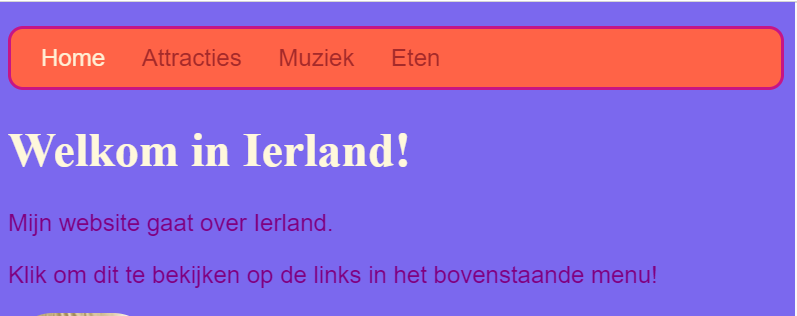

## Alle kleuren!

Zoals je al eerder hebt gezien, kun je veel verschillende kleurnamen typen als woorden en de browser herkent ze. Maar een meer gebruikelijke manier om kleuren in te stellen is om iets te gebruiken dat ** hex-codes** heet ('hex' is een afkorting van ** hexadecimaal **, een speciale manier om te tellen).

+ Bekijk je **style sheet **. Dat is het bestand met `.css ` in de naam.

+ Zet binnen de CSS-regels voor ` body `, de achtergrondkleur op de hex-code `#7B68EE`:

```html
  background-color: #7B68EE;
```

Opmerking: als je een Mac gebruikt, typ je ` # ` door tegelijkertijd op de <kbd> alt </kbd> en de <kbd> 3 </kbd> toets te drukken.

Je website zou nu een paarse achtergrond moeten hebben.

 

+ Geen fan van paars? Ga naar [this web page ](http://dojo.soy/html2-colors) {:target="_blank"} en kies een andere kleur voor je stylesheet - typ in plaats van de naam van de kleur de hex-code in. 


Met kleurcodes kunt je elke kleur maken, zelfs als deze niet in een lijst met kleurnamen voorkomt.

+ Probeer je eigen kleurcode te maken. Het moet beginnen met een ` # `. Dit vertelt de browser dat het een hex-code is in plaats van een kleurnaam. De rest van de code bestaat uit zes tekens. Ze kunnen elk nummer van ** 0 tot 9 ** zijn en elke letter van ** A tot F **.

## \--- collapse \---

## title: Hoe werkt het?

Elke kleur wordt gemaakt door verschillende hoeveelheden ** rood **, ** groen ** en ** blauw ** te mengen. Dit wordt soms als ** RGB** geschreven. Elk van deze kleuren wordt weergegeven door twee van de zes cijfers in je HEX-code. ` 00 ` is het minimum en ` FF ` is het maximum.

** Hexadecimal ** is een manier van tellen die nummers korter maakt om te schrijven door de letters A-F als extra tekens te gebruiken. The number `255` is written as `FF` in hexadecimal. You don't need to worry about learning to count with hexadecimal numbers. Instead, experiment with different hex codes to get used to using them.

+ Here are some basic colours to try out on your website. Try putting in smaller numbers instead of `FF` to see how the shades change.

|      | R  | G  | B  |   Result    |
| ---- | -- | -- | -- |:-----------:|
| \# | FF | 00 | 00 |     Red     |
| \# | 00 | FF | 00 |    Green    |
| \# | 00 | 00 | FF |    Blue     |
| \# | FF | FF | 00 |   Yellow    |
| \# | FF | 00 | FF |   Magenta   |
| \# | 00 | FF | FF |    Cyan     |
| \# | FF | 8c | 00 | Dark orange |

\--- /collapse \---

Mixing the perfect colour can take a lot of experimenting. Luckily, there are plenty of online colour picking tools that help you get the hex code for any colour you want.


+ Try out [this colour picker](http://dojo.soy/html2-color-picker){:target="_blank"} to choose some hex colour codes to use for the rest of the styles on your website.