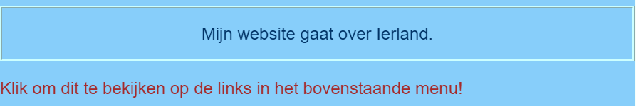
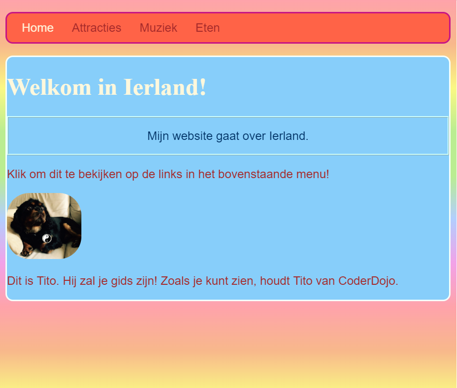
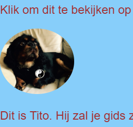

## Eigen stijl

Laten we de startpagina een beetje opleuken! Met een ander soort CSS selector kun je een unieke set CSS regels toepassen op slechts **een specifiek element**.

+ Ga naar `index.html` en zoek een alinea (`p`) element, of voeg er een toe als je er geen hebt. Voeg het volgende **attribute** toe aan de tag:

```html
    <p id="myCoolText"> 
       Mijn website gaat over Ierland.
    </p> 
```

De `id` is een naam die je een bepaald element geeft om deze te **identificeren**). Twee elementen op dezelfde pagina mogen nooit dezelfde `id` hebben!

+ Ga nu naar je style sheet en voeg de volgende code toe:

```css
    #myCoolText {
        color: #003366;
        border: 2px ridge #ccffff;
        padding: 15px;
        text-align: center;
    }
```

Je tekst zou er nu als volgt uit moeten zien:



Een selector met een `#` ervoor wordt gebruikt om CSS regels aan een specifiek element op je website toe te wijzen. Je specificeert het element met behulp van de naam waaraan je het `id` attribuut hebt toegewezen.

+ Laten we er een doen voor de `body` van de home page. Ga naar `index.html` en voeg een `id` toe aan de `body` tag.

```html
    <body id="frontPage">
```

+ Voeg in de stijl sheet de volgende CSS regels toe:

```css
    #frontPage {
        background: #48D1CC;
        background: linear-gradient(#fea3aa, #f8b88b, #faf884, #baed91, #baed91, #b2cefe, #f2a2e8, #fea3aa);
    }
```

Je zou iets moeten krijgen dat er zo uitziet:



Je hebt zojuist een **gradient** (verloop) gebruikt! Dat is de naam die wordt gegeven aan het effect waarbij de ene kleur verloopt in de andere. Opmerking: de eerste `background` (achtergrond) eigenschap boven het verloop bepaalt een standaardkleur voor browsers die geen verlopen ondersteunen.

Als je de code perfect over hebt getypt en je hebt het mooie regenboogeffect hierboven niet gekregen, dan kan het zijn dat je browser geen verlopen ondersteunt.

Je kunt met verlopen veel verschillende effecten maken. Als je meer informatie wilt, kijk [hier](http://dojo.soy/html2-css-gradients) {: target = "_blank"}.

\--- challenge \---

## Uitdaging: style nog wat meer elementen

+ Probeer een ander element een `id` te geven en maak dat element op met behulp van de ID-selector met een `#` zoals hierboven. Zullen we een foto maken met een `border-radius` (straal van de rand) van `100%` zodat het volledig afgerond is? Alle andere afbeeldingen op de website blijven hetzelfde als ze zijn. 

\--- hints \---

\--- hint \---

Je geeft een element een `id` door het kenmerk `id` als volgt toe te voegen aan de HTML-code:

```html
          
```

Kies een `id` naam die je leuk vindt.

\--- /hint \---

\--- hint \---

Om stijlregels voor een specifiek element te definiëren, gebruik je het `#` symbool en de naam die je het element hebt gegeven bij de `id`.

```css
  #titoPicture {
    border-radius: 100%;
  }
```

Opmerking: de naam die je in de CSS regels typt, moet **precies** overeenkomen met de naam die je in het `id` attribuut van het element hebt gegeven.

\--- /hint \---

\--- /hints \---



\--- /challenge \---