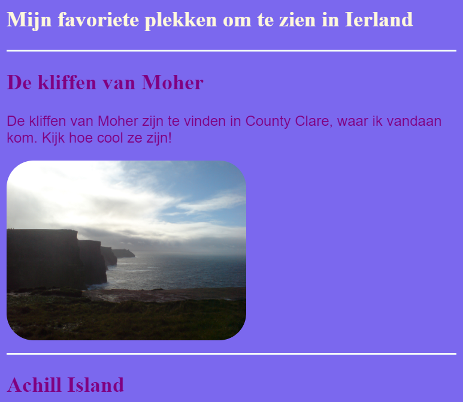
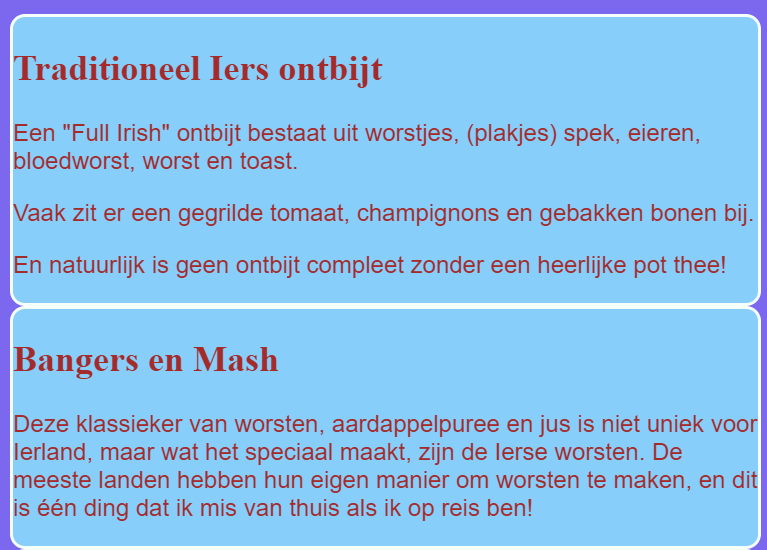
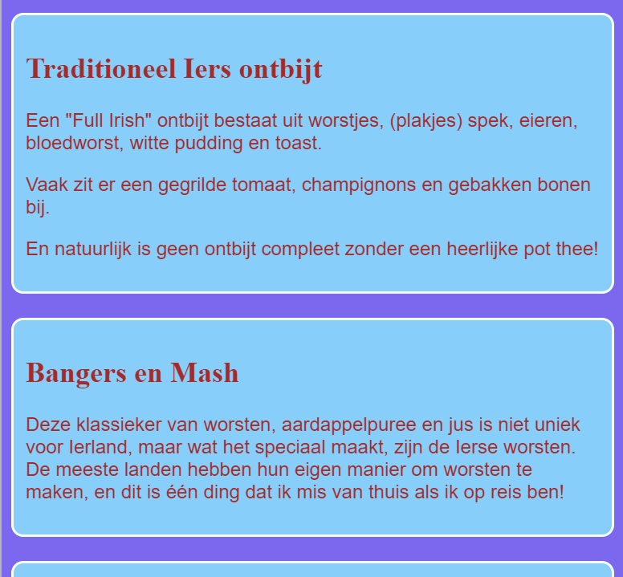
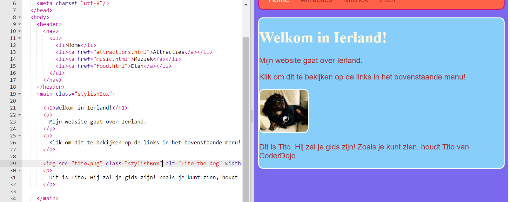

## Ontwerp enkele thema's

CSS-regels schrijven voor elementen zoals `section` en `p` is geweldig, maar wat als je wilt dat sommige ervan er anders uitzien dan andere? Op deze kaart leer je hoe je verschillende sets stijl regels toepast op elementen van hetzelfde type en een ander thema maakt voor elke pagina op je website!

+ Ga naar je style sheet bestand en voeg het volgende toe \--- zorg ervoor dat je de punt aan het begin ook typt!

```css
  .topDivider {
    border-top-style: solid;
    border-top-width: 2px;
    border-top-color: #F5FFFA;
    padding-bottom: 10px;
  }
```

+ Ga nu naar `attractions.html` (of het HTML-bestand waaraan je werkt als je jouw eigen project gebruikt) en voeg het volgende **attribute** toe na elk `section` label:

```html
  <section class="topDivider">
```

Je zou boven elke sectie op de pagina een lijn moeten zien verschijnen. Gefeliciteerd - je hebt zojuist je eerste **CSS-klasse** gemaakt!



+ Kijk hoe je webpagina er nu uitziet en vergelijk deze met de andere pagina's die `section` elementen bevatten. Je ziet dat alleen die waaraan je het attribuut `class="topDivider"` hebt toegevoegd de lijn bovenaan hebben.

## \--- collapse \---

## title: Hoe werkt het?

Onthoud dat wanneer je een CSS **selector** zoals `section`, `p` of `nav ul` gebruikt, de stijlregels van toepassing zijn op **alle** elementen van dat type op je website.

Met CSS **classes**, kun je de stijl van slechts **enkele** elementen veranderen.

Door een punt vóór je selector te plaatsen, wordt deze een **class selector** (klasse selectie). Een klasse kan elke naam hebben, dus het hoeft niet de naam van een HTML-element te zijn. Bijvoorbeeld:

```css
  .mijnGeweldigeClass {
    /*mijn coole stijl regel komt hier*/
  }
```

Om te kiezen op welke elementen de stijl regels van toepassing zijn, voeg je de `class` **attribuut** toe aan de elementen in de HTML-code: typ de naam van de klasse in als de waarde voor het attribute, **zonder** de punt, zoals dit:

```html
  class="mijnGeweldigeClass"
```

\--- /collapse \---

+ Klaar om een ​​andere class te proberen? Voeg de volgende CSS code toe aan `style.css`:

```css
  .stylishBox {
    background-color: #87CEFA;
    color: #A52A2A;
    border-style: solid;
    border-width: 2px;
    border-color: #F5FFFA;
    border-radius: 10px;
  }
```

+ Voeg vervolgens op een andere pagina van je website de class toe aan enkele elementen daar. Ik ga het toevoegen aan de `section` elementen op de Food pagina van mijn website, zoals deze: `<section class="stylishBox">`.

Het ziet er goed uit, maar nu zijn mijn secties allemaal samengeknepen.



Je kunt zoveel CSS-klassen op een element toepassen als je maar wilt. Schrijf gewoon de namen van alle klassen die je wilt gebruiken binnen het `class` attribuut (onthoud, zonder de punt!), scheid ze met spaties.

+ Laten we nog een CSS klasse maken om de secties wat marge en opvulling te geven. In het `styles.css` bestand, maak je de volgende CSS-klasse:

```css
  .someSpacing {
    padding: 10px;
    margin-top: 20px;
  }
```

+ In je `html` code, voeg je de nieuwe klasse toe aan elk van de elementen waar je aan werkte, zoals dit:

```html
  <section class="stylishBox someSpacing">
```



Dus CSS klassen laten je **kiezen** welke elementen je wilt stijlen en ze laten je **opnieuw** dezelfde set stijlregels gebruiken voor welke elementen die jij dan ook wilt.

+ Ga naar `index.html` en voeg de `stylishBox` class toe aan het `main` element of een ander element op de pagina. Je kunt het later weer verwijderen!

```html
    <main class="stylishBox">   
```

Dit is hoe mijn startpagina eruit ziet met de CSS class. Ik heb ook de `topDivider` class toegevoegd aan de `img` tag met de afbeelding van Tito.



\--- challenge \---

## Uitdaging: maak enkele nieuwe classes

+ Gebruik CSS **classes** om een ​​paar verschillende foto formaten voor je website te definiëren, bijvoorbeeld `.smallPictures` (kleine foto's) en `.mediumPictures` (medium foto's). Verwijder vervolgens het `width` attribuut van elk van je `img` elementen en voeg in plaats daarvan de juiste class toe.

\--- hints \---

\--- hint \---

Je kunt een CSS class maken die alleen de breedte van een element als dit definieert:

```css
  .smallPictures {
    width: 100px;
  }
```

\--- /hint \---

\--- hint \---

Dit is een `img` tag met een `width` attribuut:

```html
         
```

Wanneer je het kenmerk `width` verwijdert en in plaats daarvan de grootte met de CSS class bepaalt, ziet het eruit als volgt:

```html
         
```

Door een CSS-klasse te gebruiken, kun je eenvoudig de breedte van alle afbeeldingen in één keer wijzigen door slechts één regel code in je stylesheet te wijzigen!

\--- /hint \---

\--- /hints \---

\--- /challenge \---