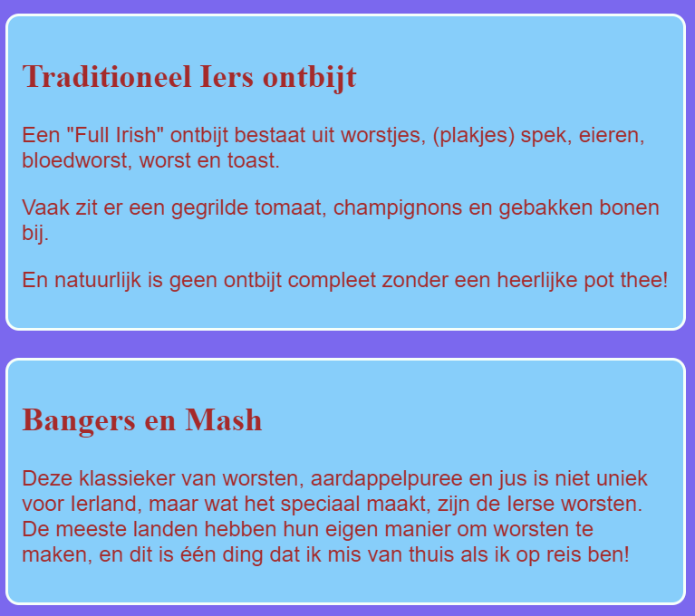

## Ontwerp enkele thema's

CSS-regels schrijven voor elementen zoals `section` en `p` is geweldig, maar wat als je wilt dat sommige ervan er anders uitzien dan andere? Op deze kaart leer je hoe je verschillende sets stijl regels toepast op elementen van hetzelfde type en een ander thema maakt voor elke pagina op je website!

+ Ga naar je style sheet bestand en voeg het volgende toe \--- zorg ervoor dat je de punt aan het begin ook typt!

```css
  .topDivider {
    border-top-style: solid;
    border-top-width: 2px;
    border-top-color: #F5FFFA;
    padding-bottom: 10px;
  }
```

+ Ga nu naar `attractions.html` (of het HTML-bestand waaraan je werkt als je jouw eigen project gebruikt) en voeg het volgende **attribute** toe na elk `section` label:

```html
  <section class="topDivider">
```

Je zou boven elke sectie op de pagina een lijn moeten zien verschijnen. Gefeliciteerd - je hebt zojuist je eerste **CSS-klasse** gemaakt!


+ Kijk hoe je webpagina er nu uitziet en vergelijk deze met de andere pagina's die `section` elementen bevatten. Je ziet dat alleen die waaraan je het attribuut `class="topDivider"` hebt toegevoegd de lijn bovenaan hebben.

## \--- collapse \---

## title: Hoe werkt het?

Onthoud dat wanneer je een CSS **selector** zoals `section`, `p` of `nav ul` gebruikt, de stijlregels van toepassing zijn op **alle** elementen van dat type op je website.

Met CSS **classes**, kun je de stijl van slechts **enkele** elementen veranderen.

Door een punt vóór je selector te plaatsen, wordt deze een **class selector** (klasse selectie). Een klasse kan elke naam hebben, dus het hoeft niet de naam van een HTML-element te zijn. Bijvoorbeeld:

```css
  .mijnGeweldigeClass {
    /*mijn coole stijl regel komt hier*/
  }
```

To choose which elements the style rules apply to, you add the `class` **attribute** to those elements in the HTML code: put the name of the class in as the value for the attribute, **without** the dot, like this:

```html
  class="myAwesomeClass"
```

\--- /collapse \---

+ Ready to try another class? Add the following CSS code to `styles.css`:

```css
  .stylishBox {
    background-color: #87CEFA;
    color: #A52A2A;
    border-style: solid;
    border-width: 2px;
    border-color: #F5FFFA;
    border-radius: 10px;
  }
```

+ Then, on a different page of your website, add the class to some elements there. I'm going to add it to the `section` elements on the Food page of my website, like this: `<section class="stylishBox">`.

It looks great, but now my sections are all squashed together.


You can apply as many CSS classes to an element as you like. Just write the names of all the classes you want to use inside the `class` attribute (remember, without the dot!), separating them with spaces.

+ Let's make another CSS class to give the sections some margin and padding. In the `styles.css` file, create the following CSS class:

```css
  .someSpacing {
    padding: 10px;
    margin-top: 20px;
  }
```

+ In your `html` code, add the new class to each of the elements you were working on, like this:

```html
  <section class="stylishBox someSpacing">
```



So CSS classes let you **choose** which elements to style, and they let you **reuse** the same set of style rules on any elements you want.

+ Go to `index.html` and add the `stylishBox` class to the `main` element, or another element on the page. You can remove it again afterwards!

```html
    <main class="stylishBox">   
```

Here's what my home page looks like with the CSS class. I've also added the `topDivider` class to the `img` tag with the picture of Tito.


\--- challenge \---

## Challenge: make some new classes

+ Use CSS **classes** to define a few different picture sizes for your website, for example `.smallPictures` and `.mediumPictures`. Then remove the `width` attribute from each of your `img` elements and add the appropriate class instead.

\--- hints \---

\--- hint \---

You can make a CSS class that defines just the width of an element like this:

```css
  .smallPictures {
    width: 100px;
  }
```

\--- /hint \---

\--- hint \---

Here's an `img` tag with a `width` attribute:

```html
         
```

When you remove the `width` attribute and control the size with the CSS class instead, it looks like this:

```html
         
```

By using a CSS class, you can easily change the width of all the pictures at once by changing only one line of code in your style sheet!

\--- /hint \---

\--- /hints \---

\--- /challenge \---